# SLAIF Agent-Site
## Detailed Software Architecture and Implementation Blueprint

**Document status:** Proposed architecture  
**Revision:** 2.1  
**Date:** 2026-08-17  
**Target repository:** `slaif-agent-site`  
**Core subsystem:** SLAIF Agent-State  
**Foundation distribution:** [`agent-cow-postgresql`](https://pypi.org/project/agent-cow-postgresql/)  
**Foundation source repository:** [`jpers1/agent-cow-postgresql`](https://github.com/jpers1/agent-cow-postgresql)  
**Foundation release verified:** PyPI `0.2.0`, published 2026-08-16  
**Foundation dependency policy:** resolve from PyPI and freeze the exact version and artifact hashes in `uv.lock`; no production Git/VCS dependency  
**Proposed project license:** Apache License 2.0  
**Runtime policy:** fully self-hosted; no hosted account, subscription, cloud API key, or proprietary runtime dependency

---

## 0. Revision history

| Revision | Date | Summary |
|---|---|---|
| 1.0 | 2026-08-16 | Proposed SLAIF Agent-State architecture with an agent-editable website as the first reference application. |
| 2.0 | 2026-08-16 | Consolidates Architecture Addendum 1: renames the product to SLAIF Agent-Site, makes Agent-State an internal subsystem, and adds multi-site administration, configurable content models, Puck editing, NGINX/Apache deployment, and Playwright visual feedback. |
| 2.1 | 2026-08-17 | Replaces the GitHub-pinned foundation dependency with the published PyPI distribution `agent-cow-postgresql`, frozen by exact version and artifact hashes in the product lockfile. |

Revision 2.1 is the single normative architecture. Where the Revision 1.0 source and Architecture Addendum 1 differed, the addendum has precedence; superseded choices are not alternatives in this document.

---

## 1. Executive summary

SLAIF Agent-Site is an agent-first, human-governed, self-hosted website construction and management platform. Humans and external AI agents build, redesign, and manage sites in isolated workspaces, inspect the actual responsive result, and publish only after an authorized human reviews and accepts the work.

The website platform is the product, not a reference application. It includes multi-site administration, local or institutional OIDC authentication, site-scoped roles and delegation ceilings, configurable content types and fields, a Puck-based visual page builder, structured REST/OpenAPI and MCP tools, immutable media, private responsive previews, and human-only review and publication.

Inside the product, **SLAIF Agent-State** is the reusable isolation and governance subsystem. It owns workspace lifecycle, opaque capabilities, delegated scopes, server-owned session binding, semantic audit correlation, immutable review snapshots, conflict-safe promotion/discard, expiry, and cleanup. It is designed so it can be extracted after a second non-website consumer exists, but it remains an internal package in the first repository.

The architecture is built above the hardened MIT-licensed `agent-cow-postgresql` distribution. The package is installed from PyPI, imports as `agentcow` / `agentcow.postgres`, and supplies the PostgreSQL isolation and promotion substrate:

- session-specific logical copy-on-write overlays;
- server-selected session and operation context;
- deterministic operation ordering;
- setup/runtime/reviewer role separation;
- fail-closed write behavior;
- transaction-owning async request scopes;
- operation dependency inspection;
- first-touch optimistic conflict detection;
- atomic whole-session or selective promotion/discard;
- cancellation- and pool-safe transaction cleanup;
- tested support for Python 3.10–3.14 and PostgreSQL 14–18.

SLAIF Agent-Site, principally through its Agent-State subsystem, supplies the layers that the generic library deliberately does not provide:

- installation, site, user, and site-scoped authorization management;
- short-lived opaque agent capabilities;
- delegation ceilings and four agent delegation presets distinct from human roles;
- configurable content types and bounded field primitives stored as workspace data;
- a product-owned normalized composition model edited by both Puck and agents;
- a finite trusted React component catalog and responsive theme system;
- semantic REST/OpenAPI and MCP interfaces;
- server-side capability-to-session binding;
- semantic audit events;
- immutable media and private browser artifacts;
- private rendered previews;
- curated Playwright screenshot, accessibility, diagnostic, and responsive-sweep tools;
- human-only review, acceptance, and publication;
- lifecycle management, quotas, expiry, cleanup, packaging, and operations.

The core product contract is:

> A request authorized solely by an Agent-Site agent capability can modify only the capability's site-bound isolated workspace. It cannot write canonical content, manage users, mint capabilities, run physical schema migrations, alter executable code or infrastructure, or publish.

The complete flow is:

```text
human identity
    ↓
site membership + delegation preset + granular scope ceiling
    ↓
short-lived opaque capability
    ↓
server-owned site context + agent-cow session UUID
    ↓
structured model/content/composition REST or MCP operations
    ↓
logical CoW workspace + semantic audit
    ↓
shared renderer + Puck + constrained Playwright visual feedback
    ↓
freeze + immutable review snapshot + human decision
    ↓
atomic conflict-safe promotion to canonical content
```

The product does not claim to invent database branching or to match the WordPress ecosystem. `agent-cow-postgresql` supplies the generic CoW substrate; Agent-State binds temporary authority to isolated state; Agent-Site turns that boundary into a complete autonomous website-design platform with real rendered feedback and human-controlled publication.

---

## 2. Architecture decision summary

The following decisions are normative for the first implementation.

| Decision | Revision 2.1 selected approach |
|---|---|
| Product repository | New monorepo named `slaif-agent-site` |
| Product identity | SLAIF Agent-Site |
| Reusable core | SLAIF Agent-State subsystem inside the monorepo |
| Foundation | `agent-cow-postgresql` from PyPI, with exact version and artifact hashes frozen in `uv.lock`; no Git/VCS production dependency |
| Database | Ordinary self-hosted PostgreSQL |
| Isolation | Logical per-workspace CoW supplied by `agent-cow-postgresql` |
| Edge server | NGINX Open Source as the default and reference deployment |
| Alternative edge | Apache HTTP Server 2.4 documented as a supported alternative |
| Edge coupling | No authorization, session, content, preview, or publication semantics in the edge server |
| Web application | One Next.js/React/TypeScript application for public sites, administration, Puck editing, and previews |
| Visual page builder | Puck behind a product-owned composition adapter and schema |
| Admin UI | Tailwind CSS OSS, shadcn/ui source components, and Radix Primitives |
| Backend | FastAPI services using asyncpg |
| Browser automation | Playwright as both E2E framework and an internal agent preview/source-browser subsystem |
| Browser-agent interface | Curated Agent-Site tools; never unrestricted raw Playwright authority |
| Queue | PostgreSQL-backed durable queue with transactional claims; no Redis dependency |
| Media | Immutable content-addressed storage through a `MediaStore`; local OCI volume by default |
| Scale media path | Shared filesystem or approved self-hosted content store behind the same interface |
| Packaging | OCI images and Compose Specification |
| Default startup | `docker compose up --build`, then open `http://localhost:8080` |
| External dependencies | Downloadable source packages and images only; no account is required |
| Agent interface | REST/OpenAPI is canonical; MCP delegates to the same semantic services |
| Agent database access | None; no SQL endpoint and no database credentials |
| Canonical writes | Reviewer/promotion authority unavailable to agent-facing processes |
| Human editing | Workspace-based; Puck and manual forms write to human workspaces |
| Agent publication | Never permitted |
| Site model | Multi-site-capable data and authorization model from v1 |
| Tenancy claim | Trusted institutional multi-site installation, not hostile public SaaS isolation |
| Content model | Configurable content types, fields, relations, and views stored as data |
| Physical schema migration | Alembic only for developer-controlled platform releases |
| Website flexibility | Content, models, structure, composition, theme, and responsive design editable through bounded primitives |
| Executable code | Not editable by content roles or agents through the product |
| Authorization | Site-scoped human RBAC plus four agent delegation presets over granular scopes |
| Preview | Same renderer and component code as canonical sites |
| Agent visual iteration | Playwright screenshots, accessibility snapshots, responsive sweeps, and console/network checks |
| E2E support | Chromium, Firefox, WebKit, tablet, mobile Chromium-class, and mobile WebKit-class projects |
| License | Apache-2.0 for Agent-Site; compatible third-party notices retained |
| SaaS | Prohibited as a required runtime component |

---

## 3. Problem statement

Modern AI agents are increasingly able to operate tools rather than merely produce text. A useful website-editing agent must be able to perform many related actions:

- define and evolve site-specific content types and fields;
- inspect existing pages;
- create and delete pages;
- rewrite text;
- update translations;
- upload media;
- reorganize navigation;
- change page hierarchy and URLs;
- alter page composition;
- change theme and global design;
- inspect the rendered desktop, tablet, and mobile result;
- diagnose visual, accessibility, console, network, link, and media failures;
- reconstruct an existing website from a source URL.

If the agent writes directly to the live CMS, every tool call has production consequences. Confirmation prompts, revisions, trash, and backups reduce risk but do not change the underlying fact that the agent is operating on canonical state.

The SLAIF Agent-State subsystem changes the location in which authority takes effect. The agent receives broad authority inside one site-bound disposable workspace, not narrow authority over production. Agent-Site adds semantic modeling and composition APIs plus a confined browser feedback loop, allowing useful autonomous work without granting SQL, executable-code, infrastructure, identity, or publication authority.

This is intentionally stronger than trying to make the model perfectly obedient:

```text
Conventional approach:
    "Prevent the agent from attempting a destructive action."

SLAIF approach:
    "Assume destructive actions will eventually occur.
     Ensure they occur only in disposable state."
```

Agent-Site makes this security architecture useful to nontechnical users. A user can ask an agent to add a new content domain, rebuild a site, inspect the agent's real responsive screenshots, adjust the same composition in Puck, and then publish or discard it. Database branching, browser sandboxing, and promotion machinery remain hidden behind product concepts.

---

## 4. Goals

### 4.1 Security goals

1. An agent capability cannot mutate canonical content.
2. An agent capability is bound to exactly one workspace and one deployment/site.
3. The caller cannot choose the PostgreSQL session UUID, operation UUID, schema, or canonical target.
4. The agent-facing process has no setup or promotion authority.
5. Publication requires a separately authenticated human/control-plane action.
6. Revoked, expired, frozen, accepted, or discarded capabilities fail closed.
7. Concurrent sessions cannot see each other's isolated writes.
8. Promotion cannot silently overwrite conflicting canonical changes.
9. Media is immutable and cannot be overwritten through an agent request.
10. External side effects are not executed from an active agent workspace.
11. Every successful mutation can be associated with a capability, session, operation, resource, and human delegator.
12. A failed or cancelled promotion leaves canonical state unchanged and retains pending work for review.
13. Every operation is confined to a server-owned site context; cross-site object substitution fails closed.
14. Site-specific content-model changes remain workspace data and never grant Alembic or physical-schema authority.
15. Browser tools can observe only the bound preview and explicitly approved source origins and have no database, identity, write, or reviewer credentials.
16. A successful browser or accessibility check is evidence only and cannot publish.

### 4.2 Product goals

1. A person with Git and an OCI/Compose runtime can clone and run the complete demonstrator with one command.
2. No signup, subscription, hosted database, cloud API key, or proprietary service is required.
3. Public sites, multi-site administration, Puck, previews, APIs, workers, browser automation, database, and media storage all run locally.
4. A nontechnical user can delegate one of four understandable levels of authority.
5. An external agent can use REST/OpenAPI or MCP without understanding PostgreSQL or CoW.
6. A Level 4 agent can create bounded content models and reconstruct a complete website within the supplied field, component, and design primitives.
7. The same website renderer is used for canonical and preview state.
8. Humans and agents mutate the same product-owned normalized composition; Puck is the human editor, not a second data format.
9. Agents can inspect their actual rendered result through constrained Playwright tools at desktop, tablet, and phone-class targets.
10. Platform administrators and site owners can manage sites, memberships, roles, delegation ceilings, and reviews through a complete administration UI.
11. One installation supports multiple institutionally trusted sites while making no hostile public-SaaS isolation claim.
12. The Agent-State subsystem remains separable from site-domain concepts and the foundation remains a separate generic repository.

### 4.3 Engineering goals

1. Use the hardened high-level `asyncpg_cow_session` and `asyncpg_cow_reviewer` APIs.
2. Preserve PostgreSQL-native transaction semantics.
3. Keep services stateless wherever possible.
4. Avoid a mandatory distributed transaction.
5. Use one PostgreSQL deployment with separate schemas and roles so session validation, COW writes, semantic auditing, and promotion can share transactions where necessary.
6. Maintain reproducible locked dependencies and container builds.
7. Test invariants rather than relying only on endpoint-level tests.
8. Keep the first deployment operationally comprehensible to a small institutional team.
9. Keep persistence independent of Puck internals through versioned composition and adapter contracts.
10. Scale browser workers independently and keep all security-critical policy in application services rather than NGINX or Apache.

---

## 5. Non-goals

The contractual MVP does not provide:

- a new database engine;
- physical filesystem or storage-level database clones;
- arbitrary SQL access for external agents;
- agent-controlled database schema migration;
- agent-defined executable field primitives, query operators, or React components;
- a WordPress-compatible plugin/theme ecosystem;
- arbitrary HTML, CSS, JavaScript, React, or server-side code generation;
- agent installation of packages or plugins;
- unrestricted Playwright, raw browser evaluation, arbitrary URL navigation, or `file://` access;
- automatic publication by an agent;
- guaranteed automatic resolution of concurrent edits;
- hostile public database-as-a-service multi-tenancy;
- isolation guarantees between mutually hostile tenants sharing one trusted installation;
- a promise that advanced Puck drag-and-drop authoring is fully ergonomic on narrow phones;
- transactional execution of arbitrary external services;
- a custom foundation model or agent runtime;
- a mandatory hosted LLM integration;
- a guarantee that infrastructure administrators or server compromise can never damage data;
- a replacement for PostgreSQL backup and point-in-time recovery.

---

## 6. Hard constraints

### 6.1 Self-hosting and licensing

The complete default stack must be usable without:

- a Neon, PlanetScale, Xata Cloud, Vercel, Netlify, AWS, Azure, GCP, or other hosted account;
- a recurring subscription;
- a proprietary control plane;
- a service-specific API key;
- a source-available or field-of-use-restricted runtime dependency.

Application libraries incorporated into the project must use licenses approved by project policy, normally:

```text
Apache-2.0
MIT
BSD-2-Clause
BSD-3-Clause
ISC
PostgreSQL License
PSF License
other permissive licenses after explicit review
```

AGPL, SSPL, BUSL/BSL, Elastic License, Commons Clause, noncommercial, source-available, and account-bound runtime dependencies are not permitted without a deliberate architecture revision and human approval.

OCI images, including the pinned Playwright browser image, contain operating-system packages and browser binaries under their own licenses. Their aggregation does not by itself relicense SLAIF Agent-Site, but every distributed image must have an SBOM and third-party notice inventory. This document is an engineering policy, not legal advice; institutional release still requires normal license review.

### 6.2 Clone-and-run requirement

The default demonstrator must pass this acceptance test on a clean Linux host:

```bash
git clone https://github.com/<owner>/slaif-agent-site.git
cd slaif-agent-site
docker compose up --build
```

The operator then opens:

```text
http://localhost:8080
```

No manual installation of Python, Node.js, Playwright browsers, PostgreSQL, NGINX, or database extensions is permitted. No DNS or wildcard hosts are required for local use.

### 6.3 Foundation boundary

`agent-cow-postgresql` remains a generic PostgreSQL library. Product services, user policy, website concepts, API tokens, UIs, NGINX/Apache configuration, Puck integration, Playwright services, and application migrations do not belong in that package or its source repository.

The product declares the `agent-cow-postgresql` PyPI distribution, freezes the selected release and artifact hashes in `uv.lock`, and wraps its public `agentcow.postgres` APIs. Normal development, CI, release, and deployment builds must not use a Git URL, branch, tag, commit, local path, or editable checkout for this dependency. The GitHub repository remains relevant for provenance, source review, issues, and upstream contribution only. Product code must not depend on private implementation tables or undocumented SQL.

---

## 7. Foundation package baseline

This architecture has verified the non-yanked `agent-cow-postgresql` `0.2.0` release on PyPI. Its package metadata declares MIT licensing, Python `>=3.10,<3.15`, a universal wheel and source distribution, and the existing `agentcow` / `agentcow.postgres` import paths. Release `0.2.0` is the initial product baseline; subsequent versions must pass the qualification gate below before the lockfile changes.

### 7.1 Capabilities relied upon

The SLAIF Agent-State subsystem relies on these public foundation capabilities:

- `deploy_cow_functions(...)`;
- `enable_cow_schema(...)`;
- `harden_cow_schema(...)`;
- `validate_cow_schema_privileges(...)`;
- `asyncpg_cow_session(...)`;
- `asyncpg_cow_reviewer(...)`;
- session operation listing;
- operation dependency inspection;
- conflict inspection;
- atomic whole-session commit/discard;
- atomic selective operation commit/discard;
- `CowConflictError`;
- deterministic operation ordering;
- first-touch row and schema baselines;
- controlled setup/runtime/reviewer privilege separation;
- pooled-connection context cleanup;
- cancellation-safe rollback;
- foreign-key-aware multi-table promotion.

### 7.2 Semantics that must be understood correctly

The foundation implements a logical overlay, not a physical branch or a complete database snapshot at session creation.

For an enabled table it conceptually creates:

```text
original table       → <name>_base
session mutations    → <name>_changes
application target   → <name> view
```

A session reads:

```text
current canonical base
    +
the selected session's visible operations
```

Important consequences:

1. Creating a session does not copy all rows.
2. Untouched canonical rows may change while a session is active.
3. A first-touch baseline is captured when the session first changes a primary key.
4. Promotion checks touched rows and schema state under locks.
5. Unrelated canonical edits can survive and need not be overwritten.
6. A session is therefore a live-base overlay with conflict-safe promotion, not an immutable snapshot.

This is an acceptable and useful model for Agent-Site. It is more storage-efficient than a complete copy and can allow non-overlapping concurrent edits. The UI must not describe an active workspace as a frozen backup; stable approval begins only after the immutable review snapshot is materialized.

### 7.3 Foundation trust boundary

Custom PostgreSQL settings used by `agent-cow` are context, not credentials. The library cannot authenticate an external caller or cryptographically bind a shared database role to a session UUID. Therefore:

- only trusted application code may select the session UUID;
- an external agent never supplies a session UUID that is passed through directly;
- database credentials never leave the service boundary;
- the agent API never exposes `CowSession.native`;
- no arbitrary SQL endpoint is provided;
- capability resolution is an application responsibility.

### 7.4 PyPI release qualification gate

Before the product adopts or upgrades a foundation release:

1. verify that the exact version exists on PyPI and is not yanked;
2. resolve the distribution from the configured PyPI index and freeze its exact wheel/source artifact hashes in `uv.lock`;
3. build and test with `uv sync --frozen` so an undeclared resolution or VCS fallback fails;
4. verify the expected `agentcow.postgres` public APIs and supported Python/PostgreSQL matrix;
5. rerun Agent-Site database, privilege, concurrency, cancellation, conflict, promotion, and packaging tests;
6. verify the package's MIT license, dependency inventory, SBOM inclusion, and upstream/downstream attribution;
7. reject a yanked, mutable, unhashed, local-path, editable, or Git/VCS dependency from release builds.

The source repository's tag and release artifacts may be compared with PyPI for audit, but GitHub availability is not required to install or build Agent-Site from a locked release.

---

## 8. Prior art and product positioning

The underlying ideas are established independently:

- Neon and Anything demonstrate branch-per-agent orchestration and cleanup;
- PlanetScale demonstrates OAuth/scoped agent gateways and short-lived backend credentials;
- TiDB/TINE demonstrates non-destructive branch-per-instruction revisions;
- Dolt and DoltgreSQL demonstrate branch, diff, history, conflict, and merge semantics;
- Xata demonstrates open-source storage-level CoW PostgreSQL and preview environments;
- PostgresAI Database Lab demonstrates REST-operated thin PostgreSQL clones;
- `agent-cow` demonstrates logical session/operation isolation and selective commit/discard;
- Sanity demonstrates rendered draft/release review workflows;
- WordPress demonstrates a mature CMS, revisions, staging, and current agent-facing editing tools.

No reviewed system combines the complete application-facing contract used here:

```text
site-scoped human authorization
→ bounded temporary capability
→ server-bound isolated state
→ configurable model and semantic composition APIs
→ operation-level audit
→ Puck editing and confined responsive browser feedback
→ human-only promotion
```

### 8.1 WordPress comparison

SLAIF Agent-Site must not compete with WordPress on:

- plugin ecosystem;
- themes;
- hosting;
- page-builder breadth;
- SEO tooling;
- editor maturity;
- third-party integration count.

The relevant distinction is:

```text
WordPress-style direct agent write:
    agent → authorized operation → live or conventional staged CMS state

SLAIF Agent-Site:
    agent → capability-bound disposable workspace
          → semantic model/composition tools
          → actual responsive preview feedback
          → separately authenticated human promotion
```

Agent-Site focuses on a different security and autonomy model. Puck, configurable site models, and browser feedback make it a complete website product; Agent-State supplies the reusable boundary beneath it. WordPress remains a maturity baseline and a possible future adapter target.

---

## 9. System context

### 9.1 Actors

| Actor | Description |
|---|---|
| Visitor | Reads a published site selected through trusted hostname/path mapping |
| Platform Administrator | Initializes the installation, creates sites, configures identity, assigns owners, and sets installation quotas |
| Site Owner | Governs one site, memberships, delegation ceilings, reviews, and publication |
| Human architect/designer/editor | Edits content models, content, structure, composition, or design within role-authorized human workspaces |
| Human delegator | Creates an agent workspace and chooses a bounded delegation preset |
| Human reviewer/publisher | Opens private previews and evidence, freezes, accepts, selectively accepts, or discards work according to separate publish authority |
| Reviewer/Viewer | Reads authorized previews, diffs, validations, audit, and optionally comments without implicit publication rights |
| External AI agent | Uses only semantic REST/OpenAPI or MCP tools and a short-lived site-bound capability |
| System administrator | Installs, configures, backs up, upgrades, and operates the trusted deployment |
| Promotion worker | Non-interactive trusted service holding controlled reviewer authority |
| Scheduler/job worker | Claims durable jobs for expiry, cleanup, model validation, and browser work; cannot publish except through the separate review worker |
| Browser worker | Runs confined Playwright contexts for previews and explicitly approved source origins; has no database or publication authority |
| Import agent/tool | Reads a human-approved source origin and creates model/content/composition data in a Level 4 workspace |

### 9.2 Context diagram

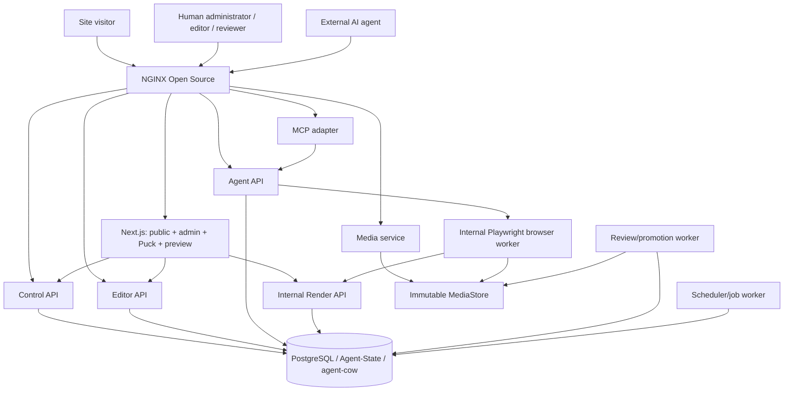

### 9.3 Core user story

```text
1. Jane logs in and selects a site on which she is Site Owner.
2. Jane creates a one-hour Site Architect agent workspace and approves one source origin.
3. Agent-State creates a server-owned workspace UUID and displays one opaque capability once.
4. Jane gives the Agent API/MCP details and capability to an external agent.
5. The agent discovers the field primitives, current model, component catalog, and design tokens.
6. Through confined source tools it inspects the approved source; through semantic tools it creates content types, items, pages, composition, navigation, media references, and theme data.
7. The agent repeatedly requests Playwright screenshots, accessibility snapshots, diagnostics, and responsive sweeps of its own preview.
8. The published site and every other site remain unchanged.
9. Jane opens the same composition in Puck, makes an optional human-workspace adjustment, and freezes the workspace.
10. The system drains in-flight writes and creates an immutable snapshot with semantic, visual, validation, conflict, and media evidence.
11. Jane accepts, selectively accepts when supported, or discards.
12. Only the review worker can atomically promote canonical rows and advance the site's revision.
```

---

## 10. Core invariants

The implementation is acceptable only if these invariants are tested continuously.

### I-1: No agent canonical-write path

The agent-facing process must not possess:

- setup-owner credentials;
- reviewer credentials;
- direct base-table privileges;
- schema `CREATE`;
- control-plane session creation or acceptance authority.

### I-2: Server-owned session selection

The session UUID passed to `asyncpg_cow_session` is resolved from an opaque capability by trusted server code. It is never copied from an untrusted header, query parameter, path parameter, JSON field, or MCP tool argument.

### I-3: Agent publication is impossible

No route authenticated by an agent capability can transition a workspace to accepted state or invoke reviewer promotion.

### I-4: One capability, one workspace

A capability maps to exactly one:

```text
deployment
site
workspace session UUID
delegating human
effective scope set
expiry
quota set
```

### I-5: All editorial writes are workspace writes

Human and agent request handlers write through `asyncpg_cow_session`. The online application does not use unsafe canonical-write-through-view compatibility.

### I-6: Promotion is atomic

The accepted operation set, canonical content changes, site revision increment, audit record, and terminal session status are committed or rolled back together.

### I-7: Conflict policy is fail-safe

SLAIF public product APIs always use `conflict_policy="error"`. The foundation's overwrite compatibility mode is not exposed.

### I-8: Media is immutable

An existing content-addressed object is never overwritten. A content edit changes a reference.

### I-9: The approved review is immutable

A workspace is frozen and its capability revoked before the final review bundle is produced. Every mutation transaction holds a product-level shared workspace advisory lock; the freeze worker obtains the corresponding exclusive lock, proving that in-flight mutations have finished. The system then materializes an immutable review snapshot; human approval refers to that snapshot, not to a live-base preview.

### I-10: Executable implementation is outside delegated authority

No delegation level grants the agent the ability to edit application source, templates implemented in code, arbitrary CSS/JS, dependencies, physical database schema, NGINX/Apache configuration, container configuration, identity policy, or secrets.

### I-11: Site confinement

Every human or agent editorial operation uses a server-owned site context. A caller-controlled object ID, route parameter, hostname, or body value cannot move an operation to another site without a separate authorization decision.

### I-12: Content-model changes are workspace data

Creating or changing a site-specific content type or field definition is an editorial workspace operation. It does not grant physical schema authority and does not invoke Alembic.

### I-13: Component implementations are trusted code

Humans and agents may instantiate and configure catalog components and field primitives. They cannot register executable components or primitives, scripts, packages, arbitrary CSS, or server code through editorial APIs.

### I-14: Browser tools are observational and confined

Agent browser tools may inspect only the bound workspace preview and explicitly approved source origins. The browser worker has no content-write, canonical-write, reviewer, database, identity, or infrastructure authority.

### I-15: Visual validation is evidence, not authority

A passing screenshot review, accessibility snapshot, responsive sweep, or zero-error diagnostic cannot accept or publish a workspace.

### I-16: Human and agent composition converge

Puck and Agent API operations mutate the same versioned product-owned normalized composition. Public, active-preview, and review rendering use the same trusted React component implementations.

### I-17: Multi-site does not imply hostile tenancy

The product supports multiple sites and site-scoped users from v1, but makes no isolation claim against mutually hostile tenants sharing the same trusted installation until a dedicated deployment profile proves it.

---

## 11. Logical architecture

The product is one monorepo containing separately deployable processes. Separation is based on authority, not on organizational fashion.

### 11.1 Product decomposition

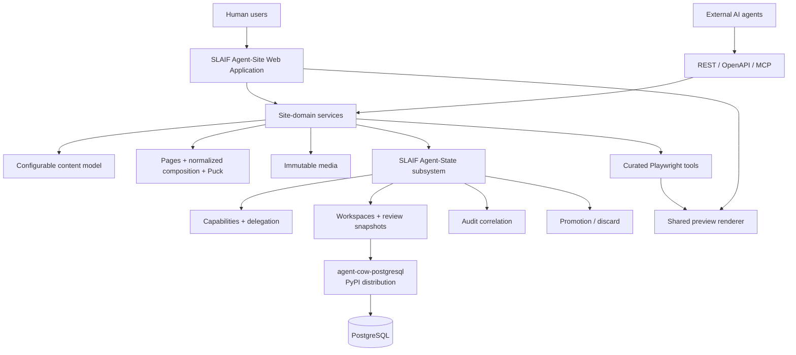

Agent-Site owns installation, identity/sites/users, the site domain, Puck, agent interfaces, browser tooling, rendering, media, governance UI, and operations. Agent-State owns workspaces, capabilities, delegated authority, server-owned agent-cow context, snapshot/audit orchestration, promotion/discard, expiry, and cleanup. The installed `agent-cow-postgresql` package owns generic PostgreSQL COW mechanics only.

### 11.2 Process topology

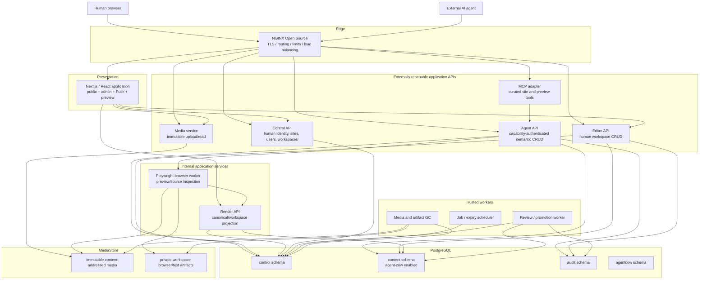

### 11.3 Why separate processes

The services may share one Python codebase and one OCI image, but they start with different commands and credentials.

This makes several failures structurally less dangerous:

- an Agent API remote-code-execution bug does not reveal reviewer credentials;
- a public renderer bug does not reveal content-write credentials;
- a scheduler bug cannot accidentally accept a session;
- a compromised preview page or browser context cannot reach PostgreSQL, the Docker socket, or reviewer services;
- the setup owner password is absent from every long-running service;
- NGINX is the only externally bound process in the default deployment.

### 11.4 Process inventory

| Process | External exposure | Primary authority | Responsibilities |
|---|---|---|---|
| NGINX Open Source | `8080` local; `80/443` production | None | TLS, routing, request limits, compression, edge logging, and OSS load balancing |
| Web | Through NGINX | No direct DB write authority | Public SSR, multi-site admin UI, Puck editor, preview shell, and responsive review UI |
| Control API | Through NGINX | Control-schema authority only | Authentication, sites/domains, users, memberships, roles, workspace/capability lifecycle, and review requests |
| Editor API | Through NGINX | COW runtime role | Human-workspace content-model, content, and composition operations |
| Agent API | Through NGINX | COW runtime role | Capability-authenticated model/content/composition operations and browser-job requests |
| MCP adapter | Through NGINX | No DB credentials | Maps MCP tools to Agent API and curated browser-tool requests |
| Media service | Through NGINX | Media metadata and `MediaStore` authority | Upload validation, immutable storage, and authenticated media/artifact reads |
| Render API | Internal only | Read-only canonical/workspace projections | Resolves sites, routes, models, compositions, themes, and review snapshots |
| Browser worker | Internal only | Service-only preview/source credential | Isolated Playwright contexts, screenshots, snapshots, diagnostics, and responsive sweeps |
| Review worker | Internal only | Reviewer DB role; no agent route | Freeze verification, immutable snapshots, conflict inspection, promotion, and discard |
| Scheduler/job worker | Internal only | Queue-claim and lifecycle authority | Expiry, cleanup, validation, browser jobs, and retries; no reviewer credential |
| Media/artifact GC | Internal only | Reference inspection and delete authority | Removes unreferenced staging objects and expired private artifacts |
| Bootstrap/migration | One-shot | Setup owner | Alembic, agent-cow deployment/hardening, privilege validation, seed, and one-time setup token |
| PostgreSQL | Internal network only | N/A | Durable control, content, audit, COW state, and job queue |

### 11.5 Authority boundaries

- Agent API and Editor API receive runtime credentials only.
- Review worker alone receives reviewer credentials.
- Bootstrap alone receives setup-owner credentials.
- Web and MCP have no database credentials.
- Browser worker has no PostgreSQL credentials, human cookies, reviewer authority, repository mount, or Docker socket.
- NGINX has no product secrets other than TLS material and optional edge configuration.

---

## 12. Repository architecture

The product belongs in a new repository.

```text
slaif-agent-site/
├── README.md
├── ARCHITECTURE.md
├── LICENSE
├── NOTICE
├── AGENTS.md
├── compose.yaml
├── .env.example
├── pyproject.toml
├── uv.lock
├── package.json
├── pnpm-lock.yaml
├── playwright.config.ts
│
├── apps/
│   └── web/
│       ├── app/
│       │   ├── (public)/
│       │   ├── setup/
│       │   ├── admin/
│       │   │   ├── sites/
│       │   │   ├── content-models/
│       │   │   ├── content/
│       │   │   ├── pages/
│       │   │   ├── design/
│       │   │   ├── ai-sessions/
│       │   │   ├── users/
│       │   │   └── audit/
│       │   └── preview/[workspaceId]/
│       ├── src/
│       │   ├── admin-ui/
│       │   ├── puck/
│       │   │   ├── config/
│       │   │   ├── adapter/
│       │   │   └── permissions/
│       │   ├── site-components/
│       │   ├── composition-renderer/
│       │   ├── design-tokens/
│       │   └── api-client/
│       ├── public/
│       ├── Dockerfile
│       └── package.json
│
├── services/
│   ├── backend/
│   │   ├── src/slaif_agent_site/
│   │   │   ├── agent_state/
│   │   │   │   ├── capabilities/
│   │   │   │   ├── workspaces/
│   │   │   │   ├── review/
│   │   │   │   └── promotion/
│   │   │   ├── identity/
│   │   │   ├── sites/
│   │   │   ├── content_model/
│   │   │   ├── content_items/
│   │   │   ├── composition/
│   │   │   ├── component_catalog/
│   │   │   ├── themes/
│   │   │   ├── media/
│   │   │   ├── browser_tools/
│   │   │   ├── audit/
│   │   │   ├── jobs/
│   │   │   ├── db/
│   │   │   ├── policy/
│   │   │   ├── control_api/
│   │   │   ├── editor_api/
│   │   │   ├── agent_api/
│   │   │   ├── render_api/
│   │   │   ├── mcp_adapter/
│   │   │   ├── review_worker/
│   │   │   ├── scheduler/
│   │   │   └── bootstrap/
│   │   ├── tests/
│   │   └── Dockerfile
│   └── browser-worker/
│       ├── src/
│       │   ├── preview/
│       │   ├── source-import/
│       │   ├── network-policy/
│       │   ├── diagnostics/
│       │   ├── artifacts/
│       │   └── server.ts
│       ├── tests/
│       ├── Dockerfile
│       └── package.json
│
├── packages/
│   ├── composition-schema/
│   ├── component-catalog/
│   ├── content-model-schema/
│   ├── scope-catalog/
│   ├── browser-tool-contracts/
│   ├── api-client/
│   └── test-fixtures/
│
├── contracts/
│   ├── openapi/
│   ├── mcp/
│   ├── json-schema/
│   │   ├── content-model/
│   │   ├── composition/
│   │   ├── component-props/
│   │   └── browser-results/
│   └── generated/
│
├── migrations/
│   ├── alembic/
│   ├── bootstrap/
│   └── seed/
│
├── infra/
│   ├── nginx/
│   │   ├── nginx.conf
│   │   └── conf.d/
│   ├── apache/
│   │   └── slaif-agent-site.conf.example
│   ├── postgres/
│   │   ├── init/
│   │   └── healthcheck.sh
│   ├── compose/
│   └── production/
│
├── tools/
│   ├── demo-agent/
│   ├── site-import/
│   ├── backup/
│   ├── restore/
│   ├── license-audit/
│   └── browser-policy-test/
│
├── tests/
│   ├── e2e/
│   │   ├── auth.setup.ts
│   │   ├── site-management.spec.ts
│   │   ├── user-management.spec.ts
│   │   ├── content-model.spec.ts
│   │   ├── puck-builder.spec.ts
│   │   ├── agent-session.spec.ts
│   │   ├── agent-visual-loop.spec.ts
│   │   ├── responsive-preview.spec.ts
│   │   ├── promotion.spec.ts
│   │   ├── conflict.spec.ts
│   │   ├── media.spec.ts
│   │   └── destructive-agent.spec.ts
│   ├── contract/
│   ├── integration/
│   ├── security/
│   ├── concurrency/
│   ├── packaging/
│   ├── recovery/
│   └── license/
│
└── docs/
    ├── THREAT_MODEL.md
    ├── SECURITY_INVARIANTS.md
    ├── ACCESS_MODEL.md
    ├── USER_MANAGEMENT.md
    ├── API.md
    ├── CONTENT_MODEL.md
    ├── COMPOSITION_MODEL.md
    ├── COMPONENT_CATALOG.md
    ├── PUCK_INTEGRATION.md
    ├── PLAYWRIGHT_AGENT_TOOLS.md
    ├── PROMOTION_SEMANTICS.md
    ├── OPERATIONS.md
    ├── SCALING.md
    ├── BACKUP_RESTORE.md
    ├── LICENSE_POLICY.md
    ├── WORDPRESS_COMPARISON.md
    └── DEMO.md
```

### 12.1 Code ownership boundaries

The generic Agent-State subsystem may know about:

```text
principal
site
workspace
capability
scope
operation
resource
review snapshot
promotion
conflict
expiry
audit
```

Site-domain modules may know about:

```text
content type
field definition
content item
relation
page
composition
component
navigation
theme
media
locale
redirect
```

The Puck adapter may know Puck APIs but does not own product persistence or authorization. The browser worker may know preview routes and approved origins but not database credentials or publication. The PostgreSQL foundation package knows none of these product concepts.

### 12.2 Dependency on the PyPI distribution

The initial product dependency is the registry package:

```toml
dependencies = [
  "agent-cow-postgresql==0.2.0",
]
```

`uv.lock` is committed and records the exact resolved distribution artifacts and hashes. CI and OCI builds use `uv sync --frozen`; dependency-update automation may not change the foundation version without an explicit qualification PR.

Production dependency forms such as the following are prohibited:

```text
git+https://...
github.com/...@branch
github.com/...@commit
local path
editable checkout
unhashed direct wheel URL
```

An operator-controlled PyPI mirror or immutable package cache may be used for offline/reproducible builds as long as it serves the locked, hash-verified PyPI artifact. GitHub remains a source/provenance and issue-tracking location, not a build dependency.

---

## 13. Deployment architecture

### 13.1 Local demonstration topology

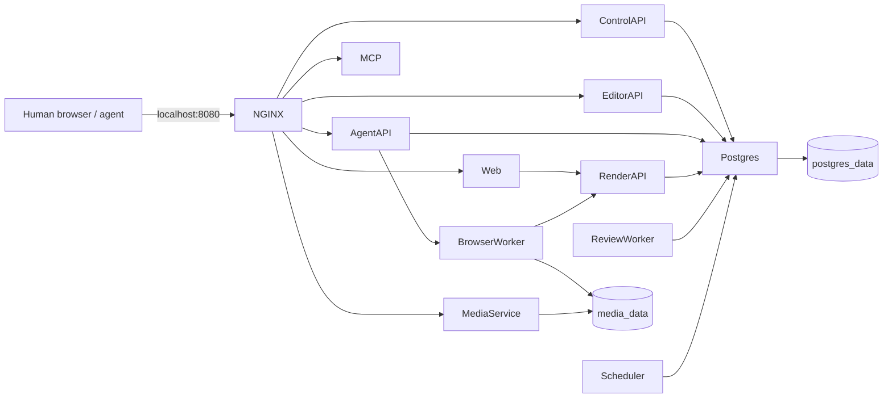

Only the NGINX container publishes a host port. PostgreSQL, Render API, browser worker, review worker, scheduler, and GC stay on internal networks.

### 13.2 Compose services

```yaml
services:
  nginx:
    # NGINX Open Source; only published service
    ports:
      - "8080:80"

  web:
    # Next.js public, admin, Puck, and preview application

  control-api:
    # Human identity, sites, users, workspaces, and capabilities

  editor-api:
    # Human-workspace semantic writes

  agent-api:
    # Capability-authenticated semantic writes and browser-job requests

  render-api:
    # Internal canonical/workspace projection

  mcp-adapter:
    # Semantic site tools and curated preview/source tools

  media-service:
    # Immutable media/artifact upload and authenticated read

  browser-worker:
    # Pinned Playwright runtime; internal only

  review-worker:
    # Reviewer credentials; internal only

  scheduler:
    # Queue claims, expiry, validation, and retry coordination

  media-gc:
    # Unreferenced media and private-artifact cleanup

  bootstrap:
    # Alembic, COW hardening, privilege validation, seed/setup token

  postgres:
    # PostgreSQL 18 default; supported range follows the foundation gate
```

The actual Compose file should use:

- health checks;
- `depends_on` with health or completion conditions;
- named volumes;
- an internal network;
- a separate restricted browser network and enforceable egress policy;
- no database host-port publication;
- explicit service users;
- read-only root filesystems where practical;
- dropped Linux capabilities;
- pinned image digests for release manifests.

Recommended profiles are:

```text
default   complete demonstrator including browser-worker
e2e       Playwright test runner and isolated test fixtures
dev       developer mounts and hot reload
backup    one-shot backup/restore tools
```

The browser worker and its browser binaries are built into a pinned, reproducible, license-scanned OCI image. No hosted browser grid is required.

### 13.3 NGINX reference routing

Local routing avoids wildcard DNS.

```nginx
server {
    listen 80;
    server_name _;
    client_max_body_size 128m;

    location /api/agent/ {
        proxy_pass http://agent-api:8000;
        proxy_http_version 1.1;
        proxy_set_header Host $host;
        proxy_set_header X-Forwarded-Proto $scheme;
        proxy_set_header X-Forwarded-For $proxy_add_x_forwarded_for;
        proxy_set_header X-Request-ID $request_id;
    }

    location /api/editor/ {
        proxy_pass http://editor-api:8000;
        proxy_set_header Host $host;
        proxy_set_header X-Forwarded-Proto $scheme;
        proxy_set_header X-Forwarded-For $proxy_add_x_forwarded_for;
        proxy_set_header X-Request-ID $request_id;
    }

    location /api/control/ {
        proxy_pass http://control-api:8000;
        proxy_set_header Host $host;
        proxy_set_header X-Forwarded-Proto $scheme;
        proxy_set_header X-Forwarded-For $proxy_add_x_forwarded_for;
        proxy_set_header X-Request-ID $request_id;
    }

    location /mcp/ {
        proxy_pass http://mcp-adapter:8000;
        proxy_http_version 1.1;
        proxy_set_header Host $host;
        proxy_set_header X-Forwarded-Proto $scheme;
        proxy_set_header X-Forwarded-For $proxy_add_x_forwarded_for;
        proxy_set_header X-Request-ID $request_id;
        proxy_buffering off;
    }

    location /media/ {
        proxy_pass http://media-service:8000;
        proxy_set_header Host $host;
        proxy_set_header X-Request-ID $request_id;
    }

    location / {
        proxy_pass http://web:3000;
        proxy_http_version 1.1;
        proxy_set_header Host $host;
        proxy_set_header X-Forwarded-Proto $scheme;
        proxy_set_header X-Forwarded-For $proxy_add_x_forwarded_for;
        proxy_set_header X-Request-ID $request_id;
        proxy_buffering off;
    }
}
```

The production configuration must account for Next.js streaming and any MCP/SSE endpoints. NGINX may apply TLS, limits, compression, caching, request IDs, rate limiting, and load balancing, but no capability, site, preview, content, or publication rule may depend on it.

### 13.4 Apache HTTP Server alternative

Document an Apache HTTP Server 2.4 adapter using standard open-source modules such as `mod_proxy`, `mod_proxy_http`, `mod_proxy_wstunnel` where needed, `mod_headers`, `mod_rewrite`, `mod_ssl`, and `mod_deflate` or `mod_brotli`. It exposes the same paths and application images as NGINX. Security-critical policy remains in the application so an alternative edge cannot omit it.

Production hostnames may include:

```text
www.example.si
admin.example.si
agent.example.si
```

Preview subdomains are optional. Path-based previews remain the default because they work unchanged on localhost.

### 13.5 Production and scale topology

A small institutional installation can run the same Compose deployment on one Linux server:

```text
Internet
   ↓
NGINX Open Source :443
   ↓
application containers
   ↓
PostgreSQL volume + LocalVolumeMediaStore
   ↓
independent backup target
```

A scale-out installation uses NGINX replicas or an institutional ingress in front of stateless web/API replicas; separate browser-worker and review-worker pools claim PostgreSQL jobs; PostgreSQL may use an institutionally operated HA topology; and media uses a shared `MediaStore`. NGINX Plus, hosted PostgreSQL, and hosted object storage are not required. Compose is the reference packaging, not the scalability ceiling.

### 13.6 MediaStore deployment boundary

The storage contract is implemented by:

```text
LocalVolumeMediaStore             default demo and single-host production
SharedFilesystemMediaStore        multi-node institutional deployment
OptionalSelfHostedObjectMediaStore later, after permissive-license review
```

At scale, NGINX proxies media reads to the media service or uses an explicitly shared filesystem. The design does not assume that every NGINX or web replica has the same local volume.

---

## 14. Web application architecture

### 14.1 Selected web stack

The reference architecture uses:

- NGINX Open Source as the reference edge and Apache HTTP Server as a supported adapter;
- Next.js with React and TypeScript as the application renderer;
- Puck as the embedded human visual editor behind a product-owned adapter;
- Tailwind CSS OSS, shadcn/ui source components, and Radix Primitives for administration UI;
- one codebase for public sites, authenticated administration, Puck, and workspace previews;
- FastAPI services as the authoritative application API.

Next.js is not coupled to Vercel. It runs as a normal Node.js process in an OCI container behind NGINX or Apache.

Only the open-source Tailwind CSS package is used; Tailwind Plus or another commercial template/component license is not part of the architecture. shadcn/ui source is retained in-repository with required notices, and every UI dependency remains subject to permissive-license CI policy.

### 14.2 Administration information architecture

The authenticated application is a first-class product surface:

```text
Dashboard
Sites
Content
Content Models
Pages
Structure
Design
Media
AI Sessions
Reviews
Users & Permissions
Audit
Settings
```

Within a selected site, the dashboard exposes status, active human/agent workspaces, unresolved conflicts, recent publication, browser validation, and audit activity. Content covers types, collection items, translations, and media references. Structure covers page trees, navigation, redirects, locales, and domains. Design covers Puck, theme tokens, header/footer, component catalog, and responsive validation. AI Sessions covers creation, one-time capability display, monitoring, preview, freeze, accept, and discard. Users & Permissions covers memberships, built-in roles, delegation ceilings, and locally appropriate invitations/provisioning.

Site selection is derived from authenticated membership. Hostnames and local path prefixes resolve through trusted site-domain data, not a caller-supplied `site_id` alone. The first-run `/setup` surface is available only while an unexpired one-time installation token exists and closes permanently after initialization.

### 14.3 One composition, two editors

Humans and agents edit the same logical composition:

```text
Human → Puck → product composition API
Agent → REST/MCP semantic tools → product composition API
Both → normalized workspace composition → shared React renderer
```

Puck is an authoring surface, not the persistence, authorization, or publication authority. A `PuckCompositionAdapter` converts between the product's versioned normalized composition and Puck's editor data/config. Puck's `onPublish` action is labeled and implemented as **Save workspace** or **Save draft**; it never invokes canonical promotion. Server-side scope, schema, site, and row-version checks remain authoritative even when the Puck UI hides an action.

### 14.4 One renderer, multiple state contexts

The public and preview websites must use the same renderer and component implementations.

```text
same route
same component tree
same CSS
same content projection

difference:
    canonical site context
    active workspace context
    or immutable review-snapshot context
```

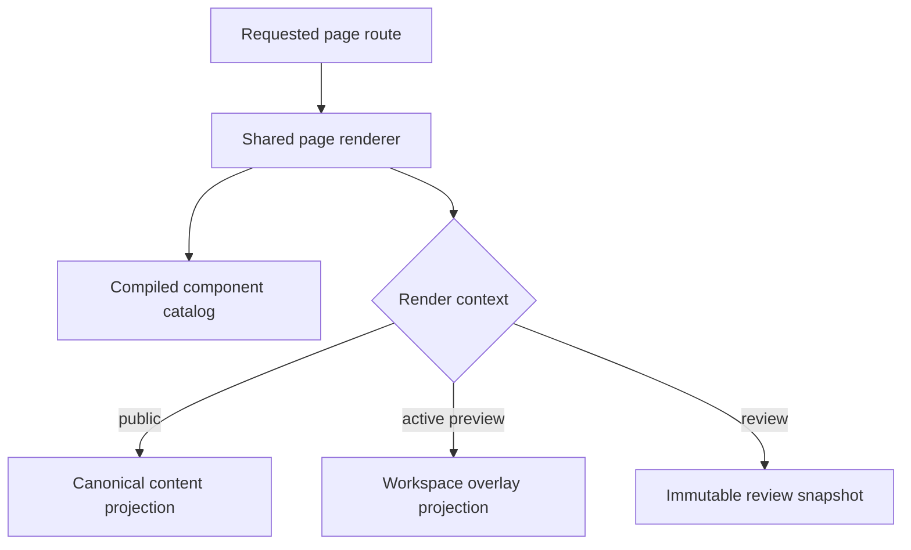

This prevents a preview from being a misleading approximation of production.

### 14.5 Public routes

Examples:

```text
/
 /about
 /research/projects
 /news/<slug>
 /events/<slug>
 /people/<slug>
 /<locale>/...
```

Public rendering calls the internal Render API in canonical mode after trusted hostname/path-to-site resolution. No session UUID is present. Generic content types may produce collection and detail routes; `/news`, `/events`, and `/people` are examples rather than fixed physical domains.

### 14.6 Administration routes

Examples:

```text
/admin
/admin/sites
/admin/sites/<site-id>/content-models
/admin/sites/<site-id>/content
/admin/sites/<site-id>/pages
/admin/sites/<site-id>/design
/admin/sites/<site-id>/ai-sessions
/admin/sites/<site-id>/users
/admin/sites/<site-id>/audit
/admin/workspaces/<id>/changes
/admin/workspaces/<id>/conflicts
```

The browser receives an HTTP-only human session cookie. Control requests require CSRF protection.

### 14.7 Preview routes

Local and default form:

```text
/preview/<workspace-id>/<normal-site-route>
```

Production optional form:

```text
https://<workspace-id>.preview.example.si/<route>
```

Preview authorization is separate from the agent capability. The preview endpoint verifies the logged-in human's site membership and session access.

The internal browser worker uses a short-lived service-only preview credential bound to the site, workspace, run, and expiry. Browser contexts contain neither the agent capability nor human cookies.

The agent token must never appear in:

- a preview URL;
- browser local storage;
- page source;
- analytics;
- server-rendered HTML;
- referrer headers.

### 14.8 Caching

Public pages may be cached by canonical site revision.

Active preview pages are keyed by:

```text
workspace_id
workspace operation watermark
route
locale
component catalog version
composition schema version
content model revision
```

Once a workspace enters `REVIEW`, the renderer uses the immutable review snapshot identified by `review_snapshot_id` rather than reading the live-base COW overlay. Preview responses use private/no-store policy by default. Public assets use immutable cache headers.

After successful promotion, the worker increments the canonical site revision and emits a cache-invalidation event.

### 14.9 Search-engine behavior

Preview responses include:

```http
X-Robots-Tag: noindex, nofollow, noarchive
Cache-Control: private, no-store
```

The preview sitemap is disabled. Canonical pages produce normal SEO metadata.

### 14.10 Responsive support contract

| Surface | Desktop | Tablet | Phone |
|---|---:|---:|---:|
| Public website | Required | Required | Required |
| Login, dashboard, and site selection | Required | Required | Required |
| Create/revoke agent session | Required | Required | Required |
| Preview/review/accept/discard | Required | Required | Required |
| Common content forms | Required | Required | Required |
| Full Puck page composition | Required | Required | Best effort for MVP; claim only what E2E proves |
| Theme/global architecture editing | Required | Required | Not a required narrow-phone MVP workflow |

Critical governance remains usable on phone-class targets even though advanced drag-and-drop site composition is primarily a desktop/tablet workflow.

---

## 15. Backend service architecture

### 15.1 Shared backend package

All Python services use one package but separate entrypoints:

```text
python -m slaif_agent_site.control_api
python -m slaif_agent_site.editor_api
python -m slaif_agent_site.agent_api
python -m slaif_agent_site.render_api
python -m slaif_agent_site.mcp_adapter
python -m slaif_agent_site.media_service
python -m slaif_agent_site.review_worker
python -m slaif_agent_site.scheduler
python -m slaif_agent_site.media_gc
python -m slaif_agent_site.bootstrap
```

Shared code includes:

- Pydantic/domain models;
- site-scoped RBAC and delegation policy;
- field-primitive, content-model, query-DSL, content-item, and relation validators;
- normalized composition and component-prop validators;
- versioned contracts shared with the TypeScript packages;
- database adapters;
- audit event generation;
- media digest and validation code;
- error mapping;
- OpenAPI schema generation.

Service-specific packages own their route handlers and credentials.

### 15.2 Control API

Responsibilities:

- authenticate human users;
- own one-time installation setup and optional OIDC integration;
- create and configure sites and trusted domain mappings;
- manage site memberships, built-in roles, permission inspection, and delegation ceilings;
- read site membership and delegation ceilings;
- create human or agent workspaces;
- compute effective scopes;
- issue one-time opaque capabilities;
- revoke capabilities;
- freeze sessions for review;
- enqueue accept/discard/selective actions;
- expose status, semantic changes, conflicts, and audit;
- expose browser-run/artifact and validation status without executing browser work.

The Control API cannot directly invoke content DML and has no reviewer credential.

### 15.3 Editor API

Responsibilities:

- authenticate a human browser session;
- verify membership, workspace ownership/access, and editing scopes;
- derive the human workspace UUID server-side;
- reuse the same domain commands and validators as the Agent API;
- persist manual forms and Puck operations into the product-owned normalized model;
- execute writes through `asyncpg_cow_session`;
- append semantic audit events with actor type `HUMAN`;
- never write canonical content directly.

The Editor API and Agent API share application services but not authentication handlers or database credentials.

### 15.4 Agent API

Responsibilities:

- authenticate an opaque capability;
- resolve it to a server-owned site and workspace UUID;
- enforce state, expiry, site, scope, quotas, and resource filters;
- generate server-owned operation IDs;
- execute semantic mutations through `asyncpg_cow_session`;
- append a semantic audit event in the same PostgreSQL transaction;
- expose semantic content-model, content-item, page, component, navigation, theme, and media-reference operations;
- enqueue policy-checked browser jobs using trusted site/workspace/source context;
- return stable API errors.

The Agent API never accepts SQL, schema migrations, raw JavaScript/browser evaluation, arbitrary URLs, or database identity.

### 15.5 Render API

Responsibilities:

- return content projections optimized for the Next.js renderer;
- read canonical state with no COW session context;
- read workspace state with a server-authorized session context;
- optionally apply `visible_operations` for selective previews;
- read immutable review snapshots after freeze;
- produce trusted site/domain resolution, dynamic content-model projection, bounded collection results, normalized composition, redirects, navigation, localized content, theme, and media references.

It is internal-only and uses a read-only database role.

### 15.6 MCP adapter

The MCP adapter:

- authenticates the same opaque capability;
- exposes a curated set of tools;
- calls the Agent API over internal HTTP for all semantic and browser-tool authorization;
- exposes only curated model/content/composition/preview/source tools;
- does not import database code;
- does not create independent authorization semantics;
- does not implement publication;
- returns Agent API validation and conflict errors faithfully.

REST/OpenAPI remains the source of truth.

### 15.7 Media service

The media service:

- streams bounded uploads while hashing and validating bytes;
- writes immutable objects through `MediaStore`;
- coordinates COW media metadata/reference records through authorized API workflows;
- serves public media and authenticated staging/private artifact reads;
- never makes workspace browser artifacts public automatically;
- prevents filename-based overwrite and validates site/workspace ownership.

### 15.8 Browser worker

The internal Node.js/TypeScript browser worker:

- claims or receives policy-resolved preview/source jobs;
- creates a fresh isolated Playwright context per run;
- obtains a short-lived internal preview credential, never an agent token or human cookie;
- captures screenshots, accessibility/DOM snapshots, console errors, failed requests, link/media checks, overflow checks, heading diagnostics, and bounded responsive sweeps;
- navigates source pages only within human-approved origins and egress policy;
- stores results as private workspace artifacts;
- destroys context and credentials after every run.

It has no PostgreSQL credentials, content-write API token, reviewer credential, host filesystem/repository mount, Docker socket, or unrestricted internal-network path.

### 15.9 Review worker

The review worker:

- consumes PostgreSQL queue jobs;
- transitions a frozen session to the requested terminal action;
- opens `asyncpg_cow_reviewer`;
- inspects operations, dependencies, and conflicts;
- verifies audit completeness;
- validates content-model definitions and mappings, content items, bounded queries, component bindings, routes, accessibility policy, and media;
- attaches browser evidence to the review bundle without treating it as publication authority;
- promotes or discards atomically;
- updates terminal state and site revision in the same transaction;
- records promotion audit;
- finalizes or cleans media;
- invalidates caches.

The worker has no public listener.

### 15.10 Scheduler

The scheduler:

- marks expired active capabilities unusable;
- transitions expired workspaces to cleanup policy;
- enqueues discard after the configured retention period;
- detects stuck jobs and stale sessions;
- coordinates browser, responsive-sweep, model-validation, and artifact-cleanup jobs;
- never invokes promotion;
- never holds reviewer credentials.

### 15.11 Media and artifact garbage collector

The collector removes:

- discarded session staging directories after retention;
- abandoned upload temporary files;
- public content-addressed objects with no canonical references after a long safety window;
- expired workspace screenshots, traces, snapshots, and reports after their private retention window.

It never removes a currently referenced canonical object.

---

## 16. PostgreSQL architecture

### 16.1 One database, separate schemas

The first implementation uses one PostgreSQL database with strict schemas and roles:

```text
control      human identity, sessions, capabilities, jobs, policy
content      configurable site models, content, pages, composition, and media metadata; agent-cow enabled
audit        append-only semantic and security events
agentcow     foundation control functions
alembic      migration metadata, or a dedicated unprotected table
```

Advantages:

- capability assertion, COW mutation, semantic audit, and quota consumption can share one transaction;
- promotion and terminal state changes can share one reviewer transaction;
- no distributed transaction coordinator is required;
- one PostgreSQL container is sufficient for the demonstrator;
- schema boundaries remain explicit and testable.

Only the `content` schema is COW-enabled.

The `control` schema owns narrowly granted security-definer functions for capability resolution, state assertion, audit insertion, terminal state transitions, and product-level shared/exclusive workspace advisory locks. Runtime roles receive only the specific `EXECUTE` grants they require.

Every site-owned control, content, workspace, media, browser-run, and audit object carries `site_id` or an equally immutable association. Parent/child constraints prevent mismatched sites. Application lookups always receive a trusted `SiteContext`; composite uniqueness and foreign keys include `site_id` where practical. PostgreSQL RLS is not claimed until its behavior with agent-cow views and triggers is implemented and tested.

### 16.2 Platform and editable table boundary

Control tables include installation state, sites/domains, user identities, roles/permissions, site memberships, workspaces, capabilities, idempotency records, review snapshots, jobs, browser runs, and browser artifacts. They are not COW-enabled.

The editable `content` schema uses fixed platform infrastructure tables plus a configurable site model:

```text
Fixed site infrastructure
    locale
    page
    page_composition
    component_instance
    navigation
    navigation_item
    redirect
    theme
    media_asset
    proposed_side_effect

Configurable model
    content_type
    field_definition
    content_item
    content_item_translation
    item_relation
    collection_view
```

These editable tables are COW-enabled. `News`, `Event`, `Person`, `Project`, and similar concepts are content-type rows, never required physical tables.

### 16.3 Database roles

| Role | Long-lived service | Allowed | Explicitly denied |
|---|---|---|---|
| `slaif_owner` | Bootstrap only | Own schemas/tables; migrate; deploy/harden COW | Long-running request traffic |
| `slaif_control` | Control API | Manage human/session/capability/job state through controlled tables/functions | Content DML, reviewer functions, setup |
| `slaif_editor_runtime` | Editor API | Resolve authorized human workspace through functions; CRUD on COW views; append human audit | Base/change tables, canonical writes, reviewer functions, schema create |
| `slaif_agent_runtime` | Agent API | Resolve/assert capability through functions; CRUD on COW views; append audit through function | Base/change tables, canonical writes, reviewer functions, schema create |
| `slaif_public_reader` | Render API canonical pool | SELECT on content views with no context | Any DML or internal table |
| `slaif_preview_reader` | Render API preview pool | SELECT on content views under trusted session context | Any DML or internal table |
| `slaif_reviewer` | Review worker | Controlled inspection/commit/discard; terminal control/audit functions | Runtime view DML, setup/teardown, arbitrary control updates |
| `slaif_scheduler` | Scheduler | Read expiry and enqueue cleanup jobs | Content read/write, commit |
| `slaif_gc` | Media GC | Read media reference projection and update GC records | Content DML and promotion |

`PUBLIC` receives no schema or function authority beyond unavoidable defaults, which are explicitly revoked during bootstrap.

Browser worker, Web, and MCP adapter have no database role. The media service receives only the narrowly required media metadata/reference functions and never reviewer or setup authority.

### 16.4 All online edits use workspaces

The architecture intentionally avoids a trusted web request path that writes canonical content directly.

Human editing works as follows:

```text
human opens editor
    ↓
implicit or explicit human workspace
    ↓
COW edits
    ↓
preview/review
    ↓
human with publish authority promotes
```

A quick-edit UI may hide the workspace mechanics and offer “Save and publish,” but internally it still creates or uses a workspace and calls the reviewer path.

This keeps one canonical mutation boundary and avoids enabling `allow_unsafe_canonical_writes=True`.

### 16.5 COW bootstrap

After Alembic creates content tables, bootstrap performs:

```python
await deploy_cow_functions(setup)
await enable_cow_schema(
    setup,
    schema="content",
    exclude={"alembic_version"},
    allow_deferred_fks=True,
    allow_unsafe_canonical_writes=False,
)
await harden_cow_schema(
    setup,
    schema="content",
    runtime_roles=["slaif_agent_runtime", "slaif_editor_runtime"],
    reviewer_roles=["slaif_reviewer"],
)
validation = await validate_cow_schema_privileges(...)
assert validation["safe"]
```

Application-specific read-only grants are then applied and independently validated.

### 16.6 Product-level workspace freeze lock

The product must not depend on a private foundation function to know when all in-flight requests have drained. It therefore defines a second, application-owned advisory-lock contract:

```text
control.lock_workspace_shared(workspace_uuid)
control.lock_workspace_exclusive(workspace_uuid)
```

The functions use transaction-scoped PostgreSQL advisory locks in a dedicated key namespace.

- Every mutating Editor API or Agent API transaction acquires the shared lock and then rechecks workspace state.
- The freeze worker first marks the workspace `FREEZING`, then obtains the exclusive lock.
- New mutations fail the state recheck.
- Existing mutations must commit or roll back before the exclusive lock is granted.
- The lock is released automatically at transaction end.

The foundation's own H07 locks remain authoritative for promotion consistency. The product lock exists for the application lifecycle and immutable review-snapshot boundary.

### 16.7 Transaction flow for an agent write

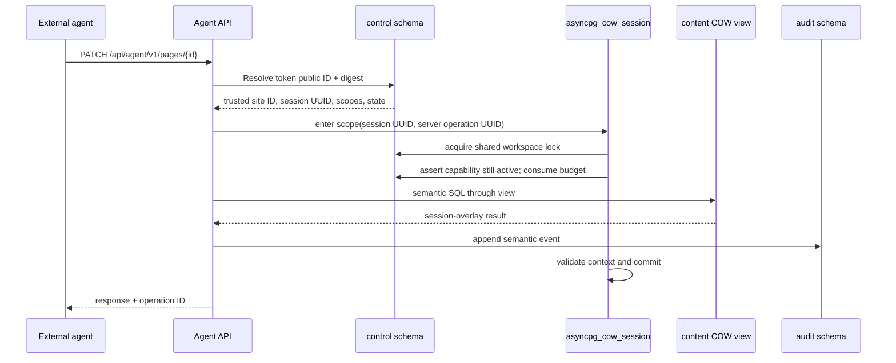

If any step fails, the COW mutation and semantic audit event roll back together.

### 16.8 Transaction flow for promotion

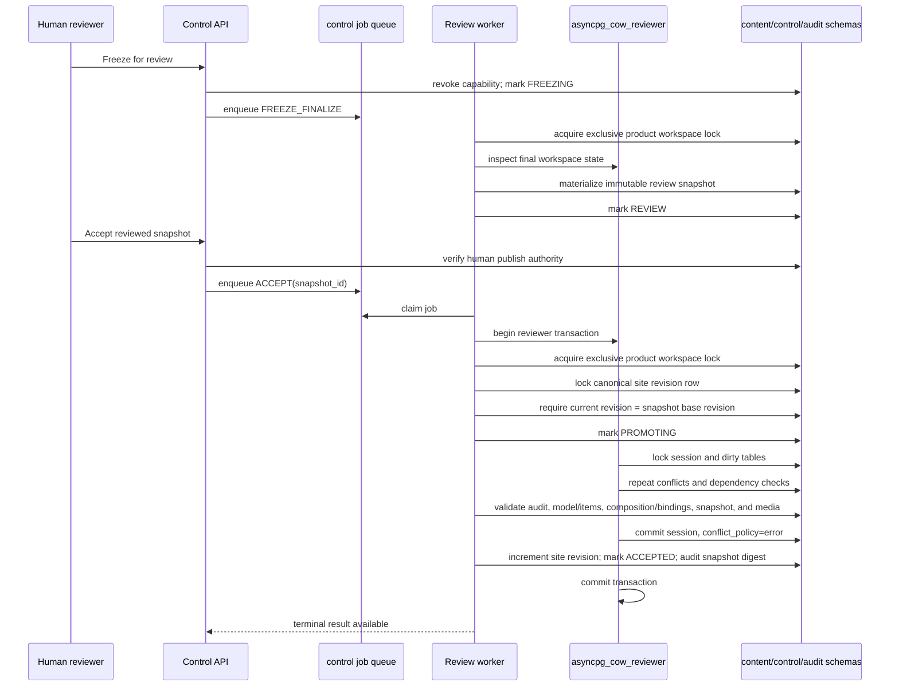

A failure after content mutation but before terminal state update rolls back the entire transaction.

### 16.9 Foreign keys and hierarchical content

Website data contains self-referential and cyclic relationships:

- page parent/child;
- navigation item parent/child;
- nested component instances and slots;
- item relations, collection views, component bindings, pages, and media.

Relevant foreign keys are declared `DEFERRABLE INITIALLY IMMEDIATE`. Review promotion uses `defer_fk_constraints=True`, allowing validation at transaction end while preserving referential integrity.

Schema cycles and promotion behavior must be covered by integration tests before release.

### 16.10 Content-model data versus physical schema

The boundary is explicit:

```text
Site operation
    create content type or field definition
    add a News section
    create items, collection views, pages, or components
    change navigation, theme, or responsive settings
        → workspace DATA
        → normal review/promotion
        → no Alembic

Platform release
    add a physical table or index
    add a field-primitive implementation or query operator
    alter a control/audit invariant
    change storage or executable component code
        → trusted CODE/SCHEMA release
        → Alembic where applicable
        → setup-owner authority only
```

Even Level 4 has no `schema:migrate` authority. Definition changes are versioned and use deterministic declarative mappings; arbitrary transformation code is forbidden.

### 16.11 Physical schema migration policy

Agents cannot perform DDL.

Application migrations follow maintenance mode:

1. stop creation of new workspaces;
2. freeze, accept, or discard active workspaces;
3. wait for no pending COW state;
4. run Alembic as `slaif_owner`;
5. deploy/upgrade agent-cow functions;
6. enable any new content tables;
7. rerun hardening;
8. validate all privileges;
9. run smoke tests;
10. resume workspace creation.

If pending work exists across an incompatible foundation upgrade, the deployment fails rather than inventing baselines.

### 16.12 Deterministic promotion validation

Before invoking promotion, the review worker verifies under the same trusted site/snapshot context that:

- every field definition uses an allowlisted primitive and bounded validation schema;
- every affected item validates against the proposed definition version or an approved declarative mapping;
- relations point to in-site items of allowed target types;
- collection queries use the bounded DSL, allowed operators, limits, and index policy;
- component instances use available catalog/schema versions and valid responsive props;
- component bindings reference existing fields, items, media, and collection views;
- route, navigation, redirect, locale, accessibility, and structural invariants hold;
- no dangling or mutable media reference exists.

Errors block promotion before canonical mutation. Visual browser evidence may reveal additional warnings but is never an authorization input.

---

## 17. Workspace model and lifecycle

### 17.1 Workspace types

The same mechanism supports:

| Type | Actor | Typical use |
|---|---|---|
| `AGENT` | External AI | Delegated website editing |
| `HUMAN` | Logged-in editor | Manual draft editing |
| `IMPORT` | Agent/tool | Whole-site migration |
| `SYSTEM` | Trusted migration utility | Controlled maintenance, rarely used |

All types use a UUID compatible with `agent-cow` session IDs and an immutable `site_id`. A capability, browser run, artifact, event, snapshot, and job inherits that site/workspace association.

### 17.2 Lifecycle

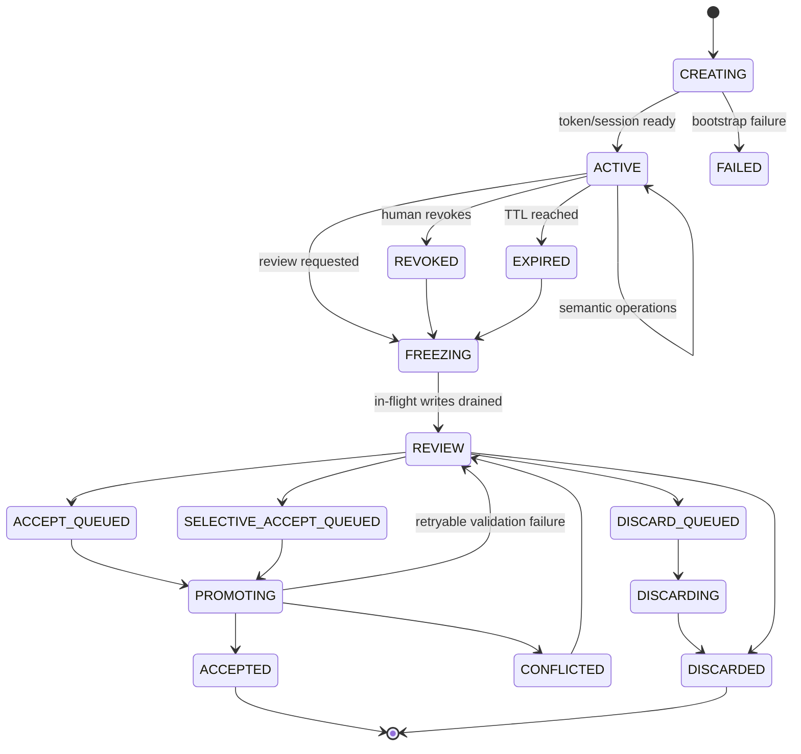

### 17.3 State rules

- Only `ACTIVE` accepts agent writes.
- Browser preview jobs are permitted only while policy allows inspection of that workspace state; source jobs additionally require the approved origin and scope.
- `REVOKED` and `EXPIRED` reject new requests.
- `FREEZING` prevents new requests and waits for the reviewer lock boundary.
- `REVIEW` is read-only.
- Only a human-authenticated control action can enqueue accept/selective accept.
- Duplicate terminal requests are idempotent.
- An accepted or discarded workspace is immutable audit history.
- Session data may be retained for policy-defined periods after terminal state.

### 17.4 Live-base overlay behavior

The UI must explain the actual model:

> Your workspace contains your isolated changes layered over the current published content. If published content touched by your workspace changes concurrently, acceptance will report a conflict rather than overwrite it.

The UI may display:

- base site revision at workspace creation;
- current site revision;
- “published site changed while this workspace was active” warning;
- authoritative row-level conflict results.

During active work, a coarse site-revision difference is a warning rather than a correctness failure. At final review, however, the system records the current canonical revision in the immutable review snapshot. The contractual MVP requires that revision to remain unchanged until acceptance, so the human-approved rendered result is the result that can be published. A later release may relax this through resource-level re-review.

### 17.5 Freeze behavior

Freeze is a three-part boundary:

1. the Control API changes workspace state and invalidates capabilities;
2. the freeze worker obtains the product-level exclusive workspace advisory lock, waiting for all shared mutation locks to drain;
3. the worker materializes an immutable review snapshot and records the canonical site revision, operation set, catalog version, and snapshot digest.

Requests that have not started are denied. A request already inside a runtime transaction may finish before the exclusive lock is acquired. The final review bundle is computed only after that lock boundary.

The immutable snapshot contains the normalized site projection and evidence needed by the renderer and reviewer:

```text
site profile
theme
locales
content-type and field definitions with definition versions
content items, translations, and relations
collection views and bounded query specifications
pages and normalized component-instance trees
navigation
redirects
media references
operation set and dependency graph
validation report
browser-run summaries and private artifact references
component catalog, composition schema, renderer, and content-model versions
canonical site revision
```

The `REVIEW` preview reads this snapshot. It does not continue to follow later canonical-base changes.

### 17.6 Browser runs and artifacts

Browser runs are subordinate workspace resources, not a separate state branch. Each run records trusted `site_id`, `workspace_id`, requester, run type, approved origins, targets/routes, quotas, result summary, and lifecycle timestamps. Each artifact records its run, immutable digest, private type, metadata, and expiry. Revocation stops new agent-requested runs; freeze may wait for or cancel outstanding runs according to policy, and the final snapshot records only completed evidence selected by the server.

---

## 18. Human roles, delegation ceilings, and publication

Human roles are site-scoped governance assignments. Agent delegation levels are separate presets over granular scopes. A person can never create a capability with delegatable scopes they do not possess on the selected site.

### 18.1 Human role model

Built-in roles:

| Human role | Delegation ceiling | Publish? | Other authority |
|---|---:|---:|---|
| Platform Administrator | Policy-defined per assigned site; installation authority is never delegatable | Separately granted | Installation settings, site creation, identity configuration, quotas, and owner assignment |
| Site Owner | Level 4 | Yes by default | Full governance of one site, memberships, delegation, review, and policy |
| Site Architect | Level 4 | Optional policy | Content models, global structure, design system, and imports; no user management unless separately granted |
| Site Designer | Level 3 | Optional policy | Composition, variants, responsive settings, and theme tokens within policy |
| Site Editor | Level 2 | Optional policy | Pages, hierarchy, navigation, redirects, and existing collections |
| Content Editor | Level 1 | Optional policy | Existing item values, translations, media, and existing component content props |
| Reviewer | None by default | Only if separately granted | Read previews, diffs, validations, and audit; may comment |
| Viewer | None | No | Read-only administrative access |

A user can hold different roles on different sites. The authorization source is `control.site_membership`, not a global user-role field. A custom-role designer is not required for the contractual MVP; built-in policy data and explicit permission overrides are sufficient.

Publication is orthogonal to editing level. An organization may require two-person review by giving designers no publish scope.

### 18.2 Delegation calculation

```text
effective agent scopes
    =
requested preset scopes
    ∩ delegator's delegatable site scopes
    ∩ site policy
    ∩ resource constraints
    ∩ system safety ceiling
```

The result is persisted immutably on the workspace and capability.

### 18.3 Non-delegatable scopes

These scopes are never present in an agent capability:

```text
site:create
site:archive
site:delete
site-domain:manage
workspace:create
workspace:freeze
workspace:accept
workspace:accept-selective
workspace:discard
capability:create
capability:revoke
site:publish
membership:manage
role:manage
identity:configure
installation:manage
schema:migrate
component-code:install
server:configure
secret:read
audit:delete
```

---

## 19. Four delegation presets

The four levels are user-interface presets over granular scopes. They are not four token formats and not four database roles.

### 19.1 Level 1 — Content Editor

May modify content within existing structure:

- values of existing content items and page metadata;
- translations;
- documents and media uploads;
- alt text, captions, and SEO descriptions;
- content props of existing component instances without changing type or placement;
- its own workspace preview through bounded inspection tools.

Cannot:

- create/delete/move normal pages;
- change URL hierarchy;
- change navigation;
- create content types or fields;
- add/remove/reorder structural components;
- change theme or header/footer.

Example scopes:

```text
site:read
content-model:read
content-item:read
collection-view:read
page:read
composition:read
navigation:read
media:read
theme:read
component-catalog:read
content-item:create
content-item:write
content-item:delete
translation:write
media:upload
media-metadata:write
media-reference:delete
component-content-props:write
seo:write
preview:inspect
```

### 19.2 Level 2 — Site Editor

Includes Level 1 and may change information architecture:

- create, archive, restore, and delete pages in the workspace;
- change page parent/child hierarchy;
- change slugs and routes;
- create redirects;
- create and reorganize menus;
- create collection views over existing content types;
- add, remove, and move approved structural components;
- change relationships between existing items and pages.

Level 2 works with existing content types. It cannot define fields, change broad composition/design behavior, or edit global design.

Additional scopes:

```text
page:create
page:write
page:delete
page:restore
page:move
route:write
redirect:create
redirect:write
redirect:delete
navigation:create
navigation:write
navigation:delete
collection-view:create
collection-view:write
collection-view:delete
component-structure:create
component-structure:delete
component-structure:move
relationship:write
```

### 19.3 Level 3 — Site Designer

Includes Levels 1–2 and may change composition and responsive design:

- select component types and variants;
- configure columns, grids, hero variants, galleries, accordions, cards, and lists;
- change page-level layout;
- create reusable content compositions allowed by the catalog;
- choose bounded local and site theme tokens;
- configure allowlisted desktop, tablet, and mobile props;
- run quota-controlled responsive sweeps.

Cannot define content types/fields, change global header/footer architecture, add component code, or alter server behavior.

Additional scopes:

```text
composition:write
component-props:write
component-variant:write
layout:write
responsive-design:write
page-style:write
theme-tokens:write
preview:responsive-sweep
```

### 19.4 Level 4 — Site Architect

Includes Levels 1–3 and may reconstruct the complete site within the structured platform:

- create, change, and delete site-specific content types, fields, relations, and collection views;
- apply declarative content-model mappings and validate affected items;
- change global theme tokens;
- change colors, typography selection, spacing scale, radii, widths, and approved shadows;
- change header/footer variants;
- change global regions and announcement bars;
- change locale configuration;
- perform whole-site import/manifests;
- replace the complete page hierarchy and navigation;
- reset all website content inside the workspace;
- reconstruct a source website using the component catalog.
- inspect only a human-approved source origin through confined browser tools.

Additional scopes:

```text
content-model:create
content-model:write
content-model:delete
field-definition:create
field-definition:write
field-definition:delete
content-model:mapping
site-structure:write
global-region:create
global-region:write
global-region:delete
header-footer:write
theme-global:write
locale:configure
site-import:validate
site-import:apply
source:inspect
site-reset:workspace
```

Level 4 still cannot add field primitives or query operators, edit executable code, run Alembic, navigate arbitrary origins, manage identities, or publish.

### 19.5 Resource restrictions

Any preset may be narrowed by:

- locale;
- page subtree;
- content type;
- allowed media MIME types;
- maximum deletion count;
- maximum upload bytes;
- route prefix;
- operation count;
- session duration;
- browser run, screenshot, route, target, byte, and concurrency budgets;
- explicitly approved source origin and whether subdomains are allowed.

Example:

```json
{
  "preset": "SITE_DESIGNER",
  "resource_constraints": {
    "page_subtrees": ["/workshops/ijcb-2026"],
    "locales": ["en", "sl"],
    "max_deletes": 10,
    "max_upload_bytes": 52428800,
    "max_browser_runs": 20,
    "allowed_preview_targets": ["desktop-chromium", "tablet", "mobile-webkit"]
  }
}
```

`preview:inspect` may be included in every preset because it observes only the bound preview. Full sweeps remain expensive quota-controlled Level 3/4 operations. `source:inspect` is Level 4 only and is ineffective without a human-approved source-origin constraint.

---

## 20. Capability design

### 20.1 Token format

Use an opaque versioned bearer capability:

```text
sas2_<public-id>_<secret>
```

Where:

- `public-id` is a random lookup identifier;
- `secret` contains at least 256 bits of cryptographic randomness;
- no session, site, scope, or expiry data is encoded in clear text.

The database stores:

```text
public_id
secret_digest
site_id
workspace_id
delegator_id
effective_scopes
resource_constraints
approved_source_origins
browser_limits
created_at
expires_at
revoked_at
last_used_at
request_budget
upload_budget
browser_run_budget
screenshot_budget
```

A fast cryptographic digest is appropriate because the secret has high entropy. The comparison is constant-time. An application pepper may be added through HMAC.

### 20.2 Issuance

The capability is displayed once. The UI provides:

```text
Agent API URL
MCP endpoint
one-time token
expiry
delegated level
scope summary
preview link
approved source origin, if any
visual-tool and responsive-target limits
suggested agent instructions
```

The plaintext token is never stored after issuance and is never emitted to logs.

### 20.3 Authentication sequence

1. Parse token version and public ID.
2. Look up candidate capability through a controlled database function.
3. Compare the presented secret digest.
4. Verify:
   - capability not revoked;
   - current time before expiry;
   - workspace state `ACTIVE`;
   - delegator/site still valid;
   - request budget available.
5. Return a trusted internal authorization object containing immutable site, workspace, scope, source-origin, and quota context.
6. Enter `asyncpg_cow_session` using the returned workspace UUID.
7. Reassert active state inside the mutation transaction.
8. Execute semantic operation.

### 20.4 Revocation semantics

Revocation is immediate for new requests. In-flight database transactions may finish. Freeze/review obtains the exclusive session lock after in-flight shared runtime locks complete.

### 20.5 Scope checks

Authorization occurs at several composing layers:

- route-level scope, such as `navigation:write`;
- resource-level constraint, such as route prefix `/events`.
- site-bound lookup and cross-site negative check;
- browser run/source-origin and target quota where applicable;
- domain, model, query, composition, and structural invariants.

Every handler declares its required scopes. Policy tests enumerate every mutating route and verify that no route lacks an authorization declaration.

### 20.6 Quotas

Default one-hour capability quotas may include:

```text
2,000 requests
250 mutating operations
100 MB uploaded media
500 created records
100 deleted records
10 concurrent requests
20 browser runs
50 screenshots
10 routes per responsive sweep
```

Limits are configurable by site policy and preset. A Level 4 import session receives explicit larger limits rather than unlimited authority.

The agent capability is never put in a preview URL, browser cookie, local/session storage, screenshot artifact, or trace. Agent API converts an authorized browser request into a trusted job; browser worker obtains a separate short-lived internal preview credential bound to that job.

---

## 21. Website content architecture

Agent-Site is a structured, configurable website platform. It does not require a physical table for every semantic domain, and neither agents nor content-role humans edit source files or arbitrary HTML documents. They edit validated site-model, content, and composition data rendered by trusted code.

### 21.1 Five-layer model

```text
Layer 1 — Content
    configurable items, values, relations, translations, media

Layer 2 — Information architecture
    content types, fields, views, pages, routes, navigation, redirects

Layer 3 — Page composition
    normalized component instances, slots, ordering, bindings, variants

Layer 4 — Global site design
    theme tokens, header, footer, global regions, typography, palette

Layer 5 — Executable implementation
    React/Puck adapters, field primitive implementations, backend code,
    CSS implementation, physical database schema, packages, plugins,
    NGINX/Apache, containers, browser policy, authentication

Agent-editable: Layers 1–4 according to delegated scopes
Never agent-editable: Layer 5
```

This is the key boundary that permits an agent to “rebuild the whole website” without granting remote code execution.

### 21.2 Fixed platform primitives and configurable semantics

Platform code knows a bounded set of generic entities:

```text
Site
Locale
ContentType
FieldDefinition
ContentItem
ContentItemTranslation
ItemRelation
CollectionView
Page
PageComposition
ComponentInstance
Navigation
NavigationItem
MediaAsset
Redirect
Theme
ProposedSideEffect
```

A site defines semantic types as data, for example:

```text
News
Event
Person
Project
Publication
Course
Laboratory Equipment
Research Group
Dataset
Job Vacancy
```

These names do not imply corresponding PostgreSQL tables. Every editorial entity has a UUID, immutable site association, timestamps, row version, and workspace/audit provenance.

### 21.3 Field primitive catalog

The initial code-defined field catalog is:

```text
short_text
long_text
rich_text
integer
decimal
boolean
date
datetime
url
email
enum
media
document
reference
multi_reference
location
object
repeatable_object
```

Each primitive defines storage representation, JSON Schema, human editor control, validation, localization behavior, indexing/query support, rendering, and agent-facing discovery. Level 4 may instantiate and configure primitives but cannot add executable primitive implementations.

### 21.4 Hybrid relational/JSONB model

`content.content_type` contains `site_id`, stable key/labels, optional slug pattern, status, settings, and monotonically increasing definition version. `content.field_definition` contains its type, key, label, primitive, required/localized/cardinality flags, stable position, bounded validation/UI options, and definition version.

`content.content_item` contains the owning site/type, slug/status, type-definition version, nonlocalized `values` JSONB, timestamps, and row version. `content.content_item_translation` stores locale-keyed localized values. Referential fields are normalized into `content.item_relation` rows with source item, field definition, target item, position, and bounded metadata so referential integrity and site checks are enforceable.

`content.collection_view` stores a named type binding plus bounded filter, sort, projection, and pagination specifications. It uses a declarative query DSL, never raw SQL.

Representative type definition:

```json
{
  "key": "news",
  "singular_label": "News item",
  "plural_label": "News",
  "definition_version": 4,
  "fields": [
    {"key": "title", "type": "short_text", "required": true, "localized": true},
    {"key": "summary", "type": "rich_text", "localized": true},
    {"key": "body", "type": "rich_text", "localized": true},
    {"key": "image", "type": "media"},
    {"key": "published_at", "type": "datetime"},
    {"key": "featured", "type": "boolean"}
  ]
}
```

### 21.5 Content-model authoring and versioning

Default authority is:

- Level 1 edits values of existing content items;
- Level 2 creates collection pages/views using existing types;
- Level 3 configures collection presentation and composition;
- Level 4 creates or changes types, fields, relations, model-level views, and declarative mappings.

Each definition change increments a version and produces a model-change report classifying affected items as compatible, defaultable, transformable, or invalid. Adding an optional field needs no transformation. Renaming a field uses an explicit declarative mapping:

```json
{
  "operation": "rename_field",
  "from": "date",
  "to": "published_at"
}
```

Changing `short_text` to `date` requires a supported conversion policy and validation preview. Arbitrary transformation code is forbidden. Generated server-side validators run on human forms, agent requests, preview projection, freeze, and promotion.

### 21.6 “Add News” is a data operation

An instruction to add News means, inside one workspace:

```text
1. Create ContentType "News".
2. Add bounded fields such as title, summary, body, image,
   published_at, and featured.
3. Create a CollectionView sorted by published_at.
4. Create /news and bind CollectionList or CollectionGrid to the view.
5. Optionally configure a generic detail-page template.
6. Add the page to navigation.
7. Create requested News items.
8. Validate and inspect desktop/tablet/mobile previews.
```

No Alembic migration runs and no PostgreSQL table is added. Model definitions, items, view, page, components, and navigation are normal COW workspace rows and promote or discard together.

### 21.7 Page, route, and locale model

A page carries `site_id`, parent, slug segment, route/layout metadata, status, navigation visibility, timestamps, and row version. Localized page metadata is stored in an appropriate localized representation. Routes are derived from hierarchy and locale and validate:

- no duplicate route per site and locale;
- no cycle in page hierarchy;
- maximum hierarchy depth;
- reserved path exclusions;
- redirect loops;
- canonical locale behavior.

A route change may automatically propose redirects from old paths, but the agent must have `redirect:write`.

### 21.8 Product-owned normalized composition

Do not persist one opaque, unversioned Puck object as the source of truth. The product contract is versioned and normalized:

```json
{
  "schema_version": "site-composition/v1",
  "page_id": "page-uuid",
  "root": {"title": "Home", "layout": "default"},
  "nodes": [
    {
      "id": "component-uuid",
      "component_type": "Hero",
      "parent_id": null,
      "slot": "content",
      "order_key": "a0",
      "props": {"heading": "SLAIF", "variant": "image-right"}
    }
  ]
}
```

The logical tables are `page`, `page_composition`, `component_instance`, and optional normalized `component_prop_reference`. A component instance contains stable ID, site/page/parent, slot, component type and schema version, order key, validated props, timestamps, and row version. A render cache may store a page-level denormalized snapshot but is not authoritative.

Benefits include stable agent/Puck identifiers, semantic move/update/delete operations, finer conflict boundaries, useful audit events, deterministic Puck-tree reconstruction, and better selective-acceptance dependencies.

### 21.9 Data-driven components and query bindings

Generic collection components bind to validated collection views and map declared fields:

```json
{
  "component_type": "CollectionGrid",
  "props": {
    "view_id": "featured-projects",
    "fields": {
      "title": "title",
      "summary": "abstract",
      "image": "cover_image"
    },
    "columns": {"desktop": 3, "tablet": 2, "mobile": 1}
  }
}
```

The server verifies that the view, fields, item type, projection, component prop schema, and site association agree. The query DSL allowlists operators, depths, sortable/filterable fields, result limits, and complexity. No request contains SQL.

### 21.10 Ordering and structural mutations

The API owns ordering. Agents express relative semantic intent and do not depend on raw storage ranks:

```http
POST /api/agent/v1/components/{componentId}/move
{
  "new_parent_component_id": "...",
  "slot": "content",
  "before_component_id": "..."
}
```

The application assigns stable order keys or rebalances positions transactionally. Depth, slot compatibility, component count, and cycle rules are checked server-side.

### 21.11 Deletion

Editorial deletion is represented as a workspace operation and may use soft deletion or explicit tombstones in domain data. The CoW foundation itself tracks deletion semantics. The API returns deleted resources in the review diff.

Canonical hard deletion occurs only through accepted promotion and only where domain policy allows it. Some objects, such as audit records and published media blobs, are never hard-deleted through content APIs.

---

## 22. Component catalog and safe design system

A Level 3 or Level 4 agent needs enough expressive power to create a genuinely different site. The solution is a finite, versioned, code-defined, trusted React component catalog exposed through both Puck and semantic APIs.

### 22.1 Initial component set

The initial catalog should include at least:

| Category | Components |
|---|---|
| Layout | `Section`, `Container`, `Columns`, `Grid`, `Stack`, bounded `Spacer` |
| Basic content | `Heading`, `RichText`, `Image`, `Gallery`, `VideoEmbed`, `Quote`, `Button`, `CallToAction` |
| Data driven | `CollectionList`, `CollectionGrid`, `CollectionDetail`, `CollectionSearch`, `CollectionFilter`, `RelatedItems` |
| Institutional | `Hero`, `Statistics`, `Timeline`, `LogoGrid`, `DocumentList`, `ContactBlock`, `MapBlock`, `FAQ` |
| Global | `Header`, `Footer`, `Breadcrumbs`, `LanguageSwitcher` |

Labels such as `NewsList`, `ProjectGrid`, or `PeopleGrid` may be convenience presets, but normally compile to generic collection components bound to a configurable type/view rather than introduce hard-coded domain tables.

### 22.2 Component contract

Each component has:

```text
component type
schema version
allowed variants
settings JSON Schema
localized content JSON Schema
renderer implementation
Puck editor representation and adapter mapping
accessibility rules
migration function between schema versions
allowed slots/children and maximum depth
bounded responsive prop schema
data-binding schema where applicable
```

Example catalog entry:

```json
{
  "type": "hero",
  "version": 1,
  "variants": ["image-right", "image-left", "background-image", "text-only"],
  "settings_schema": "...",
  "content_schema": "...",
  "required_accessibility_fields": ["heading"]
}
```

### 22.3 No arbitrary CSS or JavaScript

The agent may select:

- predefined variants;
- approved theme tokens;
- bounded column counts;
- approved aspect ratios;
- predefined alignment and spacing values.

It may not submit:

- raw CSS;
- style tags;
- JavaScript;
- event handlers;
- arbitrary iframes;
- server-rendered templates;
- package names;
- component source code;
- arbitrary field-to-query expressions or executable component props.

### 22.4 Puck integration boundary

Puck consumes a generated configuration derived from the trusted component catalog. `PuckCompositionAdapter` maps stable product component IDs, slots, props, and schema versions to and from Puck data. Product schemas and server services own validation, audit, workspace state, and persistence.

Puck permissions improve UX by hiding actions outside the current human role, but a crafted browser request is treated exactly like any other Editor API request and revalidated. Puck upgrades require adapter contract tests and a deterministic migration or backward-compatible reader for any representation change.

### 22.5 Theme and responsive model

A theme is structured data:

```json
{
  "palette": {
    "primary": "#17365D",
    "secondary": "#5B7FA3",
    "accent": "#D98C20",
    "surface": "#FFFFFF",
    "surface_muted": "#F4F6F8",
    "text": "#17212B"
  },
  "typography": {
    "heading_family": "Source Sans 3",
    "body_family": "Source Sans 3",
    "base_scale": "medium",
    "heading_weight": 700
  },
  "layout": {
    "content_width": "wide",
    "section_spacing": "comfortable",
    "grid_gap": "medium"
  },
  "shape": {
    "radius": "small",
    "shadow": "subtle"
  },
  "header_variant": "institutional",
  "footer_variant": "multi-column"
}
```

Fonts are selected from locally packaged, license-approved font families. The agent cannot cause the renderer to load an arbitrary remote font.

Responsive props use stable product targets and bounded tokens:

```json
{
  "columns": {"desktop": 3, "tablet": 2, "mobile": 1},
  "spacing": {"desktop": "lg", "mobile": "md"}
}
```

The API never accepts arbitrary CSS, breakpoints, or Playwright-specific device descriptors as design values.

### 22.6 Accessibility validation

Promotion validation includes:

- alt text for meaningful images;
- heading hierarchy;
- link text checks;
- color contrast checks for theme tokens;
- keyboard-safe components;
- no forbidden autoplay;
- language metadata;
- form label requirements where forms are supported.

Some checks are hard errors and some are warnings requiring human acknowledgement.

### 22.7 Catalog versioning

Every workspace records:

```text
component_catalog_version
renderer_version
composition_schema_version
content_model_revision
puck_adapter_version
```

If an incompatible renderer/catalog deployment occurs while a workspace is active, review is blocked until the workspace is migrated or recreated.

---

## 23. Website reconstruction and import architecture

A Level 4 agent can be told:

> Inspect `http://genericno.ijs.si:5173/` and rebuild the complete website in this workspace, preserving the information while modernizing the structure and design.

### 23.1 Supported model

The agent may:

- inspect only the human-approved source origin through curated `source.*` tools or use its own separately governed browsing capability;
- read Agent-Site's field primitives, current content model, query DSL, component catalog, and theme schema;
- create content types and fields appropriate to the source;
- create a new hierarchy;
- reproduce or improve navigation;
- upload accessible images and documents;
- map source pages to normalized component compositions and generic collections;
- create a new theme;
- preserve routes through redirects;
- create translations where instructed;
- delete all current workspace content and start again.
- iteratively inspect its own desktop, tablet, and mobile preview through curated `preview.*` tools.

The published site is unaffected until acceptance.

### 23.2 Agent-driven import flow

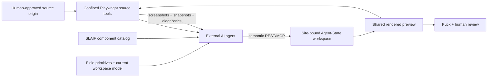

The browser worker is observational. It never writes content or publishes; the agent must express every change through semantic workspace APIs.

### 23.3 Source tool contract

Level 4 or an explicit `source:inspect` scope may expose:

```text
source.open
source.snapshot
source.screenshot
source.extract_links
source.extract_metadata
source.fetch_asset
```

The workspace records approved origin, subdomain policy, maximum pages, bytes, redirects, downloads, and duration. A source page cannot expand the allowlist by linking elsewhere. Credentials are unsupported unless separately designed and approved.

### 23.4 Optional self-hosted import manifest tool

A later `site-import` tool may crawl a source website and emit a neutral manifest:

```json
{
  "source": "http://genericno.ijs.si:5173/",
  "pages": [],
  "links": [],
  "media": [],
  "observed_navigation": [],
  "observed_design_tokens": {}
}
```

The tool runs in a disposable container. It does not write canonical content. Its output is applied only through a Level 4 workspace.

### 23.5 Browser and importer network controls

Any server-side fetch feature must:

- reject loopback, link-local, metadata-service, and private addresses by default;
- resolve DNS and recheck destination addresses;
- limit redirects, response sizes, MIME types, and timeouts;
- require explicit administrator allowlisting for private institutional hosts;
- validate every redirect and DNS result against policy;
- keep crawl credentials out of agent prompts;
- use a separate browser network/egress proxy with no route to PostgreSQL, internal control/reviewer services, Docker socket, host files, or unrestricted private networks;
- create a fresh nonpersistent browser context and destroy it after each run;
- impose CPU, memory, time, page, screenshot, trace, and download quotas;
- never use the Agent API process's network identity.

For the IJS example, an administrator could explicitly allow the relevant internal host.

### 23.6 Import manifest API

For large rebuilds, Level 4 may use:

```http
POST /api/agent/v1/import-manifests:validate
POST /api/agent/v1/import-manifests:apply
```

The manifest is bounded, schema-validated, and applied in chunks or one transaction according to size. Every chunk receives a server-owned operation ID and idempotency key.

### 23.7 Required visual iteration

A Level 3 or Level 4 workflow should inspect representative routes at stable targets:

```text
desktop-chromium
desktop-firefox
desktop-webkit
tablet
mobile-chromium
mobile-webkit
```

The product-level names map to pinned Playwright device descriptors. Runtime support may initially use a policy-approved subset, but E2E defines all six. A responsive sweep reports console errors, failed requests, broken links, missing media, horizontal overflow, heading/accessibility warnings, and private artifact IDs. The report improves design quality but does not authorize publication.

---

## 24. REST API architecture

### 24.1 General principles

- Version every public API under `/v1`.
- Use application concepts, never database concepts.
- Generate OpenAPI from the same typed handlers.
- Require idempotency keys for mutations.
- Return stable machine-readable error codes.
- Use UUID resource identifiers.
- Use ETags or row versions for optional client-side concurrency.
- Enforce scopes and constraints before database access.
- Validate again before promotion.

### 24.2 Control API

Representative endpoints:

| Method | Endpoint | Purpose |
|---|---|---|
| `POST` | `/api/control/v1/login` | Local login; OIDC mode uses its standards flow |
| `POST` | `/api/control/v1/sites` | Create site with Platform Administrator authority |
| `GET` | `/api/control/v1/sites` | List sites visible through membership |
| `GET/PATCH` | `/api/control/v1/sites/{site_id}` | Read/update one authorized site |
| `GET/POST` | `/api/control/v1/sites/{site_id}/memberships` | List/add site memberships |
| `PATCH/DELETE` | `/api/control/v1/sites/{site_id}/memberships/{user_id}` | Change/remove membership with governance authority |
| `GET` | `/api/control/v1/roles` | Inspect built-in human roles |
| `GET` | `/api/control/v1/permissions` | Inspect permission catalog |
| `POST` | `/api/control/v1/sites/{site_id}/workspaces` | Create human/agent/import workspace after membership check |
| `GET` | `/api/control/v1/sites/{site_id}/workspaces` | List authorized site workspaces |
| `GET` | `/api/control/v1/workspaces/{id}` | Workspace status |
| `POST` | `/api/control/v1/workspaces/{id}/capabilities` | Issue one-time capability |
| `POST` | `/api/control/v1/capabilities/{id}/revoke` | Revoke one capability |
| `POST` | `/api/control/v1/workspaces/{id}/freeze` | Enter review |
| `GET` | `/api/control/v1/workspaces/{id}/changes` | Semantic changes |
| `GET` | `/api/control/v1/workspaces/{id}/operations` | Operation timeline/dependencies |
| `GET` | `/api/control/v1/workspaces/{id}/conflicts` | Advisory conflicts |
| `POST` | `/api/control/v1/workspaces/{id}/accept` | Queue full acceptance |
| `POST` | `/api/control/v1/workspaces/{id}/accept-operations` | Queue selective acceptance |
| `POST` | `/api/control/v1/workspaces/{id}/discard` | Queue discard |
| `GET` | `/api/control/v1/workspaces/{id}/browser-runs` | List visual/source evidence visible to reviewer |
| `GET` | `/api/control/v1/jobs/{id}` | Terminal job status |
| `GET` | `/api/control/v1/audit` | Authorized audit search |

### 24.3 Editor API

The human Editor API uses the same domain commands and validation schemas but authenticates a browser user and resolves the workspace server-side.

Representative routes:

```http
GET    /api/editor/v1/workspaces/{workspaceId}/pages
POST   /api/editor/v1/workspaces/{workspaceId}/pages
PATCH  /api/editor/v1/workspaces/{workspaceId}/pages/{pageId}
DELETE /api/editor/v1/workspaces/{workspaceId}/pages/{pageId}

GET/POST/PATCH/DELETE /api/editor/v1/workspaces/{workspaceId}/content-types/...
GET/POST/PATCH/DELETE /api/editor/v1/workspaces/{workspaceId}/content-items/...
GET/POST/PATCH/DELETE /api/editor/v1/workspaces/{workspaceId}/collection-views/...

GET    /api/editor/v1/workspaces/{workspaceId}/pages/{pageId}/composition
POST   /api/editor/v1/workspaces/{workspaceId}/pages/{pageId}/components
PATCH  /api/editor/v1/workspaces/{workspaceId}/components/{componentId}
POST   /api/editor/v1/workspaces/{workspaceId}/components/{componentId}/move
DELETE /api/editor/v1/workspaces/{workspaceId}/components/{componentId}

GET    /api/editor/v1/workspaces/{workspaceId}/theme
PATCH  /api/editor/v1/workspaces/{workspaceId}/theme
```

The `workspaceId` is an application resource identifier, not trusted database context. The server verifies human access and returns the corresponding server-owned COW session UUID.

### 24.4 Agent discovery endpoints

```http
GET /api/agent/v1/session
GET /api/agent/v1/permissions
GET /api/agent/v1/site-model
GET /api/agent/v1/content-model/field-types
GET /api/agent/v1/component-catalog
GET /api/agent/v1/theme-schema
GET /api/agent/v1/validation-rules
```

The response tells the agent what it may do without exposing internal branch state.

### 24.5 Agent content-model and item endpoints

```http
GET    /api/agent/v1/content-model/field-types
GET    /api/agent/v1/content-types
POST   /api/agent/v1/content-types
GET    /api/agent/v1/content-types/{type_id}
PATCH  /api/agent/v1/content-types/{type_id}
DELETE /api/agent/v1/content-types/{type_id}

POST   /api/agent/v1/content-types/{type_id}/fields
PATCH  /api/agent/v1/fields/{field_id}
DELETE /api/agent/v1/fields/{field_id}

GET    /api/agent/v1/content-types/{type_id}/items
POST   /api/agent/v1/content-types/{type_id}/items
GET    /api/agent/v1/content-items/{item_id}
PATCH  /api/agent/v1/content-items/{item_id}
DELETE /api/agent/v1/content-items/{item_id}

GET/POST/PATCH/DELETE /api/agent/v1/collection-views/...
```

Level 4 scope is required for model definitions; lower presets operate only on model/item/view capabilities granted to them. There are no `/news`, `/events`, or `/people` physical-domain APIs.

### 24.6 Agent page and composition endpoints

```http
GET    /api/agent/v1/pages
GET    /api/agent/v1/pages/{id}
POST   /api/agent/v1/pages
PATCH  /api/agent/v1/pages/{id}
DELETE /api/agent/v1/pages/{id}

POST   /api/agent/v1/pages/{id}:move
POST   /api/agent/v1/pages/{id}:restore

GET    /api/agent/v1/pages/{id}/composition
POST   /api/agent/v1/pages/{id}/components
PATCH  /api/agent/v1/components/{id}
DELETE /api/agent/v1/components/{id}
POST   /api/agent/v1/components/{id}/move

GET    /api/agent/v1/navigation
PUT    /api/agent/v1/navigation/{id}
POST   /api/agent/v1/navigation/{id}/items
PATCH  /api/agent/v1/navigation-items/{id}
DELETE /api/agent/v1/navigation-items/{id}

GET/POST/PATCH/DELETE /api/agent/v1/redirects/...

GET    /api/agent/v1/design-system
GET    /api/agent/v1/component-catalog
GET    /api/agent/v1/theme
PATCH  /api/agent/v1/theme
GET    /api/agent/v1/global-regions
PATCH  /api/agent/v1/global-regions/{id}
```

Every operation validates capability/site/workspace binding, catalog and schema versions, component props and data bindings, structural limits, row versions, quotas, and idempotency.

### 24.7 Media endpoints

```http
POST   /api/agent/v1/media
GET    /api/agent/v1/media
GET    /api/agent/v1/media/{id}
PATCH  /api/agent/v1/media/{id}
DELETE /api/agent/v1/media/{id}
```

Delete removes a workspace reference or marks the asset deleted; it never overwrites or directly removes an immutable object.

### 24.8 Curated browser-tool boundary

External REST/MCP operations include stable product actions corresponding to `preview.screenshot`, `preview.snapshot`, diagnostics, responsive sweeps, and explicitly authorized `source.*` inspection. The caller supplies a path/target or source-relative request, never a workspace ID, preview origin, internal credential, or arbitrary URL.

The raw browser API is internal only:

```http
POST /internal/browser/v1/preview-runs
POST /internal/browser/v1/source-runs
GET  /internal/browser/v1/runs/{run_id}
```

Agent API resolves site/workspace/origin policy before creating the job. Raw Playwright commands, `page.evaluate`, arbitrary JavaScript, and arbitrary navigation are absent.

### 24.9 Batch endpoint

```http
POST /api/agent/v1/batches
Idempotency-Key: ...

{
  "description": "Create the new workshop landing area",
  "operations": [
    {"op": "create_page", ...},
    {"op": "create_component", ...},
    {"op": "update_navigation", ...}
  ]
}
```

Limits:

- bounded number of operations;
- bounded body size;
- one database transaction;
- one server-owned operation UUID;
- all-or-nothing validation;
- no arbitrary endpoint URLs in the batch.

Browser and model-transform jobs also require idempotency and have bounded inputs, but need not share one synchronous database transaction with long browser execution.

### 24.10 Error contract

```json
{
  "error": {
    "code": "SCOPE_REQUIRED",
    "message": "This operation requires navigation:write.",
    "request_id": "req_...",
    "operation_id": null,
    "details": {
      "required_scope": "navigation:write"
    }
  }
}
```

Important status mappings:

| Status | Meaning |
|---|---|
| `400` | Malformed request |
| `401` | Invalid, expired, or revoked capability |
| `403` | Scope/resource policy denial |
| `404` | Resource not visible in this site/workspace |
| `409` | Workspace frozen, idempotency mismatch, resource conflict, or promotion conflict |
| `413` | Upload/request too large |
| `422` | Domain/schema validation failure |
| `429` | Quota/rate limit exceeded |
| `503` | Temporary worker/database/browser unavailability |

### 24.11 No agent terminal or unrestricted endpoints

The agent API deliberately has no:

```text
publish
accept
discard
create-workspace
mint-token
manage-users
manage-roles
run-sql
run-alembic
run-shell
install-component
register-field-primitive
evaluate-javascript
open-arbitrary-url
change-server
```

---

## 25. MCP architecture

### 25.1 Purpose

MCP improves agent usability but must not become a parallel authorization or business-logic layer.

### 25.2 Tool categories

```text
Site discovery
    site.describe
    site.list_locales
    site.get_structure

Content model
    model.list_field_types
    model.list_content_types
    model.create_content_type
    model.add_field
    model.update_field
    model.validate

Content
    content.list_items
    content.create_item
    content.update_item
    content.delete_item

Pages and composition
    page.create
    page.move
    page.delete
    component.add
    component.update
    component.move
    component.delete

Design and media
    design.get_catalog
    design.get_theme
    design.update_theme
    media.upload

Preview
    preview.open
    preview.screenshot
    preview.snapshot
    preview.console_errors
    preview.network_failures
    preview.check_links
    preview.check_media
    preview.check_overflow
    preview.check_heading_structure
    preview.run_responsive_sweep
    preview.list_artifacts

Source import, explicitly authorized
    source.open
    source.snapshot
    source.screenshot
    source.extract_links
    source.extract_metadata
    source.fetch_asset
```

### 25.3 Implementation rule

Every tool makes an HTTP call to the Agent API using the presented capability. The adapter does not call PostgreSQL or the browser worker directly. Agent API derives the site, workspace, preview origin, and approved source origins; MCP arguments cannot override them.

A visual tool returns an MCP image content result where supported, or an artifact ID plus a short-lived authenticated retrieval URL and structured diagnostic summary. It never returns a public media URL for a private workspace artifact.

Do not expose a general Playwright MCP server. Browser automation is not a security boundary. Only the curated product operations above are external, and they cannot evaluate arbitrary code, access `file://`, or navigate arbitrary URLs.

### 25.4 Tool confirmation

The system does not depend on model-side confirmation for safety. Clients may still show confirmations, but the isolation boundary remains effective even when an agent performs destructive calls without confirmation.

### 25.5 OpenAPI compatibility

Agents that do not support MCP use the same REST API and OpenAPI document. No capability is tied to one AI vendor.

---

## 26. Semantic operation journal

The foundation records low-level operation identity and dependencies. SLAIF adds application meaning.

### 26.1 Audit schemas

Recommended tables:

```text
audit.semantic_event
audit.security_event
audit.promotion_event
audit.job_event
audit.browser_event
```

The agent runtime role cannot update or delete audit rows. It inserts semantic events only through a controlled function.

### 26.2 Event shape

```json
{
  "event_id": "uuid",
  "sequence": 47,
  "occurred_at": "2026-08-16T11:32:19.412Z",
  "site_id": "uuid",
  "workspace_id": "uuid",
  "capability_id": "uuid",
  "delegator_id": "uuid",
  "operation_id": "uuid",
  "request_id": "req_...",
  "trace_id": "trace_...",
  "actor_type": "AGENT",
  "method": "PATCH",
  "route_template": "/api/agent/v1/pages/{id}",
  "resource_type": "page",
  "resource_id": "uuid",
  "semantic_action": "PAGE_RENAMED",
  "base_row_version": 12,
  "result_row_version": 13,
  "before_digest": "sha256:...",
  "after_digest": "sha256:...",
  "patch": [
    {"op": "replace", "path": "/translations/en/title", "value": "Research"}
  ],
  "scope_used": "content-item:write",
  "status": "SUCCEEDED",
  "previous_event_digest": "sha256:..."
}
```

### 26.3 Atomicity

A successful content mutation and its semantic event are committed in the same PostgreSQL transaction. A mutation without an audit event is a transaction failure.

### 26.4 Cross-check with agent-cow operations

Before promotion, the worker verifies:

- every selected foundation operation UUID has at least one semantic event, unless explicitly classified as system-generated;
- every semantic event operation UUID exists in the workspace operation set;
- event ordering is consistent;
- resource digests match the final visible state where applicable;
- selected operations are causally closed.

This does not make audit cryptographically immutable against a fully compromised database owner, but it detects normal application omissions and straightforward tampering.

Model-definition changes, declarative mappings, component mutations, Puck-originated human operations, and browser-run requests/results use explicit semantic action types. Browser events reference `browser_run_id`, stable target, requested route or approved source origin, summary digest, and private artifact IDs; they never contain the capability secret, internal preview credential, or unrestricted trace payload. Browser evidence has no foundation operation UUID unless it accompanies a database mutation and is classified separately during the pre-promotion cross-check.

### 26.5 Sensitive values

The audit policy may:

- store full JSON patches for public website content;
- redact secrets and personal fields;
- encrypt selected before/after values;
- retain only hashes for sensitive deployments.

Website content is generally low sensitivity, but user identities and capability material are never logged.

---

## 27. Idempotency and operation grouping

AI agents retry. Network clients retry. Every mutation, declarative model transformation, and browser-job request must be safely repeatable.

### 27.1 Idempotency key

Mutating requests require:

```http
Idempotency-Key: <client-generated opaque value>
```

The server maps:

```text
capability_id + idempotency_key
    → server operation UUID + request digest + stored result
```

A retry with the same digest returns the stored result. A retry with different content returns `409 IDEMPOTENCY_MISMATCH`.

Long-running browser jobs map their idempotency key to a stable `browser_run_id` and stored terminal result rather than holding an HTTP transaction open. Repeated model validation against the same workspace watermark and definition digest may reuse a cached report.

### 27.2 Server-owned operation UUID

The client-supplied key is not used directly as the PostgreSQL operation UUID. The server creates a UUID and passes it to `asyncpg_cow_session`.

### 27.3 Multi-request logical tasks

An agent may optionally send:

```http
X-Agent-Task-Group: <opaque label>
```

This is audit metadata only. It does not alter foundation dependency semantics.

A bounded batch endpoint is preferred when changes must be atomic.

### 27.4 Selective acceptance

The review UI selects operation UUIDs, not arbitrary audit event IDs. The worker:

1. resolves selected semantic events to operation IDs;
2. verifies dependency closure;
3. requests `commit_operations`;
4. records the accepted subset;
5. refreshes remaining workspace state.

---

## 28. Preview and review architecture

### 28.1 Active preview

While `ACTIVE`, humans may watch changes and open the normalized composition in Puck. An authorized agent may request curated Playwright screenshots, accessibility/DOM snapshots, console/network/link/media/overflow checks, and responsive sweeps of the same renderer. Active preview and browser artifacts are not the approval snapshot.

The browser gateway derives the preview origin and workspace from capability state. It issues a short-lived internal preview credential to a fresh isolated context; the agent cannot select another workspace.

### 28.2 Final review snapshot

When review begins:

1. revoke capabilities;
2. move to `FREEZING`;
3. acquire the product-level exclusive workspace lock;
4. obtain final operation/dependency/conflict state;
5. read and normalize the complete workspace website projection;
6. validate models/items, query DSL, composition/bindings, routes, accessibility rules, and media;
7. record the current canonical site revision;
8. attach completed browser-run summaries and private artifact references as advisory evidence;
9. store an immutable, content-digested review snapshot;
10. move to `REVIEW`.

The review preview is then stable because it is rendered from the snapshot, not because logical CoW itself is a frozen database snapshot.

### 28.3 Review UI sections

The review page contains:

1. **Rendered website**
2. **Summary**
   - content-type, field, and mapping changes
   - content item and relation changes
   - created/modified/deleted resources
   - composition, theme, navigation, and responsive changes
   - media changes
3. **Semantic operation timeline**
4. **Resource-by-resource diff**
5. **Visual evidence**
   - desktop/tablet/mobile screenshots
   - diagnostics, accessibility warnings, and responsive sweep
   - link to open the normalized composition in Puck where policy permits
6. **Warnings and deterministic validation**
7. **Conflict report**
8. **Permission and quota use**
9. **Agent, source-origin, and browser-session metadata**
10. **Accept / selective accept / discard**

### 28.4 Selective preview

The foundation supports visible operation filtering. The Render API may preview a causally closed selected operation set without mutating the workspace.

This enables:

> Show me what the website would look like if I accept the new pages and navigation but exclude the theme redesign.

Selective preview is an advanced feature. Whole-session review remains the default.

### 28.5 Human confirmation

For Level 4 or high-delete sessions, acceptance should require:

- re-authentication or recent-auth check;
- explicit summary acknowledgement;
- typed confirmation for site-wide deletion/replacement;
- optional second publisher according to site policy.

These controls supplement rather than replace isolation.

A green responsive report, zero console errors, or an accessibility pass never changes workspace state and never satisfies the human confirmation requirement by itself.

---

## 29. Promotion and discard semantics

### 29.1 Full acceptance

The worker uses:

```python
async with asyncpg_cow_reviewer(reviewer_pool) as reviewer:
    # trusted native calls may update control state in this transaction
    result = await reviewer.commit_session(
        workspace_id,
        schema="content",
        defer_fk_constraints=True,
        conflict_policy="error",
    )
```

Within the same transaction it:

- marks the job running;
- verifies workspace `REVIEW`;
- locks the canonical site-revision row;
- verifies that the current revision equals the approved snapshot's base revision;
- verifies the review-snapshot digest plus renderer, catalog, composition, Puck-adapter, and content-model versions;
- validates selected operation set and audit;
- reruns deterministic content-type/item/mapping, relation, query-DSL, component-binding, route, locale, accessibility, and site-confinement validation;
- ensures required public media objects exist;
- commits COW changes;
- increments canonical site revision;
- records promotion event;
- marks workspace `ACCEPTED`;
- marks job completed;
- emits an outbox event for cache invalidation.

### 29.2 Selective acceptance

The worker calls the foundation's selective promotion method with a causally closed operation set.

The UI must explain that later dependent operations cannot remain if their prerequisite is discarded, and that surviving operations may be rebased according to foundation semantics.

### 29.3 Discard

Discard is also a reviewer-controlled atomic action:

- discard all pending operations;
- mark workspace `DISCARDED`;
- revoke capabilities;
- schedule session staging media removal;
- schedule private browser artifacts for retention-based cleanup;
- retain audit according to policy.

### 29.4 Conflict handling

If the canonical site revision differs from the approved review snapshot, promotion stops before content mutation with `409 SITE_REVISION_CHANGED`. The workspace returns to `REVIEW_REQUIRED`, and the human must regenerate and inspect a new snapshot. This conservative MVP rule guarantees that the approved rendered site is the site eligible for publication.

The foundation's row/schema conflict check is still repeated under locks. On `CowConflictError`:

- the PostgreSQL transaction rolls back;
- canonical state remains unchanged;
- pending workspace changes remain;
- workspace moves to `CONFLICTED` or back to `REVIEW`;
- the UI displays structured conflicts;
- HTTP control status reports `409`.

Conflict types include:

```text
BASE_ROW_CHANGED
BASE_ROW_DELETED
BASE_ROW_CREATED
BASE_SCHEMA_CHANGED
```

SLAIF does not expose the overwrite policy.

Model validation failures behave like other pre-promotion validation failures: no canonical row changes, the snapshot/workspace remains available for review or correction, and the UI reports affected definitions/items/bindings. Browser evidence is verified for integrity and visibility but a missing or failed advisory browser run does not silently become publication authorization; site policy may separately require acknowledged visual evidence as a human-review condition.

### 29.5 Conflict resolution roadmap

MVP options:

- discard;
- create a fresh workspace and reapply;
- manually edit the current workspace to a new intended result;
- selectively accept non-conflicting causally closed operations.

Later:

- automated semantic rebase;
- field-level three-way merge;
- conflict-specific agent repair session.

### 29.6 No whole-database replacement

Acceptance never replaces the entire database, schema, or site state with a workspace copy. It promotes the selected operation state through the foundation's conflict-safe transaction.

---

## 30. Media architecture

### 30.1 Goals

Media must satisfy the same basic safety story as content:

- no overwrite of accepted bytes;
- no agent deletion of canonical bytes;
- workspace preview of new uploads;
- deterministic deduplication;
- no hosted object store required;
- safe acceptance and discard.

All storage is accessed through a `MediaStore` contract with immutable put, open, exists, unreferenced-delete, and authenticated-read operations. `LocalVolumeMediaStore` is the default; shared filesystem and later permissively licensed self-hosted implementations preserve the same digest and authorization semantics.

### 30.2 Storage layout

```text
/data/media/
├── temp/
│   └── <upload-id>
├── staging/
│   └── <workspace-id>/
│       └── <sha256>
├── artifacts/
│   └── workspaces/<workspace-id>/browser/<run-id>/
│       └── <sha256>
└── public/
    └── <sha256-prefix>/
        └── <sha256>
```

### 30.3 Upload flow

1. Stream to a bounded temporary file.
2. Compute SHA-256 while streaming.
3. Verify MIME by content, not only filename.
4. Reject prohibited types.
5. Inspect dimensions/page count and decompression limits.
6. Optionally malware-scan.
7. Atomically rename into the workspace staging directory.
8. Create a COW `MediaAsset` row referencing the digest.
9. Append semantic audit event.

### 30.4 Preview serving

Session media is served through an authenticated preview endpoint:

```text
/preview-media/<workspace-id>/<digest>
```

The endpoint verifies that:

- the human may review the workspace;
- a visible workspace media row references the digest;
- the file belongs to that workspace or already exists publicly.

NGINX never exposes the staging directory or private artifact namespace directly. It proxies authorized reads to the media service.

### 30.5 Promotion

Before content promotion commits, the worker:

1. enumerates selected media references;
2. verifies all staging files;
3. hard-links or copies each digest into the public content-addressed path, idempotently;
4. promotes database references;
5. commits content and terminal status.

A public orphan produced before a failed database commit is harmless and later garbage-collected.

The database stores the digest, not an environment-specific absolute path.

### 30.6 Browser artifacts

Screenshots, traces, accessibility/DOM snapshots, and diagnostic reports are immutable workspace-scoped artifacts. They are never promoted as public site media automatically. Access requires authorized human membership/review access or a short-lived agent artifact result bound to the requesting capability; URLs expire and carry no capability secret. Artifact type, browser target, route/source, run ID, digest, and retention are recorded in control/audit data.

### 30.7 Public serving

NGINX proxies public media reads to the media service, or an explicitly configured shared-filesystem deployment may use safe direct immutable serving. URLs contain the digest and use long immutable cache headers.

### 30.8 Deletion

Deleting a media asset removes or changes references. The underlying public object is retained until:

- no canonical row references it;
- no retained historical policy requires it;
- the configured long GC window has expired;
- backup policy permits deletion.

Private artifacts follow their shorter workspace retention and quota policy. GC cannot remove a retained review artifact or a currently authorized run result.

### 30.9 Foundation blob subsystem

The upstream-derived `agent-cow` blob subsystem is not used by Agent-Site. The media design above is application-specific, immutable, inspectable, scale-adaptable, and packaged without a mandatory S3 service.

---

## 31. External side effects

Database isolation does not automatically isolate email, webhooks, search indexes, analytics, or third-party APIs.

### 31.1 Rule

Active workspaces may propose side effects but cannot execute production side effects.

### 31.2 Proposed side-effect model

```text
agent operation
    ↓
COW ProposedSideEffect row
    ↓
review UI
    ↓
accepted promotion
    ↓
canonical outbox row
    ↓
trusted dispatcher
```

For the website MVP:

- email is suppressed;
- subscriber notifications are suppressed;
- webhooks are suppressed;
- search indexing is disabled for preview;
- public sitemap changes occur only after promotion;
- NGINX/application cache invalidation occurs only after promotion;
- analytics are disabled or tagged as preview.

Source-browser downloads remain private import artifacts. They do not become canonical/public media or trigger external actions; the agent must explicitly ingest validated bytes through a workspace media operation, which remains subject to review and promotion.

### 31.3 Not permitted

The agent API never provides direct tools for:

- DNS changes;
- payment;
- user invitations;
- email transmission;
- arbitrary webhook delivery;
- package installation;
- shell execution.

---

## 32. Authentication architecture

### 32.1 Human authentication modes

The default Compose demonstrator includes local authentication so it runs with no external identity service.

Production may enable standards-based OIDC against an institutional identity provider, but OIDC is optional and not a runtime requirement for the repository.

### 32.2 Secure local first-run setup

Do not ship a permanent hard-coded `admin/admin` or documented demo administrator. On an uninitialized installation, bootstrap generates a random, expiring, one-use setup-token digest and prints the setup URL and plaintext token to the operator console. The human visits `/setup`, submits the token, and creates the first Platform Administrator. Successful initialization destroys the token and closes the route. A documented one-shot `create-admin` Compose command may be an operator fallback.

Production startup and setup refuse:

- an absent/expired/reused setup token;
- weak signing secrets;
- HTTP cookie settings on a public hostname;
- default database passwords.

### 32.3 OIDC identity

OIDC mode stores the stable identity key as `(oidc_issuer, oidc_subject)`. Email and display name are mutable profile attributes and are never the immutable authorization key. OIDC remains optional and Agent-Site works without an external identity account.

### 32.4 Human browser sessions

Use:

- HTTP-only cookies;
- `Secure` in production;
- `SameSite=Lax` or stricter;
- CSRF tokens for state-changing control requests;
- short inactivity timeout;
- recent-auth timestamp for high-risk acceptance;
- password hashing with an approved memory-hard algorithm;
- no tokens in local storage.

### 32.5 Service-to-service authentication

Internal services communicate over the private Compose network and use separate database credentials. Sensitive internal HTTP endpoints additionally use a generated service secret or mutual authentication in production.

The Render API and browser worker raw API are not routed externally by NGINX. Browser preview credentials are short-lived and run-bound; browser contexts never receive a human cookie or agent capability.

---

## 33. Authorization enforcement

### 33.1 Policy layers

```text
authenticated identity
    ↓
trusted site/domain resolution
    ↓
site membership and human role
    ↓
delegation ceiling
    ↓
workspace effective scopes
    ↓
capability scopes
    ↓
route requirement
    ↓
resource constraint
    ↓
domain invariant
```

### 33.2 Route declaration

Each mutating handler declares:

```python
@requires_scopes("page:create")
async def create_page(...):
    ...
```

CI scans the route table and fails if a mutating route lacks an explicit policy declaration.

### 33.3 Database defense

The semantic gateway is trusted, but PostgreSQL adds:

- role separation;
- no direct base/change access;
- no schema creation;
- no reviewer authority in the Agent API role;
- fail-closed missing session context;
- parameterized SQL;
- controlled audit and capability functions.

### 33.4 Site scoping

Revision 2.1 retains the multi-site-capable v1 model:

- every site-owned row has an immutable site association;
- membership, role, delegation ceiling, quotas, workspaces, capabilities, media, browser runs, audit, and canonical revision are site-scoped;
- a capability resolves to exactly one site and workspace;
- human site selection is checked against membership;
- public host/path routing resolves through normalized trusted `site_domain` data;
- every domain service and repository method requires `SiteContext`;
- queries constrain object IDs to that context, and cross-site negative tests are mandatory;
- uniqueness and foreign-key design includes `site_id` where practical.

The default demo seeds one site and may expose additional local sites under `/s/<site-slug>/` and `/admin/sites/<site-id>/`. Production maps normalized hostnames through `control.site_domain`; a forged `Host` header alone never grants membership or preview access.

This is institutional application tenancy inside one trusted installation. It does not claim hostile public-SaaS isolation, per-tenant encryption, or mutually distrustful database boundaries. PostgreSQL RLS or dedicated database/deployment profiles are follow-up defenses after compatibility and invariant tests.

---

## 34. Input validation and content safety

### 34.1 Rich text

Rich text is stored in a structured portable representation. Rendering uses an allowlist.

Forbidden content includes:

- scripts;
- event-handler attributes;
- style tags;
- executable URLs;
- unapproved iframes;
- arbitrary embedded HTML.

### 34.2 URLs

Allowed schemes:

```text
https
http where site policy permits
mailto
tel
relative internal routes
```

Reject:

```text
javascript:
data: except controlled image ingestion
file:
custom executable schemes
```

External links may automatically receive safe `rel` attributes.

### 34.3 Media

Validate:

- file size;
- MIME signature;
- extension consistency;
- dimensions;
- image pixel count;
- archive/decompression behavior;
- PDF page count where supported;
- SVG sanitization or disable SVG initially.

### 34.4 Structural limits

Site policy sets:

- maximum pages;
- maximum page depth;
- maximum components per page and composition depth;
- maximum content types, fields per type, object/repeatable-object depth, and definition complexity;
- allowed field primitives and relation target types;
- query-DSL operators, joins/relations, sorts, projections, result size, execution time, and cost;
- maximum rich-text size;
- maximum navigation depth;
- maximum batch size;
- maximum deletes;
- maximum redirects;
- maximum imported URLs;
- maximum browser routes, targets, runs, screenshots, downloads, bytes, time, and concurrency.

### 34.5 Theme constraints

Theme validation rejects:

- invalid color formats;
- inaccessible foreground/background combinations below policy threshold;
- uninstalled fonts;
- unsupported token values;
- raw CSS;
- external font URLs;
- arbitrary breakpoints.

### 34.6 Content-model and composition validation

The server rejects unknown field primitives, duplicate type/field keys, recursive definitions beyond limits, invalid declarative mappings, dangling or cross-site relations, unbounded collection queries, unknown components, invalid slots/children, executable props, bad field/view bindings, unsupported catalog/schema versions, and nonallowlisted responsive values. Generated client and agent schemas are discovery aids; server validation remains authoritative.

### 34.7 Browser input validation

Preview paths are normalized internal routes, not origins. Source requests are resolved relative to the recorded approved origin. The gateway and egress layer reject credentials in URLs, `file://`, loopback, link-local, metadata, unauthorized private/RFC1918 addresses, DNS rebinding, out-of-origin redirects, excessive downloads, unsupported MIME types, and arbitrary evaluation.

---

## 35. Threat model

The agent is treated as an untrusted principal capable of intentionally hostile behavior. The human delegator may make mistakes. The semantic gateway, promotion worker, PostgreSQL owner, and host administrator are trusted to different degrees.

### 35.1 Assets

Protected assets include:

- canonical website content;
- unpublished workspace content;
- media bytes;
- private screenshots, traces, snapshots, and source-import data;
- human identities and memberships;
- capability secrets;
- audit history;
- reviewer authority;
- database credentials;
- signing keys;
- backups.

### 35.2 Trust boundaries

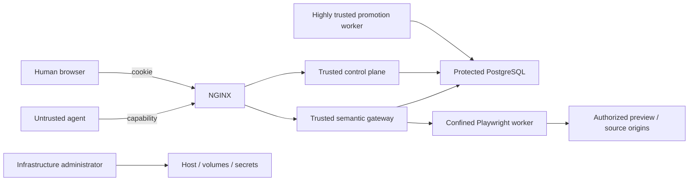

### 35.3 Threat table

| Threat | Example | Mitigation |
|---|---|---|
| Session substitution | Agent supplies another workspace UUID | UUID never accepted as database context from agent input |
| Canonical escape | Agent discovers hidden main route | Agent process has no canonical/reviewer authority |
| Scope escalation | Level 1 calls theme endpoint | Route and resource policy denies before DB |
| Self-publication | Agent calls accept endpoint | Agent token not accepted by Control API; human auth required |
| Token theft | Capability leaks in prompt/log | High entropy, short TTL, one-time display, redaction, revoke, quotas |
| Replay | Agent retries or attacker replays mutation | Idempotency key + capability expiry and state |
| Prompt injection | Source page instructs agent to erase content | Erasure stays in workspace; human review remains |
| SQL injection | Malicious text reaches query | Typed models, parameterized SQL, no raw SQL tool |
| Arbitrary SQL | Agent requests native query | No endpoint; runtime credentials never exposed |
| Context reset | Trusted code/plugin resets GUC | Safe session validates context; no arbitrary native access in handlers |
| Cross-workspace read | Agent asks for another session | Capability resolves one server-owned session only |
| Cross-site object substitution | Site A caller supplies a Site B UUID | Site derived from capability/membership; every lookup constrained to trusted site context; composite constraints and negative tests |
| Host-header site confusion | Forged host selects another site | Normalized trusted domain mapping plus membership/capability checks; Host never grants access |
| User-role escalation | Site Editor changes own role or ceiling | Membership/role APIs are human-only and require Site Owner/Platform Administrator permission |
| Content-model abuse | Thousands of fields or recursive objects | Per-site model/field/depth/complexity quotas and bounded primitive catalog |
| Query-DSL abuse | Unbounded or expensive collection query | Allowlisted operators/fields, pagination, cost/time limits, index policy; no SQL |
| Invalid model promotion | Required field removed while items remain invalid | Freeze- and promotion-time definition/item validation and declarative mapping report |
| Puck client bypass | Crafted request performs a hidden action | Backend site/scope/schema checks are authoritative |
| Component injection | Unknown component or executable prop | Versioned allowlist and JSON Schema; no arbitrary JS/CSS/code |
| In-flight write during review | Request races freeze | State revoke + product shared/exclusive workspace lock; foundation locks still protect promotion |
| Concurrent canonical conflict | Another workspace promotes touched row | First-touch conflict detection and locked promotion |
| Promotion partial failure | FK or status update fails after first table | One transaction-owning reviewer scope rolls back all |
| Audit omission | Content changes without semantic event | Event required in same transaction; pre-promotion cross-check |
| Audit modification | Runtime updates event | No update/delete grants; hash chain; backups |
| XSS | Agent inserts scripts | Structured content and sanitization at write and render |
| CSS abuse | Agent breaks layout/security | Tokenized design system; no raw CSS |
| Malicious media | Decompression bomb or script SVG | Size/dimension/MIME checks; SVG disabled or sanitized |
| Published media overwrite | Upload uses same filename | Content-addressed immutable storage |
| Preview leakage | Draft indexed or shared | Human auth, noindex, private caching, no token in URL |
| SSRF | Importer fetches metadata/internal service | Default network denial and explicit host allowlist |
| Browser SSRF | Source redirects to metadata/internal API | Separate egress policy, DNS and redirect revalidation, private/link-local rejection |
| Browser file access | Agent requests `file://` or mounted source | File URLs blocked, no repository/host mount, non-root read-only container |
| Browser session leakage | Storage/cookies cross workspaces | Fresh context, no persistent profile or human cookie, destruction after run |
| Browser-worker escalation | Compromised page reaches DB or Docker socket | Separate network, no DB/reviewer credentials, no Docker socket, narrow service token |
| Screenshot leakage | Unpublished screenshot becomes public media | Private artifact namespace and authenticated expiring reads |
| Visual-tool abuse | Thousands of full-page screenshots | Per-capability/site quotas, queue budgets, concurrency limits, cancellation/timeouts |
| Mobile-only defect | Desktop works while mobile governance/site breaks | Required responsive sweeps and mobile E2E paths |
| Setup takeover | Public uninitialized instance claimed | Random expiring one-time operator setup token and initialization closure |
| Edge-specific bypass | Apache adapter omits an NGINX rule | All security-critical policy enforced in application; edge is defense in depth |
| Side-effect escape | Agent sends email/webhook | Proposed-side-effect/outbox model |
| Resource exhaustion | Massive import or loop | Request, operation, upload, and concurrency quotas |
| Zombie workspaces | Crash prevents cleanup | Scheduler, TTL, idempotent discard |
| Reviewer credential theft | Agent API image contains secret | Separate runtime containers/secrets; reviewer secret only in worker |
| Setup credential theft | Long-running service has owner password | Setup secret used only by one-shot bootstrap |
| Host compromise | Root reads volumes/secrets | Outside agent-isolation guarantee; OS hardening, backup, incident response |
| Backup loss | Server disk fails | Separate backup and restore architecture |

### 35.4 Out-of-scope guarantee

SLAIF Agent-Site does not claim to protect canonical data from a fully compromised host administrator, PostgreSQL owner, or malicious promotion worker, nor to isolate mutually hostile tenants in one trusted installation. Conventional least privilege, monitoring, backups, and infrastructure security remain required.

---

## 36. Security headers and browser controls

NGINX/Apache and Next.js apply:

```text
Content-Security-Policy
X-Content-Type-Options: nosniff
Referrer-Policy
Permissions-Policy
Strict-Transport-Security in production
frame-ancestors policy
```

The CSP should avoid unsafe inline execution. Preview content is rendered through the same safe components.

Session tokens are never accepted in URL query strings.

Security-critical header behavior must be tested through both supported edge adapters, but authentication and authorization do not depend on headers the client can forge. Preview and setup responses use strict no-store/noindex policy.

The browser worker is a separate browser-security boundary: non-root container, read-only root filesystem, no repository or Docker socket mount, isolated nonpersistent contexts, restricted downloads, blocked file access, service-only credentials, egress enforcement with DNS/redirect revalidation, and hard CPU/memory/time/concurrency quotas. Playwright allowlists are defense in depth rather than the sole network boundary.

---

## 37. Observability

### 37.1 Correlation identifiers

Every request receives:

```text
request_id
trace_id
site_id where applicable
workspace_id where applicable
capability public ID, never secret
operation_id for mutations
browser_run_id and stable target where applicable
human delegator ID
```

### 37.2 Structured logs

Logs are JSON and include:

- service;
- route template;
- status;
- latency;
- workspace state;
- scope decision;
- operation ID;
- site ID, browser run/target, artifact count, and egress-policy result where applicable;
- database transaction result;
- promotion result.

Logs exclude:

- capability secrets;
- passwords;
- database URLs;
- human session cookies;
- full sensitive payloads;
- source credentials, browser internal preview credentials, and private artifact retrieval tokens.

### 37.3 Metrics

Expose internal metrics for:

- active workspaces;
- expired capabilities;
- requests by status;
- scope denials;
- operations per session;
- promotion duration;
- conflicts;
- discarded sessions;
- queue depth;
- failed jobs;
- media bytes;
- cleanup lag;
- database pool saturation;
- sites and workspaces by policy class;
- browser queue latency, active contexts, run duration, target/device, timeouts, and policy denials;
- screenshots/artifact bytes and retention lag;
- content-model validation duration/failures and query-DSL cost rejections.

Prometheus-compatible metrics may be enabled without shipping a mandatory Prometheus container in the default stack.

### 37.4 Audit versus logs

Operational logs are not the semantic audit. Logs may rotate. Audit events are durable database records with explicit retention.

---

## 38. Job queue architecture

A separate broker is unnecessary for the MVP.

### 38.1 PostgreSQL queue

`control.job` contains:

```text
id
job_type
site_id
workspace_id
requested_by
payload
state
attempt_count
available_at
locked_at
locked_by
last_error
created_at
completed_at
```

Workers claim jobs using:

```sql
SELECT ...
FOR UPDATE SKIP LOCKED
```

### 38.2 Job types

```text
FREEZE_FINALIZE
ACCEPT_SESSION
ACCEPT_OPERATIONS
DISCARD_SESSION
EXPIRE_SESSION
VALIDATE_CONTENT_MODEL
BROWSER_PREVIEW_RUN
BROWSER_SOURCE_RUN
RESPONSIVE_SWEEP
MEDIA_GC
ARTIFACT_GC
CACHE_INVALIDATE
AUDIT_EXPORT
```

### 38.3 Idempotency

Each terminal job has a unique key based on workspace and requested terminal action. Browser/model jobs use a digest of site, workspace watermark, operation, routes/targets/origin policy, and request payload. Duplicate requests return the existing job/run.

### 38.4 Retry policy

- transient database/network/browser errors retry with bounded exponential backoff;
- domain conflicts become terminal `CONFLICTED`;
- validation failures return to `REVIEW`;
- programming/invariant failures mark the job failed and require operator inspection;
- no automatic retry changes conflict policy.

Browser job retries always create a fresh context and cannot widen the original approved origins or quotas. Multiple browser, scheduler, and review workers use transactional claims; review authority remains confined to the review-worker process.

---

## 39. Backup and recovery architecture

Agent isolation is not backup.

### 39.1 PostgreSQL

Production should use:

- regular logical or physical base backups;
- WAL archiving for point-in-time recovery;
- tested restore procedures;
- backup encryption;
- retention independent of the application host where possible.

The default Compose demo may include simple `pg_dump` and restore scripts, but production documentation must describe stronger PITR.

### 39.2 Media

Back up:

```text
/data/media/public
```

Staging media may use a shorter retention and does not need the same recovery objective unless policy requires preserving active workspaces.

Private browser artifacts follow an explicit retention policy and are backed up only when review/audit policy requires them. A backup must not accidentally publish artifacts or preserve expired retrieval credentials.

### 39.3 Control and audit

Control/session/audit tables are part of PostgreSQL backup. Audit exports may additionally be written to append-only archival storage.

### 39.4 Recovery objectives

Suggested initial objectives:

```text
RPO: 15 minutes for canonical production data
RTO: 4 hours for a single-server deployment
```

These are deployment targets, not guarantees of the source code.

### 39.5 Restore test

A release is not operationally complete until a backup can be restored into a clean deployment and the following are verified:

- all canonical sites resolve through restored domain/path mappings and render;
- content-type definitions, items, normalized compositions, themes, and relations survive;
- identities, memberships, roles, and delegation ceilings survive;
- installation remains initialized and no stale setup token becomes usable;
- accepted audit history survives;
- capabilities are invalidated or safely restored according to policy;
- media digests resolve;
- retained private browser artifacts remain private and expired retrieval credentials remain invalid;
- COW hardening validation passes.

---

## 40. Performance and scalability

### 40.1 Expected workload

An institutional multi-site installation is not expected to be a high-frequency transaction system. Typical workspaces contain tens to hundreds of operations and individual sites contain thousands rather than billions of rows. Browser work, not request CRUD, is likely to be the dominant bursty resource consumer.

Logical COW is therefore an appropriate default.

### 40.2 Query performance

COW views merge base and changes. Required indexes include:

- changes table session ID;
- operation order;
- primary-key columns;
- site/content lookup columns;
- content-type/definition-version and item-type/status columns;
- explicitly declared indexable JSONB field projections rather than unrestricted agent-created indexes;
- relation source/target/type columns and collection-view bindings;
- component site/page/parent/slot/order keys;
- route and locale indexes;
- audit workspace/operation indexes.

Profile public canonical reads and workspace reads separately.

The query DSL exposes an explicit set of indexable field definitions. Adding a physical index is a developer/administrator-controlled platform feature, not an agent Alembic operation.

### 40.3 Session limits

Initial defaults:

```text
maximum active workspaces: 20 per deployment, further bounded per site
maximum one Level 4 import actively mutating per site by default
maximum session duration: 8 hours
default agent duration: 1 hour
maximum retained review duration: 7 days
per-site browser concurrency and artifact-byte budgets
```

These are policy settings, not foundation limits.

### 40.4 Pool separation

Use distinct asyncpg pools for:

- agent runtime;
- canonical reads;
- preview reads;
- control;
- reviewer worker.

Reviewer pool size should be small. Promotion is rare and lock-sensitive.

Browser worker has no asyncpg pool. It scales separately through PostgreSQL jobs, per-worker context limits, CPU/memory limits, cancellation, timeouts, and horizontal replicas.

### 40.5 Horizontal scaling

Stateless HTTP services may scale horizontally if:

- capability state is in PostgreSQL;
- idempotency is database-backed;
- media uses shared storage;
- review workers claim jobs atomically;
- browser workers and validation jobs claim work atomically;
- NGINX Open Source or Apache load balancing preserves no in-memory authority.

Multi-site quotas cover active workspaces, browser runs, media bytes, request rates, and content/model size. Large or sensitive sites may use a dedicated deployment or database profile. The default deployment remains single-host, and no feature requires NGINX Plus.

---

## 41. Reliability behavior

### 41.1 Agent API crash

An active database transaction rolls back. The idempotency record either commits with the mutation or not at all.

### 41.2 Worker crash during promotion

The reviewer transaction rolls back when the connection terminates. The job lease expires and may retry. Canonical state must not be partially promoted.

### 41.3 NGINX/Web crash

Public/API services restart. PostgreSQL and media volumes remain durable.

### 41.4 Scheduler downtime

Expired capabilities remain rejected by request-time expiry checks. Cleanup resumes later.

### 41.5 Media copy failure

Promotion fails before database commit. Existing canonical state remains unchanged. Any copied orphan is harmless.

### 41.6 Cache invalidation failure

Canonical state is already accepted. Public content may be stale until retry. The outbox job retries independently.

### 41.7 Browser-worker or browser-job failure

A failed/timeout browser run records a bounded error and private failure artifacts where safe, destroys its context, and may retry in a fresh context. It does not roll back already committed workspace edits and cannot change canonical state. Review shows missing/failed visual evidence; site policy determines whether the human must rerun or explicitly acknowledge it.

### 41.8 Model-validation failure

Invalid proposed definitions, items, mappings, queries, or component bindings remain isolated. Freeze or promotion fails before canonical mutation and returns a deterministic report that can be corrected in a workspace or discarded.

### 41.9 Setup interruption

An unused, unexpired setup token remains single-use. Partially committed administrator creation and installation initialization occur in one transaction; restart either resumes the uninitialized flow with a valid/new token or starts as fully initialized, never a half-open setup route.

---

## 42. Testing strategy

### 42.1 Foundation gate

Lock only an `agent-cow-postgresql` PyPI release for which:

- the distribution exists, is not yanked, and its artifact hashes are frozen in `uv.lock`;
- `uv sync --frozen` installs it without a VCS or local-path source;
- the foundation hardening suite, including H01–H09, passes;
- PostgreSQL matrix passes;
- privilege validation passes;
- package license review passes.

### 42.2 Test layers

| Layer | Examples |
|---|---|
| Unit | RBAC/delegation, validators, model mappings, query DSL, composition adapter, token parsing, route projection |
| Contract | OpenAPI, MCP, normalized composition, component props, browser-result schemas |
| Database integration | COW session writes, audit atomicity, role grants |
| Concurrency | Freeze/write races, overlapping promotion, non-overlapping promotion |
| End-to-end | First-run setup, sites/users, Puck, agent model/composition edits, visual loop, review, accept/discard |
| Security | Workspace/site substitution, role/scope escalation, XSS, browser SSRF/file access, token/artifact leakage |
| Packaging | Clean `docker compose up --build` |
| License | Lockfile and OCI SBOM allowlist |
| Recovery | Backup/restore smoke test |
| Accessibility/responsive | Trusted components, Puck shell, public pages, governance flows, desktop/tablet/mobile targets |

### 42.3 Mandatory invariant tests

1. Agent API role cannot `SELECT` base/change tables.
2. Agent API role cannot call commit/discard functions.
3. Control API role cannot mutate content.
4. Public reader cannot write.
5. Agent request without valid session context fails.
6. Client-supplied workspace UUID does not affect DB context.
7. Agent cannot access Control API acceptance routes with its token.
8. Agent can delete every content type, item, page, component, navigation entry, and media reference in its workspace while canonical data remains.
9. Two workspaces do not see each other's changes.
10. Conflicting promotion returns a conflict and preserves both canonical and pending state.
11. Non-overlapping promotion preserves concurrent accepted changes.
12. Cancellation during promotion rolls back all tables.
13. Semantic audit and mutation commit together.
14. Discard removes pending content and staging media.
15. Accepted media cannot be overwritten.
16. Preview cannot be indexed or opened without authorization.
17. Level 1 cannot call Level 2–4 operations.
18. Delegator cannot grant above their ceiling.
19. Level 4 still cannot publish or change executable code.
20. Fresh clone starts with one command.
21. A Site A capability cannot read or mutate a Site B object even with a valid UUID.
22. A non-member cannot access another site's admin or preview and cannot forge site selection through `Host`.
23. Level 4 can create `News` as data without Alembic but cannot register a field primitive.
24. Puck and agent operations produce the same normalized composition and server policy rejects crafted unauthorized Puck requests.
25. Browser worker cannot reach PostgreSQL, the Docker socket, unauthorized internal/private origins, or `file://`.
26. Browser contexts and artifacts do not leak across workspaces.
27. Browser success cannot invoke acceptance or publication.
28. One-time setup cannot be reused.

### 42.4 Mandatory Playwright projects

`playwright.config.ts` defines stable projects mapped to pinned descriptors:

```text
desktop-chromium
desktop-firefox
desktop-webkit
tablet
mobile-chromium
mobile-webkit
```

End-to-end tests traverse the public NGINX endpoint. Internal-API-only tests are integration tests, not substitutes.

Required workflows cover installation/setup; local auth; site/membership/role enforcement; delegation ceilings; dynamic content model and “add News”; Puck add/move/responsive edit and unauthorized action; capability issuance/use/revoke/freeze; preview screenshot/snapshot/responsive sweep; browser network confinement; media immutability; review/promotion/discard/conflict; and destructive isolation.

Critical mobile paths include login, site selection, create/revoke agent session, preview, review summary, accept/discard, users/permissions, and a common content edit. Full Puck drag-and-drop is required on desktop and tablet; phone support is claimed only where tested.

### 42.5 Destructive demonstration test

Automated test:

```text
seed canonical site
create Level 4 workspace
call API to delete all content types/items/pages/components/navigation/
redirects/theme customization/media references
assert preview is empty/broken as expected
assert canonical public site is unchanged
discard
assert workspace operations are gone
assert canonical remains unchanged
```

### 42.6 Whole-site reconstruction test

Use a fixture website:

1. create Level 4 session with an explicitly authorized fixture origin;
2. inspect through curated source tools;
3. construct content types/fields/items/views, hierarchy, components, theme, and media;
4. iterate using desktop/tablet/mobile screenshots and diagnostics;
5. open the same composition in Puck and make one human adjustment;
6. freeze, validate, and accept;
7. compare expected route/content coverage and verify no code/schema files changed.

### 42.7 Failure artifacts and visual regression

CI retains the Playwright HTML report, trace on first retry/failure, screenshots, useful video, console/network logs, stable browser target, and application revision under unpublished-content retention policy. Pixel baselines apply to stable catalog fixtures, navigation/header/footer, admin/Puck shells, and representative responsive pages—not arbitrary agent-generated output, which uses structural heuristics plus human review.

### 42.8 Compose acceptance command

CI starts a clean isolated test database/volume and runs:

```bash
docker compose --profile e2e run --rm e2e
```

The acceptance path executes:

```text
one-time setup
login and site selection
create capability
agent model/content/composition mutation
preview visual tools
discard
health checks
```

No secret or hosted service is injected.

---

## 43. License and supply-chain architecture

### 43.1 Project licensing

SLAIF Agent-Site should use Apache-2.0. The MIT license for `agent-cow-postgresql` and its retained attribution to the upstream `agent-cow-python` project remain intact.

### 43.2 Selected core components

| Component | Role | Expected license family |
|---|---|---|
| PostgreSQL | Database | PostgreSQL License |
| `agent-cow-postgresql` PyPI distribution | CoW foundation; imports as `agentcow.postgres` | MIT |
| FastAPI | APIs | MIT |
| asyncpg | PostgreSQL driver | Apache-2.0 |
| SQLAlchemy, if retained | Optional data layer | MIT |
| Next.js | Web application | MIT |
| React | UI | MIT |
| Puck | Human visual editor | permissive; verify pinned release |
| Playwright and bundled browsers | E2E/runtime browser worker | permissive components; verify full image inventory |
| Tailwind CSS OSS | Styling framework | MIT |
| shadcn/ui source | Admin UI components | MIT |
| Radix Primitives | Accessible UI primitives | MIT |
| NGINX Open Source | Reference edge | permissive BSD-style license |
| Apache HTTP Server 2.4 | Supported alternative edge | Apache-2.0 |
| Docker Compose / Compose implementation | Packaging path | permissive open source |
| Python | Runtime | PSF |
| Node.js | Web build/runtime | permissive project license |

Exact operational versions and transitive license results belong in the lockfile/SBOM, except for a foundation version explicitly recorded as the architecture's reviewed baseline.

### 43.3 CI policy

CI must:

- generate Python and Node dependency inventories;
- generate OCI SBOMs;
- inventory Playwright browser binaries and browser-worker OS packages;
- fail on unapproved licenses;
- fail on unpinned direct dependencies;
- assert that `agent-cow-postgresql` resolves from the package registry with locked hashes and fail on any Git/VCS, direct-URL, local-path, or editable foundation source;
- retain `NOTICE` and third-party attribution;
- scan for accidental hosted-service SDKs and account-bound configuration;
- scan images for known critical vulnerabilities according to release policy.

### 43.4 Prohibited architectural drift

A pull request may not silently add:

- hosted database SDK;
- cloud-only object store;
- proprietary authentication service;
- AGPL/SSPL/BUSL server;
- telemetry that sends data externally by default;
- mandatory paid API.

Such a change requires an explicit architecture decision and cannot replace the self-hosted default.

---

## 44. Privacy

### 44.1 Default network behavior

The core system makes no outbound application calls except those explicitly initiated by an operator or a policy-authorized source-browser/import job. Preview browser jobs remain internal. Source egress is recorded, origin-bound, quota-limited, and disabled without explicit authorization.

### 44.2 Telemetry

No telemetry leaves the deployment by default.

### 44.3 Agent data

SLAIF Agent-Site does not proxy the user's conversation with the AI provider. The user chooses the agent and is responsible for what site data they provide to that agent.

The agent capability gives API access to the delegated site data for its lifetime. It remains a secret despite its short duration.

### 44.4 Audit retention

Audit retention is configurable. Public website content may be retained longer than capability-use metadata. Personal data minimization applies to user and request records.

Unpublished screenshots, traces, DOM/accessibility snapshots, source extracts, and diagnostic logs may contain personal or confidential content. They use a private namespace, authenticated reads, per-site retention and quotas, redaction where practical, and no telemetry/public-media path. Browser profiles and credentials are not retained.

---

## 45. Operational configuration

### 45.1 Required local variables

The repository ships safe local defaults and a one-time setup flow, never permanent administrator credentials. Production requires explicit values.

```text
SLAIF_MODE
SLAIF_AUTH_MODE
SLAIF_PUBLIC_URL
SLAIF_SECRET_KEY
SLAIF_DATABASE_URL_* or generated service credentials
SLAIF_MEDIA_ROOT
SLAIF_MEDIA_STORE_BACKEND
SLAIF_DEFAULT_SESSION_TTL
SLAIF_MAX_SESSION_TTL
SLAIF_AUDIT_RETENTION_DAYS
SLAIF_STAGING_RETENTION_DAYS
SLAIF_BROWSER_ARTIFACT_RETENTION_DAYS
SLAIF_BROWSER_MAX_CONCURRENCY
SLAIF_BROWSER_EGRESS_PROXY
SLAIF_SOURCE_DEFAULT_DENY
SLAIF_OIDC_ISSUER (OIDC mode)
SLAIF_OIDC_CLIENT_ID (OIDC mode)
SLAIF_OIDC_CLIENT_SECRET_FILE (OIDC mode)
```

### 45.2 Configuration validation

Every service validates:

- installation initialized or an unexpired one-time setup flow is active;
- local/OIDC configuration is internally consistent;
- correct database role;
- expected schema privilege;
- media directory permissions;
- browser network, service credential, resource limits, and artifact namespace;
- source browsing defaults to deny without an approved origin;
- public URL scheme;
- session TTL bounds;
- compatible component catalog version;
- compatible composition schema, Puck adapter, content-model, and Playwright target mapping;
- foundation package version.

### 45.3 Secrets

Compose demo secrets may be generated by bootstrap. Production uses mounted secret files or an operator-selected local secret mechanism. Secrets are not committed to Git.

---

## 46. One-command startup design

A successful `docker compose up --build` performs:

```text
1. Pull/build pinned application and Playwright browser images.
2. Start PostgreSQL.
3. Wait for readiness.
4. Run Alembic migrations.
5. Deploy agent-cow SQL functions.
6. Enable COW on content tables.
7. Apply setup/runtime/reviewer hardening.
8. Apply read/control/scheduler grants.
9. Validate effective privileges.
10. Seed the demo site/content only when configured.
11. If uninitialized, generate an expiring one-time setup token and store only its digest.
12. Start APIs, media service, web, browser/review workers, scheduler, and GC.
13. Start NGINX on localhost:8080 as the only published service.
14. Print readiness plus the one-time setup URL/token when initialization is required.
```

No separate manual migration command is required for first startup.

### 46.1 Health endpoints

```text
/health/live
/health/ready
```

Readiness checks include:

- database connectivity;
- expected schema revision;
- agent-cow deployment status;
- privilege validation marker;
- component catalog, composition schema, Puck adapter, content-model, and Playwright target compatibility;
- media volume writability for relevant services;
- browser-worker liveness, service-auth configuration, sandbox/egress-policy marker, and artifact-store access.

### 46.2 Demo experience

The home/admin screen should include:

- first-run Platform Administrator creation when uninitialized;
- site switcher and current published site;
- content models, pages, Puck design, users/permissions, audit, and reviews;
- “Create demo agent session”;
- “Run safe destructive demonstration”;
- token/API display;
- live preview;
- Playwright desktop/tablet/mobile screenshots and diagnostics;
- accept/discard controls;
- instructions for connecting an external agent.

The built-in demo script uses the public Agent API. It does not bypass the architecture.

---

## 47. Production hardening

Before internet exposure:

- complete one-time setup and use strong local auth or institutional OIDC;
- use real TLS hostname;
- restrict PostgreSQL to the internal network;
- mount service-specific secrets;
- run containers as non-root;
- enable read-only root filesystems where possible;
- set CPU/memory/pid limits;
- configure backups;
- configure audit retention;
- configure per-site workspace, content/model, media, request, and browser quotas;
- enforce browser/source egress policy with DNS/redirect revalidation;
- isolate browser-worker network; mount no repository or Docker socket; use non-root/read-only/resource limits;
- configure a shared `MediaStore` for multi-node deployment;
- configure rate limits;
- review NGINX or Apache security headers, buffering, body limits, and trusted proxy settings;
- test restore;
- disable demo endpoints;
- validate all database privileges.

---

## 48. Upgrade architecture

### 48.1 Product upgrade

1. back up database/media;
2. stop new workspace creation;
3. inspect active sessions;
4. complete or discard incompatible sessions;
5. run new bootstrap/migration image;
6. validate foundation and application privileges;
7. deploy services;
8. run smoke tests;
9. resume.

### 48.2 Composition, Puck, and content-model upgrades

Each component instance has a schema version. Renderer/catalog upgrades include deterministic migrations or backward-compatible rendering. A Puck upgrade must pass adapter round-trip, permission, persistence, and E2E tests; stored data is never silently replaced with an undocumented Puck format.

Field primitive and query-DSL upgrades are platform releases. Existing content-type definition versions remain readable or receive deterministic declarative migrations. Active/review workspaces record catalog, renderer, composition, Puck-adapter, and content-model versions and are blocked or migrated when incompatible.

The Playwright package, browser binaries, stable target mappings, and browser-worker image update together and rerun the full device/security suite.

### 48.3 Foundation upgrade

Foundation upgrades require:

- verification that the target `agent-cow-postgresql` release is present and non-yanked on PyPI;
- release notes, source diff, license, and dependency review;
- pending-state compatibility check;
- full integration and concurrency suite;
- privilege revalidation;
- explicit `pyproject.toml` version update and regenerated `uv.lock` with exact PyPI artifact hashes;
- a frozen-install/OCI build proving that no Git/VCS or local source is used.

---

## 49. Failure and incident runbooks

### 49.1 Suspected capability leak

1. revoke capability;
2. freeze workspace;
3. inspect operations and audit;
4. discard or review;
5. rotate human/session credentials if necessary;
6. search logs for token-redaction failures.

### 49.2 Stuck promotion

1. inspect job state;
2. verify no active reviewer transaction;
3. inspect PostgreSQL locks;
4. retry only if terminal state is not committed;
5. rely on idempotency/no-op result;
6. never use overwrite conflict policy.

### 49.3 Privilege validation failure

1. keep request services stopped;
2. inspect reported effective grants/role inheritance;
3. fix as owner in one transaction;
4. rerun hardening and validation;
5. resume only after safe result.

### 49.4 Corrupt/missing media

1. block affected promotion;
2. restore object from backup or re-upload;
3. verify digest;
4. rerun validation;
5. never substitute different bytes under the same digest.

### 49.5 Suspected browser SSRF or sandbox escape

1. disable source-browser job claims and revoke affected service credentials;
2. isolate/stop browser-worker replicas without stopping review of already frozen data;
3. preserve policy, request, network, and artifact evidence under incident retention;
4. inspect egress proxy/DNS/redirect decisions and container/network boundaries;
5. rotate internal preview credentials and patch policy/image;
6. rerun browser-policy and cross-network negative tests before enabling jobs.

### 49.6 Stuck browser run

1. inspect job lease, context/worker status, quotas, and artifact writes;
2. cancel/terminate the bounded context and allow the lease to expire;
3. retry idempotently in a fresh context without widening origin policy;
4. mark a deterministic failure after retry policy is exhausted;
5. show the missing evidence to the reviewer; never publish automatically.

### 49.7 Setup-token exposure

1. invalidate the digest immediately;
2. if uninitialized, generate a new expiring token through the operator path;
3. if initialization occurred unexpectedly, disable external access, inspect security audit, and recover identities/configuration;
4. verify `/setup` is closed after legitimate initialization.

### 49.8 Cross-site authorization incident

1. revoke affected human sessions and capabilities;
2. freeze implicated workspaces and preserve audit/browser artifacts;
3. identify the missing `SiteContext`, query constraint, host mapping, or composite invariant;
4. assess all sites and restore canonical data if required;
5. add a negative cross-site regression before service restoration.

---

## 50. Implementation phases

### Phase 0 — Foundation package qualification

- verify the non-yanked `agent-cow-postgresql` PyPI release and public API;
- declare the qualified registry version in `pyproject.toml`;
- freeze exact PyPI artifact hashes in `uv.lock` and test `uv sync --frozen`;
- validate the foundation hardening and PostgreSQL support matrices;
- verify MIT/upstream attribution and publish the foundation integration note;
- reject Git/VCS, branch, commit, local-path, or editable foundation dependencies in CI.

### Phase 1 — Product skeleton and first run

- `slaif-agent-site` monorepo and Compose;
- NGINX default edge and Apache example;
- PostgreSQL, Next.js, backend, media-service, and browser-worker images;
- bootstrap, hardening, health, and one-time local setup;
- one-command startup.

### Phase 2 — Identity, sites, and workspaces

- local authentication and optional OIDC contract;
- Platform Administrator and site-scoped memberships/roles;
- multi-site schema/domain resolution and built-in roles;
- human workspaces, agent capabilities, and four presets;
- site/resource/browser quotas.

### Phase 3 — Configurable content model

- bounded field primitive catalog;
- type/field definitions, items, translations, and relations;
- collection query DSL and generic collection components;
- definition versioning, declarative mappings, and validation;
- “add News” end-to-end test with no Alembic.

### Phase 4 — Composition and Puck

- product-owned normalized composition and component persistence;
- Puck adapter and permission UX;
- trusted component catalog and responsive props;
- public/preview shared renderer, theme, media, and administration UI.

### Phase 5 — Agent semantic tools

- content-model/item/page/composition/design REST/OpenAPI;
- MCP mapping;
- semantic journal, scopes, quotas, batches, and idempotency;
- staging media and import manifest.

### Phase 6 — Playwright visual loop

- internal browser worker and network sandbox;
- curated preview screenshots/snapshots/diagnostics;
- responsive sweeps and private artifacts;
- approved-origin source tools;
- agent visual-loop E2E test.

### Phase 7 — Review, promotion, and governance

- freeze and immutable review snapshots;
- model/composition/media validation and visual evidence;
- semantic diff, conflicts, full accept/discard, and publication worker;
- users/permissions and audit UIs;
- cache invalidation and media finalization.

### Phase 8 — Whole-site reconstruction

- source authorization/manifest;
- dynamic model creation by Level 4;
- page/navigation/theme/media reconstruction;
- responsive agent iteration and human Puck adjustment;
- fixture preservation report.

### Phase 9 — Hardening and deliverable

- full Playwright browser/device matrix;
- security, cross-site, concurrency, and browser-policy tests;
- backup/restore and scale documentation;
- license/SBOM CI;
- nontechnical usability exercise and final SLAIF demonstration.

---

## 51. Contractual MVP versus follow-up

### 51.1 Contractual MVP

Must include:

- product/repository named `slaif-agent-site`;
- self-hosted one-command Compose stack;
- NGINX Open Source as default edge and an Apache HTTP Server example;
- secure local first-run Platform Administrator setup;
- site-scoped users, built-in roles, memberships, and delegation ceilings;
- multi-site-capable schema with one seeded demo site;
- four agent delegation presets;
- configurable content types, bounded field primitives, items, relations, and collection views;
- product-owned normalized composition model and Puck human editor;
- shared public/preview renderer and trusted component catalog;
- agent REST/OpenAPI and MCP tools for model/content/composition/design;
- internal Playwright browser worker with curated screenshot/snapshot/diagnostic/responsive tools;
- desktop Chromium/Firefox/WebKit, tablet, mobile Chromium-class, and mobile WebKit-class E2E targets;
- immutable media and private browser artifacts;
- capability TTL/revoke;
- semantic audit;
- private preview and immutable review snapshot;
- full accept/discard;
- conflict-safe promotion;
- destructive demo;
- one fixture reconstruction using a dynamically created content model and responsive visual iteration.

### 51.2 Strong follow-up

- selective operation acceptance UI;
- selective preview;
- two-person approval policy;
- richer declarative model-change mappings;
- PostgreSQL RLS after agent-cow compatibility validation;
- distributed shared media backend;
- Firefox/WebKit runtime agent feedback beyond CI;
- custom human role designer;
- field-level rebase;
- WordPress adapter;
- second non-website consumer and possible Agent-State extraction.

---

## 52. Acceptance criteria

The architecture is implemented successfully when all statements below are demonstrated.

### 52.1 Installation

- A clean clone runs with `docker compose up --build`.
- No account, subscription, hosted database, hosted browser, or hosted object store is required.
- Only NGINX publishes port 8080 in demo mode.
- Browser worker is included and internal.
- The first administrator is created through an expiring one-time setup flow, not a permanent default credential.
- Apache configuration exposes the same application contract as a supported production alternative.

### 52.2 Human administration and multi-site

- Platform Administrator can create a site and assign a Site Owner.
- Site Owner can manage site memberships and delegation ceilings.
- One user can hold different roles on different sites.
- A non-member cannot access another site's administration, workspace, or preview.
- Critical review/publication workflows work on desktop and phone-class targets.

### 52.3 Safety

- An agent token cannot publish.
- An agent token cannot choose a session UUID.
- An agent token cannot use SQL.
- An agent cannot run Alembic, register executable primitives/components, evaluate arbitrary browser JavaScript, manage users/roles, or navigate arbitrary origins.
- The Agent API process cannot call reviewer functions.
- Deleting all model/content/composition data in a workspace does not affect the canonical site or users.
- A conflict cannot silently overwrite canonical content.
- A failed promotion leaves canonical data unchanged.
- A successful browser sweep does not publish.

### 52.4 Delegation

- Four presets map to documented scopes.
- A human cannot delegate above their ceiling.
- Publication is separate from editing level.
- Level 4 can reconstruct the site but cannot edit code.

### 52.5 Dynamic content model

- Level 4 can create `News`, its fields, items, collection view, listing/detail experience, page, and navigation without Alembic.
- All affected items and bindings validate against proposed definition versions before promotion.
- Agents cannot create a new executable field primitive or query operator.
- Physical schema changes remain developer-controlled.

### 52.6 Visual builder and renderer

- Human can edit a page through Puck and server policy backs every UI restriction.
- Puck and agents persist equivalent operations into the same normalized composition.
- Public and preview rendering use the same component code.
- A source website can be reconstructed into a preview through Level 4 APIs.
- Preview is private and not indexed.

### 52.7 Playwright visual loop

- Agent can request a screenshot and accessibility snapshot only of its own preview.
- Agent can run quota-controlled desktop/tablet/mobile sweeps.
- Browser worker cannot reach PostgreSQL, Docker socket, host files, or unauthorized private/internal origins.
- Source inspection is constrained to a human-approved origin.
- Browser artifacts remain private, immutable, workspace-scoped, and retention-controlled.

### 52.8 Operations and scale readiness

- Audit identifies every mutation.
- Expiry/revocation works.
- Cleanup is idempotent.
- Backup and restore are documented and tested.
- License audit passes.
- OCI SBOMs are generated.
- Stateless HTTP services support replicas behind NGINX Open Source without paid modules.
- Multiple job/browser/review workers claim PostgreSQL jobs safely.
- A shared `MediaStore` implementation can replace the local volume without changing content semantics.

---

## 53. Demonstration script

### 53.1 Start

```bash
git clone https://github.com/<owner>/slaif-agent-site.git
cd slaif-agent-site
docker compose up --build
```

Open the one-time setup URL/token printed by bootstrap, create the first Platform Administrator, then open the seeded site at `http://localhost:8080`.

### 53.2 Dynamic “News” demonstration

1. Create a **Site Architect** agent session.
2. Instruct the agent:

```text
Add a News section to this site. Define an appropriate content type,
create the listing and detail experience, add it to navigation,
and populate three example items. Inspect desktop and mobile previews.
```

3. Show that the agent creates model definitions and data, not Alembic migrations.
4. Open the agent-generated normalized composition in Puck.
5. Show Playwright screenshots, diagnostics, and responsive results.
6. Show that the canonical site is unchanged until an authorized human publishes.

### 53.3 Whole-site reconstruction

1. Create a one-hour Site Architect workspace with the source origin explicitly approved.
2. Copy the Agent API URL and one-time token.
3. Give the agent:

```text
Source website:
http://genericno.ijs.si:5173/

Task:
Rebuild the complete site in the supplied SLAIF website system.
Inspect only the approved source origin. Create suitable content types,
preserve its information and media, improve its information architecture,
use the component catalog, modernize the design, and iterate using
desktop, tablet, and mobile preview tools.
Do not attempt to publish; I will review the preview.
```

4. Observe model, content, composition, browser, and audit operations.
5. Open the same result in Puck and make one small human-workspace adjustment.
6. Verify that the canonical site has not changed.
7. Freeze and review the immutable semantic/visual bundle.
8. Accept or discard.

### 53.4 Destructive safety demonstration

Create another Level 4 session and instruct:

```text
Delete every page, content type, content item, navigation item,
component instance, redirect, theme customization, and media reference
inside this workspace.
```

Show:

```text
workspace preview: destroyed/empty
published site: unchanged
users and other sites: unchanged
```

Discard the workspace.

### 53.5 Concurrent conflict demo

1. Create sessions A and B.
2. Both edit the same page title.
3. Accept A.
4. Attempt to accept B.
5. Show structured conflict and unchanged canonical state after B's failure.

---

## 54. Architecture decision records

### ADR-001: Separate product and foundation package

**Decision:** Install the generic `agent-cow-postgresql` foundation from PyPI and keep all Agent-Site product code in `slaif-agent-site`. The foundation source remains in its separate `jpers1/agent-cow-postgresql` repository.

**Reason:** Separation preserves reusable library quality and independent release cycles. PyPI plus the frozen product lockfile also removes GitHub availability and repository pinning from the build dependency path.

### ADR-002: Use logical CoW, not a hosted physical branch service

**Decision:** Use ordinary PostgreSQL plus the hardened `agent-cow-postgresql` PyPI package.

**Reason:** It is self-hosted, permissively licensed, one-command deployable, and already provides the needed isolation/promotion semantics. Commercial systems remain prior art only.

### ADR-003: All online editorial writes use workspaces

**Decision:** Humans do not bypass CoW for canonical request-time writes.

**Reason:** One promotion boundary is simpler to secure and audit.

### ADR-004: NGINX Open Source is the reference edge

**Decision:** NGINX Open Source is the default web server/reverse proxy; Apache HTTP Server 2.4 is a supported alternative.

**Reason:** One-command local use, institutional familiarity, open-source load balancing, and scale deployment without paid modules. Product security semantics remain edge-independent.

### ADR-005: One renderer and component catalog

**Decision:** Public, active preview, immutable review preview, and Puck use the same trusted React components and normalized content projection.

**Reason:** Preview fidelity is a core product property.

### ADR-006: Puck is the visual editor, not persistence authority

**Decision:** Embed Puck behind a product-owned normalized composition adapter.

**Reason:** Gain a mature visual authoring surface while retaining stable schemas, semantic APIs, audit, authorization, and controlled upgrades.

### ADR-007: Content types are data

**Decision:** News, Events, People, Projects, and similar concepts are configurable types built from bounded field primitives.

**Reason:** Varied sites can be reconstructed without predicting every domain or giving agents Alembic authority.

### ADR-008: Structured components and bounded primitives; no agent code execution

**Decision:** Agents may define site models and compose approved primitives, but cannot add executable fields, components, CSS/JS, packages, or server code.

**Reason:** This enables broad site construction without remote code execution.

### ADR-009: Four agent presets over granular scopes

**Decision:** Agent delegation uses Content Editor, Site Editor, Site Designer, and Site Architect presets; human site roles are a separate RBAC model.

**Reason:** Presets are understandable while granular server scopes remain composable.

### ADR-010: Publication is orthogonal and human-only

**Decision:** No agent preset or browser result includes publication authority.

**Reason:** Human control is the defining promotion boundary.

### ADR-011: Multi-site-capable v1

**Decision:** One installation supports multiple sites with site-scoped memberships and data.

**Reason:** Institutional deployment and user management require it from the beginning. This is not a hostile public-SaaS claim.

### ADR-012: Playwright has dual use

**Decision:** Playwright is both the E2E framework and the internal rendered-feedback engine for agents.

**Reason:** Agents need actual visual feedback to design well, and the same browser technology validates user-critical workflows.

### ADR-013: Curated browser tools, not raw browser authority

**Decision:** External agents receive high-level preview/source operations through Agent-Site APIs, never unrestricted Playwright/MCP or evaluation.

**Reason:** Browser automation is not a security boundary and introduces SSRF, leakage, and resource-abuse risks.

### ADR-014: PostgreSQL is the queue

**Decision:** Promotion, browser, validation, expiry, and GC jobs use PostgreSQL transactional claims; no Redis/RabbitMQ is required.

**Reason:** Fewer components, transactional job creation, and sufficient workload.

### ADR-015: Immutable MediaStore abstraction

**Decision:** Local content-addressed storage is the default; scaled deployments may use a shared self-hosted implementation behind the same interface.

**Reason:** Preserve clone-and-run simplicity and immutable semantics while allowing horizontal scale.

### ADR-016: Alembic is for platform schema, not site modeling

**Decision:** Content types, fields, News sections, page structure, and theme are data. Only developer-controlled physical schema/code changes use Alembic.

**Reason:** Agents must construct rich sites without database migration authority.

### ADR-017: One PostgreSQL database with separate schemas and roles

**Decision:** Control, content, audit, and foundation state share one database with strict role/schema boundaries.

**Reason:** Capability assertion, COW mutation, audit, validation, promotion, and terminal state can be transactionally coordinated without a distributed transaction.

---

## 55. Known limitations

1. Logical COW is a live-base overlay, not a frozen whole-database snapshot.
2. A workspace may observe unrelated canonical changes while active.
3. Row-level conflict detection is current-state/first-touch based, not a complete historical mutation log.
4. Table-level promotion locks may limit writer concurrency.
5. The configurable model is expressive but bounded by implemented field primitives and the declarative query language.
6. Agents cannot create executable field primitives, query operators, or React components.
7. Puck integration creates an adapter and version-maintenance responsibility.
8. Full Puck authoring on narrow phones is not guaranteed unless E2E proves the claimed workflow.
9. Playwright runs consume substantial CPU and memory and require quotas and independent scaling.
10. Automated screenshots and heuristics cannot determine beauty; human publication review remains necessary.
11. Constrained source browsing may not reconstruct authenticated, highly stateful, or inaccessible sites.
12. Multi-site support is institutional application tenancy, not hostile public-SaaS isolation.
13. Generic JSONB values require deliberate indexing and query limitations.
14. Content-type changes may require declarative mappings and legitimately produce validation failures or conflicts.
15. Local-volume media is not horizontally shared; scaled deployments configure a shared `MediaStore`.
16. Automated field-level merge is not part of the first release.
17. Infrastructure compromise remains outside the agent capability guarantee.

These limitations are acceptable and must be documented rather than hidden.

---

## 56. Future applications

The Agent-State subsystem can later protect:

- experiment-management systems;
- research dataset catalogues;
- institutional knowledge bases;
- event-management systems;
- structured document repositories;
- administrative applications;
- scientific metadata services.

A second real non-website consumer is the appropriate trigger for extracting Agent-State packages or splitting repositories.

---

## 57. References and evidence base

### Foundation distribution and source

1. [`agent-cow-postgresql` on PyPI](https://pypi.org/project/agent-cow-postgresql/)
2. [`jpers1/agent-cow-postgresql` source repository](https://github.com/jpers1/agent-cow-postgresql)
3. [PostgreSQL security model](https://github.com/jpers1/agent-cow-postgresql/blob/main/docs/POSTGRES_SECURITY_MODEL.md)
4. [Downstream hardening scope](https://github.com/jpers1/agent-cow-postgresql/blob/main/docs/DOWNSTREAM_HARDENING.md)
5. [Support matrix](https://github.com/jpers1/agent-cow-postgresql/blob/main/docs/SUPPORT_MATRIX.md)
6. [PostgreSQL integration guide](https://github.com/jpers1/agent-cow-postgresql/tree/main/agentcow/postgres)

### Related systems examined in the supplied research

7. [Neon branching documentation](https://neon.com/docs/introduction/branching)
8. [Neon: hidden ops layer of agent platforms](https://neon.com/blog/the-hidden-ops-layer-of-agent-platforms)
9. [PlanetScale MCP documentation](https://planetscale.com/docs/connect/mcp)
10. [TINE overview](https://www.pingcap.com/blog/database-branching-ai-agents-tine/)
11. [DoltgreSQL](https://github.com/dolthub/doltgresql)
12. [Dolt MCP](https://github.com/dolthub/dolt-mcp)
13. [Xata open-source platform](https://github.com/xataio/xata)
14. [PostgresAI Database Lab Engine](https://github.com/postgres-ai/database-lab-engine)
15. [Upstream agent-cow](https://github.com/trail-ml/agent-cow-python)
16. [BranchBench](https://arxiv.org/abs/2604.17180)
17. [Sanity Visual Editing](https://www.sanity.io/visual-editing)
18. [WordPress revisions](https://wordpress.org/documentation/article/revisions/)
19. [WordPress.com staging](https://wordpress.com/support/how-to-create-a-staging-site/)
20. [WordPress.com MCP tools](https://developer.wordpress.com/docs/mcp/tools-reference/)

### Selected implementation components

21. [NGINX Open Source](https://github.com/nginx/nginx)
22. [Official NGINX Dockerfiles](https://github.com/nginx/docker-nginx)
23. [Apache HTTP Server](https://github.com/apache/httpd)
24. [FastAPI](https://github.com/fastapi/fastapi)
25. [asyncpg](https://github.com/MagicStack/asyncpg)
26. [Next.js](https://github.com/vercel/next.js)
27. [Next.js self-hosting guide](https://nextjs.org/docs/app/guides/self-hosting)
28. [Puck](https://github.com/puckeditor/puck)
29. [Playwright](https://github.com/microsoft/playwright)
30. [Playwright test projects and devices](https://playwright.dev/docs/test-projects)
31. [Playwright trace viewer](https://playwright.dev/docs/trace-viewer-intro)
32. [Playwright MCP and its security guidance](https://github.com/microsoft/playwright-mcp)
33. [Tailwind CSS](https://github.com/tailwindlabs/tailwindcss)
34. [shadcn/ui](https://github.com/shadcn-ui/ui)
35. [Radix Primitives](https://github.com/radix-ui/primitives)
36. [PostgreSQL](https://www.postgresql.org/)

---

# Appendix A — Detailed scope catalog

The exact catalog is versioned. The following is the proposed initial set.

## Read scopes

```text
site:read
content-model:read
content-item:read
collection-view:read
page:read
composition:read
navigation:read
translation:read
media:read
theme:read
redirect:read
component-catalog:read
preview:inspect
validation:read
```

## Level 1 write scopes

```text
content-item:create
content-item:write
content-item:delete
translation:write
media:upload
media-metadata:write
media-reference:delete
component-content-props:write
seo:write
preview:inspect
```

## Level 2 write scopes

```text
page:create
page:write
page:delete
page:restore
page:move
route:write
redirect:create
redirect:write
redirect:delete
navigation:create
navigation:write
navigation:delete
collection-view:create
collection-view:write
collection-view:delete
component-structure:create
component-structure:delete
component-structure:move
relationship:write
```

## Level 3 write scopes

```text
composition:write
component-props:write
component-variant:write
layout:write
responsive-design:write
page-style:write
theme-tokens:write
preview:responsive-sweep
```

## Level 4 write scopes

```text
content-model:create
content-model:write
content-model:delete
field-definition:create
field-definition:write
field-definition:delete
content-model:mapping
site-structure:write
global-region:create
global-region:write
global-region:delete
header-footer:write
theme-global:write
locale:configure
site-import:validate
site-import:apply
source:inspect
site-reset:workspace
```

## Human-only scopes

```text
site:create
site:archive
site:delete
site-domain:manage
workspace:create
workspace:read-all
workspace:freeze
workspace:accept
workspace:accept-selective
workspace:discard
capability:create
capability:revoke
site:publish
membership:manage
role:manage
site-policy:manage
identity:configure
audit:read
audit:export
```

## System-only scopes

```text
schema:migrate
cow:deploy
cow:harden
cow:validate
job:claim
browser:internal-preview
browser:internal-source
media:gc
artifact:gc
backup:run
restore:run
```

---

# Appendix B — Proposed database model

This is a logical model, not final migration SQL.

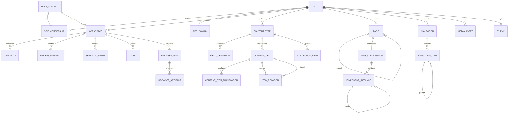

## Control tables

### `control.installation_state`

```text
id singleton PK
initialized_at TIMESTAMPTZ NULL
setup_token_digest BYTEA NULL
setup_token_expires_at TIMESTAMPTZ NULL
configuration_version BIGINT
```

### `control.site`

```text
id UUID PK
key TEXT UNIQUE
name TEXT
status TEXT
canonical_revision BIGINT
component_catalog_version TEXT
content_model_revision BIGINT
default_locale TEXT
created_at TIMESTAMPTZ
updated_at TIMESTAMPTZ
```

### `control.site_domain`

```text
id UUID PK
site_id UUID
hostname TEXT
path_prefix TEXT NULL
is_primary BOOLEAN
created_at TIMESTAMPTZ
UNIQUE (hostname, path_prefix)
```

### `control.user_account`

```text
id UUID PK
identity_kind TEXT               -- LOCAL or OIDC
local_username TEXT NULL
password_hash TEXT NULL
oidc_issuer TEXT NULL
oidc_subject TEXT NULL
email TEXT NULL
display_name TEXT
status TEXT
created_at TIMESTAMPTZ
last_login_at TIMESTAMPTZ NULL
UNIQUE (oidc_issuer, oidc_subject)
```

Local-identity uniqueness is enforced separately. Email is not the immutable OIDC identity key.

### `control.role`, `control.permission`, `control.role_permission`

Built-in site-role/permission catalogs support inspection and assignment. Source-controlled route/scope declarations remain authoritative for code enforcement.

### `control.site_membership`

```text
site_id UUID
user_id UUID
role_key TEXT
delegation_ceiling SMALLINT
permission_overrides JSONB
status TEXT
created_at TIMESTAMPTZ
updated_at TIMESTAMPTZ
PRIMARY KEY (site_id, user_id)
```

### `control.workspace`

```text
id UUID PK                 -- agent-cow session UUID
site_id UUID
created_by UUID
actor_type TEXT
title TEXT
task_description TEXT
approved_source_origins JSONB
delegation_preset TEXT
effective_scopes JSONB
resource_constraints JSONB
browser_limits JSONB
status TEXT
base_site_revision BIGINT
operation_watermark BIGINT
component_catalog_version TEXT
composition_schema_version TEXT
puck_adapter_version TEXT
content_model_revision BIGINT
created_at TIMESTAMPTZ
expires_at TIMESTAMPTZ
frozen_at TIMESTAMPTZ NULL
accepted_at TIMESTAMPTZ NULL
discarded_at TIMESTAMPTZ NULL
version BIGINT
```

### `control.review_snapshot`

```text
id UUID PK
site_id UUID
workspace_id UUID
snapshot_digest BYTEA
canonical_site_revision BIGINT
operation_ids UUID[]
operation_watermark BIGINT
component_catalog_version TEXT
renderer_version TEXT
composition_schema_version TEXT
puck_adapter_version TEXT
content_model_revision BIGINT
normalized_site JSONB
validation_report JSONB
browser_evidence JSONB
created_at TIMESTAMPTZ
created_by_job UUID
```

Snapshots are immutable. A new review after drift creates a new row rather than changing the approved object.

### `control.capability`

```text
id UUID PK
site_id UUID
workspace_id UUID
public_id TEXT UNIQUE
secret_digest BYTEA
delegator_id UUID
effective_scopes JSONB
resource_constraints JSONB
approved_source_origins JSONB
browser_limits JSONB
created_at TIMESTAMPTZ
expires_at TIMESTAMPTZ
revoked_at TIMESTAMPTZ NULL
last_used_at TIMESTAMPTZ NULL
request_limit BIGINT
request_count BIGINT
upload_limit BIGINT
upload_count BIGINT
browser_run_limit BIGINT
browser_run_count BIGINT
screenshot_limit BIGINT
screenshot_count BIGINT
```

### `control.idempotency_record`

```text
capability_id UUID
idempotency_key TEXT
request_digest BYTEA
operation_id UUID
response_status INTEGER
response_body JSONB
created_at TIMESTAMPTZ
PRIMARY KEY (capability_id, idempotency_key)
```

### `control.browser_run`

```text
id UUID PK
site_id UUID
workspace_id UUID
requested_by_capability_id UUID NULL
requested_by_user_id UUID NULL
run_type TEXT                     -- PREVIEW or SOURCE
status TEXT
targets JSONB
routes JSONB
approved_origins JSONB
quota JSONB
summary JSONB
created_at TIMESTAMPTZ
started_at TIMESTAMPTZ NULL
completed_at TIMESTAMPTZ NULL
last_error JSONB NULL
```

### `control.browser_artifact`

```text
id UUID PK
site_id UUID
workspace_id UUID
browser_run_id UUID
artifact_type TEXT                -- SCREENSHOT, TRACE, SNAPSHOT, REPORT
media_digest TEXT
metadata JSONB
created_at TIMESTAMPTZ
expires_at TIMESTAMPTZ
```

### `control.job`

```text
id UUID PK
job_type TEXT
site_id UUID
workspace_id UUID
requested_by UUID
idempotency_key TEXT UNIQUE
payload JSONB
state TEXT
attempt_count INTEGER
available_at TIMESTAMPTZ
locked_at TIMESTAMPTZ NULL
locked_by TEXT NULL
last_error JSONB NULL
created_at TIMESTAMPTZ
completed_at TIMESTAMPTZ NULL
```

## Audit tables

### `audit.semantic_event`

See Section 26.

### `audit.promotion_event`

```text
id UUID PK
site_id UUID
workspace_id UUID
job_id UUID
requested_by UUID
action TEXT
selected_operations UUID[]
foundation_result JSONB
site_revision_before BIGINT
site_revision_after BIGINT
created_at TIMESTAMPTZ
previous_event_digest BYTEA
event_digest BYTEA
```

### `audit.security_event`

Stores login, token issuance/revocation, scope denial, expiry, and suspicious request summaries.

## Content tables

All tables below are in `content`, use UUID primary keys, and are COW-enabled.

```text
locale
content_type
field_definition
content_item
content_item_translation
item_relation
collection_view
page
page_composition
component_instance
component_prop_reference, if normalized references are retained
navigation
navigation_item
media_asset
redirect
theme
proposed_side_effect
```

The essential configurable tables are:

```text
content_type
    id, site_id, key, labels, slug_pattern, status,
    definition_version, settings, timestamps
    UNIQUE (site_id, key)

field_definition
    id, site_id, content_type_id, key, label, field_type,
    required, localized, cardinality, position, validation,
    ui_options, definition_version, timestamps
    UNIQUE (content_type_id, key)

content_item
    id, site_id, content_type_id, slug, status,
    type_definition_version, values JSONB, timestamps, row_version

content_item_translation
    id, site_id, content_item_id, locale,
    localized_values JSONB, timestamps, row_version
    UNIQUE (content_item_id, locale)

item_relation
    id, site_id, source_item_id, field_definition_id,
    target_item_id, position, metadata

collection_view
    id, site_id, key, content_type_id, filter_spec,
    sort_spec, projection_spec, pagination_spec, timestamps

component_instance
    id, site_id, page_id, parent_component_id, slot_key,
    component_type_key, component_schema_version, order_key,
    props JSONB, timestamps, row_version
```

Composite constraints or equivalent triggers prevent a child/reference from crossing sites. `News`, `Event`, `Person`, and similar domains are rows in these generic tables, not physical tables.

---

# Appendix C — Example capability issuance

Request:

```http
POST /api/control/v1/sites/{site_id}/workspaces
Content-Type: application/json
Cookie: <human session>
X-CSRF-Token: ...

{
  "actor_type": "AGENT",
  "title": "Rebuild Genericno site",
  "task_description": "Reconstruct and modernize the current website.",
  "source": {
    "origin": "http://genericno.ijs.si:5173",
    "allow_subdomains": false,
    "max_pages": 100,
    "max_bytes": 524288000
  },
  "delegation_preset": "SITE_ARCHITECT",
  "ttl_seconds": 3600,
  "browser_limits": {
    "max_runs": 40,
    "max_screenshots": 100,
    "max_routes_per_sweep": 20,
    "allowed_targets": [
      "desktop-chromium",
      "tablet",
      "mobile-chromium",
      "mobile-webkit"
    ]
  },
  "resource_constraints": {
    "locales": ["sl", "en"],
    "max_deletes": 1000,
    "max_upload_bytes": 524288000
  }
}
```

Response:

```json
{
  "site_id": "9c2e...",
  "workspace_id": "f4ab6df4-...",
  "status": "ACTIVE",
  "expires_at": "2026-08-16T13:00:00+02:00",
  "agent_api_url": "http://localhost:8080/api/agent/v1",
  "mcp_url": "http://localhost:8080/mcp",
  "preview_url": "http://localhost:8080/preview/f4ab6df4-.../",
  "capability": {
    "token": "sas2_xxx_yyy",
    "displayed_once": true,
    "preset": "SITE_ARCHITECT"
  },
  "browser": {
    "preview_inspection": true,
    "source_origin": "http://genericno.ijs.si:5173"
  }
}
```

---

# Appendix D — Suggested agent instruction package

```text
You have temporary access to an isolated website-editing workspace.

Agent API:
http://localhost:8080/api/agent/v1

Capability:
sas2_...

Source website:
http://genericno.ijs.si:5173/

Your delegated level:
Site Architect

Rules:
- Inspect /session, /permissions, /site-model, /content-model/field-types,
  and /component-catalog first.
- Inspect only the explicitly approved source origin through source tools.
- Create suitable bounded content types, items, collection views, pages,
  and normalized component compositions.
- Preserve all meaningful information and media.
- Improve information architecture when useful.
- Use the available theme tokens and variants; do not request source-code access.
- Inspect the rendered result with preview screenshots/snapshots and run
  desktop, tablet, mobile Chromium-class, and mobile WebKit-class checks.
- Iterate on model/content/composition through semantic APIs; never request
  raw SQL, JavaScript evaluation, arbitrary browser navigation, or Alembic.
- All changes occur in a private workspace.
- Do not attempt to publish. The human owner will review and decide.
- Use idempotency keys for every mutation.
- Validate the final workspace and report the preview URL and a concise change summary.
```

---

# Appendix E — Example review summary

```text
Workspace: Rebuild and modernize Genericno
Delegated by: Janez Perš
Preset: Site Architect
Status: REVIEW

Content model
  + News
      + title
      + summary
      + body
      + image
      + published_at
  + Project
  ~ Person fields updated

Site structure
  + 14 pages
  ~ 8 routes
  ~ main navigation
  + 17 redirects

Composition and design
  + 72 component instances
  ~ global theme
  ~ header and footer

Content
  + 38 items
  ~ 12 translations
  + 24 media assets

Visual validation
  desktop-chromium   PASS
  tablet             PASS
  mobile-chromium    PASS
  mobile-webkit      PASS WITH 1 WARNING

  console errors             0
  failed requests            0
  broken internal links      0
  horizontal overflows       0
  heading warnings           1

Conflicts: none

[Open desktop screenshot] [Open mobile screenshot] [Open Puck editor]
[View semantic operations] [View resource diff] [View conflicts]

[Discard] [Select operations] [Accept & Publish]
```

The visual report is advisory. It never replaces explicit human acceptance.

---

# Appendix F — Minimal Compose behavior contract

The exact Compose syntax is implementation work, but the following behavior is normative:

```text
docker compose up --build
    |
    +-- postgres becomes healthy
    |
    +-- bootstrap runs exactly once per schema version
    |      +-- migrations
    |      +-- COW deploy/enable
    |      +-- role hardening
    |      +-- privilege validation
    |      +-- optional demo-site seed
    |      +-- one-time setup token when uninitialized
    |
    +-- APIs, media service, browser/review workers, scheduler, and GC start
    |
    +-- web, Puck integration, and Render API start
    |
    +-- NGINX becomes ready on localhost:8080 as the only published service
```

A failed privilege validation prevents Agent API and review-worker readiness. A failed browser sandbox/egress-policy check prevents browser-worker readiness without exposing its internal listener.

The E2E profile adds a Playwright test runner and isolated test database/volumes; it requires no hosted secrets.

---

# Appendix G — Product wording

## One sentence

> **SLAIF Agent-Site is a self-hosted platform where humans and AI agents can build, redesign, and manage websites in isolated workspaces, inspect the real responsive result, and publish only after human review.**

## Technical wording

> **SLAIF Agent-Site combines site-scoped human identity and delegation, configurable content models, a Puck-based visual builder, semantic REST/MCP tools, Playwright-powered visual feedback, and the SLAIF Agent-State capability/workspace/promotion subsystem over hardened PostgreSQL logical copy-on-write.**

## Security wording

> **A request authorized solely by an Agent-Site agent capability can modify only the capability's site-bound workspace. It cannot write canonical content, manage users, run physical schema migrations, alter executable code, or publish.**

## WordPress response

> **WordPress is a mature CMS and increasingly exposes AI editing tools. SLAIF Agent-Site focuses on a different security and autonomy model: every agent works inside an isolated state workspace, can iteratively inspect the rendered desktop and mobile result, and cannot alter the published site until a human promotes the work.**

## Database-branching response

> **The project does not claim to invent copy-on-write. The PyPI distribution `agent-cow-postgresql` supplies the generic database isolation substrate; Agent-State binds temporary authority to that isolation; Agent-Site turns it into a complete human-governed autonomous website design platform.**

---

# End of document
