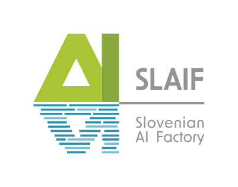

<!-- markdownlint-disable MD041 -->
<div style="text-align: center;">
  <a href="https://www.slaif.si">
    
  </a>
</div>

# SLAIF Agent-Site

[](https://github.com/ulfe-lmi/slaif-agent-site/actions/workflows/ci.yml)
[](https://github.com/ulfe-lmi/slaif-agent-site/actions/workflows/codeql.yml)
[](LICENSE)

SLAIF Agent-Site is a self-hosted, human-governed platform where humans and AI
agents build, redesign, and manage websites in isolated workspaces, inspect
the real responsive result, and publish only after human review.

## Current status

> **Pre-alpha / deployable skeleton.** This
> repository contains the normative architecture, coding-agent governance,
> reproducible Python/TypeScript toolchains, the qualified
> `agent-cow-postgresql==0.2.0` dependency, ten backend process boundaries,
> exact PostgreSQL roles/local login principals, and an owner-only
> Alembic/bootstrap path. It also enforces frozen dependency/license/source
> policy, deterministic notices and application artifacts, exact OCI
> provenance, and retained six-image SBOM/vulnerability evidence. The default
> Compose stack builds non-root OCI images,
> generates file-backed local credentials, reaches `EMPTY_SAFE safe=true`, and
> exposes an honest Next.js status surface, health routes, and bounded backend
> Control authentication endpoints through NGINX
> on <http://localhost:8080/>.
> The database revision contains only schema/version/readiness infrastructure;
> its clean zero-object content state is explicitly `EMPTY_SAFE` without
> claiming foundation table hardening. Any real content object requires the
> fully validated `HARDENED` state. A local human authentication/setup UI is
> implemented; sites,
> workspaces, editing/Puck, product routes/tables, database-backed product APIs,
> Playwright/browser commands, review, publication, and product behavior are
> not implemented yet. Control API alone owns one isolated file-backed
> login, bounded asyncpg pool, and read-only database readiness component; no
> other online process receives a database credential.

The current automation also migrates/rebuilds disposable databases, verifies
the exact role/ownership/grant matrix, exercises COW runtime/reviewer paths,
and checks failure rollback, over-grants, cancellation, and pool cleanup on
PostgreSQL 14–18. A green CI or CodeQL result does not prove product readiness,
validate planned product behavior, or certify the complete security
architecture.

## Why Agent-Site

An AI agent that edits a live content-management system can turn every tool
call into a production change. Prompts, confirmations, revisions, and backups
help, but they do not change where authority takes effect.

Agent-Site is designed around a stronger boundary: broad editing authority is
granted only inside a disposable, site-bound workspace. Humans can inspect
semantic changes and the real rendered result, freeze an immutable review
snapshot, and then accept or discard it through separately authenticated
control-plane authority.

The non-negotiable promise is:

> A request authorized solely by an Agent-Site agent capability can modify
> only the capability's site-bound workspace. It cannot write canonical
> content, manage identities, run SQL or Alembic, alter executable code or
> infrastructure, or publish.

## Planned architecture

The design has three distinct layers:

| Layer | Responsibility |
| --- | --- |
| **SLAIF Agent-Site** | Identity, sites, configurable content models, Puck, semantic APIs/MCP, rendering, browser tools, media, administration, and operations. |
| **SLAIF Agent-State** | Site-bound workspaces, capabilities, delegation, audit, immutable review snapshots, conflict-safe promotion/discard, expiry, and cleanup. |
| **`agent-cow-postgresql`** | Generic PostgreSQL logical copy-on-write mechanics, integrated as the PyPI dependency `agent-cow-postgresql==0.2.0`, frozen with registry artifact hashes and never installed from Git/VCS in production. |

```mermaid
flowchart LR
    Human[Human identity] --> Delegate[Site role and delegation ceiling]
    Delegate --> Capability[Short-lived site-bound capability]
    Capability --> Workspace[Isolated Agent-State workspace]
    Agent[External AI agent] --> Workspace
    Workspace --> APIs[Semantic content and composition APIs]
    APIs --> Renderer[Shared trusted renderer]
    Renderer --> Evidence[Responsive preview and browser evidence]
    Evidence --> Freeze[Freeze and immutable review snapshot]
    Freeze --> Review[Human review]
    Review -->|accept| Promote[Atomic conflict-safe promotion]
    Review -->|discard| Discard[Discard workspace]
    Promote --> Canonical[Canonical published site]
```



Component implementations, field primitives, renderer code, dependencies,
physical database schema, identity policy, and infrastructure remain trusted
code outside editorial authority. Multi-site support targets a trusted
institutional installation; it does not claim hostile public-SaaS tenant
isolation.

## Planned capabilities

- multi-site administration with site-scoped membership, RBAC, and delegation
  ceilings;
- configurable content types and bounded field primitives stored as workspace
  data rather than physical migrations;
- one normalized composition model edited by both Puck and semantic agent
  operations;
- REST/OpenAPI as the canonical agent interface, with MCP delegating to the
  same services;
- immutable content-addressed media and private workspace browser artifacts;
- confined Playwright screenshots, accessibility snapshots, diagnostics, and
  responsive sweeps;
- immutable review snapshots, semantic audit, fail-safe conflict detection,
  and human-only promotion;
- self-hosted NGINX, Next.js/React, FastAPI, PostgreSQL, workers, and local
  media storage packaged as OCI images with Compose.

### Delegation presets

The four planned presets are understandable UI profiles over granular,
site-scoped permissions:

| Preset | Planned workspace authority |
| --- | --- |
| Content Editor | Edit existing content values, translations, media metadata, and content props. |
| Site Editor | Add or reorganize pages, routes, navigation, redirects, views, and approved structure. |
| Site Designer | Change normalized composition, variants, layout, responsive settings, and bounded theme tokens. |
| Site Architect | Define bounded content models, global structure/design, locales, and whole-site imports inside a workspace. |

**Hard ceiling:** no delegation level can publish, manage identities, run
physical migrations, install packages or components, evaluate arbitrary code,
or edit executable implementation.

## Selected technology and operating principles

The target stack is NGINX Open Source at the edge; Next.js, React, TypeScript,
Puck, open-source Tailwind CSS, shadcn/ui source, and Radix Primitives for the
web surface; FastAPI and asyncpg for backend services; ordinary self-hosted
PostgreSQL for data and transactional jobs; and separately confined
Playwright workers for rendered feedback and E2E verification. Apache HTTP
Server 2.4 is a planned supported edge adapter.

The default deployment is intended to require no hosted database, browser,
object store, identity provider, cloud API key, subscription, or proprietary
control plane. Telemetry will not leave the deployment by default. Production
dependencies must remain permissively licensed and reproducibly locked.

## Run the deployment skeleton

With Docker Engine and Compose v2 on Linux:

```bash
git clone https://github.com/ulfe-lmi/slaif-agent-site.git
cd slaif-agent-site
docker compose up --build
```

No `.env`, manual package install, cloud account, API key, or secret-generation
step is required. Wait for health, then open <http://localhost:8080/>. Only
loopback port 8080 is published. This is a deployment/status skeleton, not the
first-run administrator or website-management product. See the
[deployment guide](docs/DEPLOYMENT.md) and [operations guide](docs/OPERATIONS.md).

## Delivery sequence

| State | Work |
| --- | --- |
| Completed preparation | Normative architecture, coding governance, versioned OAP transcript, professional project guidance, deterministic repository policy, and initial CI/CodeQL configuration. |
| Completed foundation baseline | Exact PyPI dependency and artifact hashes, public API adapter boundary, Python packaging, and downstream PostgreSQL 14–18 adoption gate. |
| Completed contract-toolchain baseline | Reproducible Node 24/pnpm 11 workspace, strict TypeScript tooling, and seven private scaffold-only package boundaries. |
| Completed backend process skeleton | Six health-only FastAPI apps, four non-listening process entrypoints, typed local configuration, conceptual authority mapping, safe errors/correlation/logging, and readiness probes. |
| Completed database boundary baseline | Exact password-free roles, packaged Alembic head, three empty product schemas, constrained `PENDING`/`EMPTY_SAFE`/`HARDENED` readiness, public-API COW reconciliation, and independent privilege validation. |
| Completed deployable skeleton | One-command Compose, generated local database principals, safe-empty bootstrap, digest-pinned OCI images, isolated browser placeholder, Next status page, NGINX edge, and Apache reference. |
| Completed supply-chain baseline | Reproducible Python/Web artifacts, exact source/action/base/scanner policy, deterministic notices, six-image SPDX SBOMs, fresh Grype scans, and checksummed retained CI evidence. |
| Completed Control readiness boundary | Isolated `slaif_control_login` mount, bounded identity-verified Control pool, one owner-defined read-only readiness function, and fail-closed Control/NGINX health dependency. |
| Planned product work | Add browser/device E2E evidence, then sites/workspaces, configurable content, normalized composition/Puck, semantic tools, browser feedback, review/promotion, reconstruction, and hardening. |

See [Architecture Section 50](ARCHITECTURE.md#50-implementation-phases) for
the normative phase plan.

## Repository map

The current repository is intentionally small:

```text
.
├── .github/             # CI, CodeQL, Dependabot, and PR guidance
├── apps/web/            # minimal Next.js pre-alpha status surface
├── contracts/           # contract ownership and future generation policy
├── docs/                # deployment, operations, contracts, and assets
├── infra/               # NGINX default and Apache reference edge adapters
├── migrations/          # Alembic location marker and bootstrap guidance
├── oap/                 # versioned strategic orders, active pointer, reports
├── packages/            # seven private TypeScript boundary scaffolds
├── services/            # backend and isolated browser-worker placeholder
├── supply-chain/        # machine policy, scanner contract, empty exceptions
├── tests/               # contract, packaging, and repository-policy tests
├── tools/               # repository, Compose, supply-chain, secret tooling
├── AGENTS.md            # coding-agent constitution
├── ARCHITECTURE.md      # normative Revision 2.1 architecture
├── compose.yaml         # local one-command deployment topology
├── CONTRIBUTING.md
├── SECURITY.md
├── NOTICE
├── package.json
├── pnpm-lock.yaml
├── pyproject.toml
├── uv.lock
└── README.md
```

The TypeScript package boundaries contain no product schemas, components,
scopes, browser tools, API behavior, or fixture data. The Python HTTP processes
contain only `/health/live` and `/health/ready`; long-running workers do no
product work. Control readiness has one injected database component, while
its liveness remains process-only. Bootstrap mutations require explicit
one-shot commands. See the
[configuration contract](docs/CONFIGURATION.md),
[database bootstrap](docs/DATABASE_BOOTSTRAP.md),
[database roles](docs/DATABASE_ROLES.md), and
[database connection boundary](docs/DATABASE_CONNECTIONS.md), with process
mappings in the
[service authority record](docs/SERVICE_AUTHORITY.md), deployment in the
[deployment guide](docs/DEPLOYMENT.md), and lifecycle commands in
[operations](docs/OPERATIONS.md). The planned application
monorepo layout remains specified in
[Architecture Section 12](ARCHITECTURE.md#12-repository-architecture).

## Repository checks and CodeQL

The [CI workflow](.github/workflows/ci.yml) runs deterministic repository
policy, isolated policy tests, Markdown lint, exact-version Mermaid rendering,
pull-request dependency review, frozen Node 24/pnpm 11 contract checks, Python
3.12–3.14 lint/type/unit/package gates (including process, config, health,
error, correlation, logging, and entrypoint contracts), and separate foundation
plus Agent-Site database suites on PostgreSQL 14–18, and a clean Compose/edge
packaging smoke. A separate bounded job builds reproducible artifacts, creates
and validates six SPDX SBOMs, scans symbol-aware SBOMs with a fresh database,
fails on every unexcepted Critical, retains High findings, secret-scans and
checksums the result, and uploads it for 14 days. See the
[supply-chain guide](docs/SUPPLY_CHAIN.md),
[license policy](docs/LICENSE_POLICY.md), and
[foundation integration record](docs/FOUNDATION_INTEGRATION.md) for the exact
contracts, commands, and limitations. The transient
diagram and package builds add no production dependency or committed output. The
[advanced CodeQL workflow](.github/workflows/codeql.yml) detects a fixed
language allowlist and now analyzes GitHub Actions, Python, and
JavaScript/TypeScript from the tracked sources. It uses no-build analysis with
the `security-extended` query suite.

All external actions are pinned to reviewed full commit SHAs. Dependabot
proposes grouped weekly GitHub Actions, npm, and Python dependency updates; the
foundation version and Node toolchain changes still require explicit
qualification. These checks will be extended—not replaced—as product code and its
database, browser, packaging, security, recovery, and license tests arrive.

## Governance and contributing

The durable project rules are:

- [Architecture Revision 2.1](ARCHITECTURE.md) — normative product design;
- [coding-agent constitution](AGENTS.md) — execution and security boundaries;
- [contribution guide](CONTRIBUTING.md) — development and validation workflow;
- [security policy](SECURITY.md) — private vulnerability reporting;
- [versioned OAP transcript](oap/) — immutable work orders and execution
  reports.

Architecture-first contributions are welcome, but current changes must remain
honest about implemented versus planned behavior. See
[CONTRIBUTING.md](CONTRIBUTING.md) before opening a pull request.

## License, privacy, and acknowledgement

SLAIF Agent-Site is licensed under the [Apache License 2.0](LICENSE). See
[NOTICE](NOTICE), the generated
[third-party inventory](THIRD_PARTY_NOTICES.md), and the
[logo provenance record](docs/assets/README.md) for attribution and the
conservative trademark boundary.

The planned default stack is fully self-hosted, makes no outbound telemetry
call by default, and treats agent capabilities, unpublished content, browser
artifacts, identities, and audit data as deployment-private information.

This work is associated with the
[Slovenian AI Factory (SLAIF)](https://www.slaif.si) and acknowledges support
from the European Commission/EuroHPC Joint Undertaking and the Slovenian
Ministry of Higher Education, Science and Innovation for SLAIF grant
`101254461`.
