# SLAIF Agent-Site

<p align="center">
  <a href="https://www.slaif.si">
    
  </a>
</p>

[](https://github.com/ulfe-lmi/slaif-agent-site/actions/workflows/ci.yml)
[](https://github.com/ulfe-lmi/slaif-agent-site/actions/workflows/codeql.yml)
[](LICENSE)

SLAIF Agent-Site is a self-hosted, human-governed platform where humans and AI
agents build, redesign, and manage websites in isolated workspaces, inspect
the real responsive result, and publish only after human review.

## Current status

> **Pre-alpha / pre-implementation.** This repository currently contains the
> normative architecture, coding-agent governance, project documentation,
> repository-policy checks, and CI/security-analysis workflows. The runnable
> Agent-Site application, Compose stack, database schema, APIs, browser worker,
> and product test suites are not implemented yet.

The current automation checks preparation artifacts and repository policy. A
green CI or CodeQL result does not prove product readiness, validate the
planned runtime, or certify the security architecture.

## Why Agent-Site

An AI agent that edits a live content-management system can turn every tool
call into a production change. Prompts, confirmations, revisions, and backups
help, but they do not change where authority takes effect.

Agent-Site is designed around a stronger boundary: broad editing authority is
granted only inside a disposable, site-bound workspace. Humans can inspect
semantic changes and the real rendered result, freeze an immutable review
snapshot, and then accept or discard it through separately authenticated
control-plane authority.

The non-negotiable promise is:

> A request authorized solely by an Agent-Site agent capability can modify
> only the capability's site-bound workspace. It cannot write canonical
> content, manage identities, run SQL or Alembic, alter executable code or
> infrastructure, or publish.

## Planned architecture

The design has three distinct layers:

| Layer | Responsibility |
| --- | --- |
| **SLAIF Agent-Site** | Identity, sites, configurable content models, Puck, semantic APIs/MCP, rendering, browser tools, media, administration, and operations. |
| **SLAIF Agent-State** | Site-bound workspaces, capabilities, delegation, audit, immutable review snapshots, conflict-safe promotion/discard, expiry, and cleanup. |
| **`agent-cow-postgresql`** | Generic PostgreSQL logical copy-on-write mechanics, planned as the PyPI dependency `agent-cow-postgresql==0.2.0`, frozen with registry artifact hashes and never installed from Git/VCS in production. |



```mermaid
flowchart LR
    Human[Human identity] --> Delegate[Site role and delegation ceiling]
    Delegate --> Capability[Short-lived site-bound capability]
    Capability --> Workspace[Isolated Agent-State workspace]
    Agent[External AI agent] --> Workspace
    Workspace --> APIs[Semantic content and composition APIs]
    APIs --> Renderer[Shared trusted renderer]
    Renderer --> Evidence[Responsive preview and browser evidence]
    Evidence --> Freeze[Freeze and immutable review snapshot]
    Freeze --> Review[Human review]
    Review -->|accept| Promote[Atomic conflict-safe promotion]
    Review -->|discard| Discard[Discard workspace]
    Promote --> Canonical[Canonical published site]
```

Component implementations, field primitives, renderer code, dependencies,
physical database schema, identity policy, and infrastructure remain trusted
code outside editorial authority. Multi-site support targets a trusted
institutional installation; it does not claim hostile public-SaaS tenant
isolation.

## Planned capabilities

- multi-site administration with site-scoped membership, RBAC, and delegation
  ceilings;
- configurable content types and bounded field primitives stored as workspace
  data rather than physical migrations;
- one normalized composition model edited by both Puck and semantic agent
  operations;
- REST/OpenAPI as the canonical agent interface, with MCP delegating to the
  same services;
- immutable content-addressed media and private workspace browser artifacts;
- confined Playwright screenshots, accessibility snapshots, diagnostics, and
  responsive sweeps;
- immutable review snapshots, semantic audit, fail-safe conflict detection,
  and human-only promotion;
- self-hosted NGINX, Next.js/React, FastAPI, PostgreSQL, workers, and local
  media storage packaged as OCI images with Compose.

### Delegation presets

The four planned presets are understandable UI profiles over granular,
site-scoped permissions:

| Preset | Planned workspace authority |
| --- | --- |
| Content Editor | Edit existing content values, translations, media metadata, and content props. |
| Site Editor | Add or reorganize pages, routes, navigation, redirects, views, and approved structure. |
| Site Designer | Change normalized composition, variants, layout, responsive settings, and bounded theme tokens. |
| Site Architect | Define bounded content models, global structure/design, locales, and whole-site imports inside a workspace. |

**Hard ceiling:** no delegation level can publish, manage identities, run
physical migrations, install packages or components, evaluate arbitrary code,
or edit executable implementation.

## Selected technology and operating principles

The target stack is NGINX Open Source at the edge; Next.js, React, TypeScript,
Puck, open-source Tailwind CSS, shadcn/ui source, and Radix Primitives for the
web surface; FastAPI and asyncpg for backend services; ordinary self-hosted
PostgreSQL for data and transactional jobs; and separately confined
Playwright workers for rendered feedback and E2E verification. Apache HTTP
Server 2.4 is a planned supported edge adapter.

The default deployment is intended to require no hosted database, browser,
object store, identity provider, cloud API key, subscription, or proprietary
control plane. Telemetry will not leave the deployment by default. Production
dependencies must remain permissively licensed and reproducibly locked.

## Target startup contract — not implemented yet

The architecture defines this future clean-host contract:

```bash
git clone https://github.com/ulfe-lmi/slaif-agent-site.git
cd slaif-agent-site
docker compose up --build
```

The repository does **not** currently contain `compose.yaml`, application
images, or a working product runtime, so this is not a quickstart. It is an
acceptance target for later implementation phases.

## Delivery sequence

| State | Work |
| --- | --- |
| Completed preparation | Normative architecture, coding governance, versioned OAP transcript, professional project guidance, deterministic repository policy, and initial CI/CodeQL configuration. |
| Planned foundation qualification | Add the exact PyPI dependency and lockfile hashes; verify public APIs, licenses, PostgreSQL support, privileges, conflicts, concurrency, and cancellation. |
| Planned product skeleton | Add the monorepo, one-command Compose packaging, secure first-run setup, service roles, and health checks. |
| Planned product work | Implement identity/sites/workspaces, configurable content, normalized composition/Puck, semantic tools, browser feedback, review/promotion, reconstruction, and hardening. |

See [Architecture Section 50](ARCHITECTURE.md#50-implementation-phases) for
the normative phase plan.

## Repository map

The current repository is intentionally small:

```text
.
├── .github/             # CI, CodeQL, Dependabot, and PR guidance
├── docs/assets/         # locally vendored SLAIF brand asset and provenance
├── oap/                 # versioned strategic orders, active pointer, reports
├── tests/repository/    # isolated repository-policy unit tests
├── tools/               # standard-library repository-policy checker
├── AGENTS.md            # coding-agent constitution
├── ARCHITECTURE.md      # normative Revision 2.1 architecture
├── CONTRIBUTING.md
├── SECURITY.md
├── NOTICE
└── README.md
```

The planned application monorepo layout is specified in
[Architecture Section 12](ARCHITECTURE.md#12-repository-architecture); those
application directories do not exist yet.

## Repository checks and CodeQL

The [CI workflow](.github/workflows/ci.yml) runs deterministic repository
policy, isolated standard-library unit tests, Markdown lint, and pull-request
dependency review. The [advanced CodeQL workflow](.github/workflows/codeql.yml)
detects a fixed language allowlist: GitHub Actions while workflow files exist,
Python when Python source exists, and JavaScript/TypeScript when corresponding
source is later added. It uses no-build analysis with the
`security-extended` query suite.

All external actions are pinned to reviewed full commit SHAs. Dependabot is
limited to GitHub Actions until application dependency manifests exist. These
preparation checks will be extended—not replaced—as product code and its
database, browser, packaging, security, recovery, and license tests arrive.

## Governance and contributing

The durable project rules are:

- [Architecture Revision 2.1](ARCHITECTURE.md) — normative product design;
- [coding-agent constitution](AGENTS.md) — execution and security boundaries;
- [contribution guide](CONTRIBUTING.md) — development and validation workflow;
- [security policy](SECURITY.md) — private vulnerability reporting;
- [versioned OAP transcript](oap/) — immutable work orders and execution
  reports.

Architecture-first contributions are welcome, but current changes must remain
honest about implemented versus planned behavior. See
[CONTRIBUTING.md](CONTRIBUTING.md) before opening a pull request.

## License, privacy, and acknowledgement

SLAIF Agent-Site is licensed under the [Apache License 2.0](LICENSE). See
[NOTICE](NOTICE) and the [logo provenance record](docs/assets/README.md) for
attribution and the conservative trademark boundary.

The planned default stack is fully self-hosted, makes no outbound telemetry
call by default, and treats agent capabilities, unpublished content, browser
artifacts, identities, and audit data as deployment-private information.

This work is associated with the
[Slovenian AI Factory (SLAIF)](https://www.slaif.si) and acknowledges support
from the European Commission/EuroHPC Joint Undertaking and the Slovenian
Ministry of Higher Education, Science and Innovation for SLAIF grant
`101254461`.
