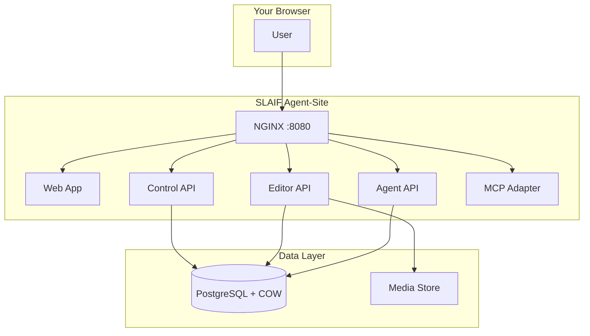
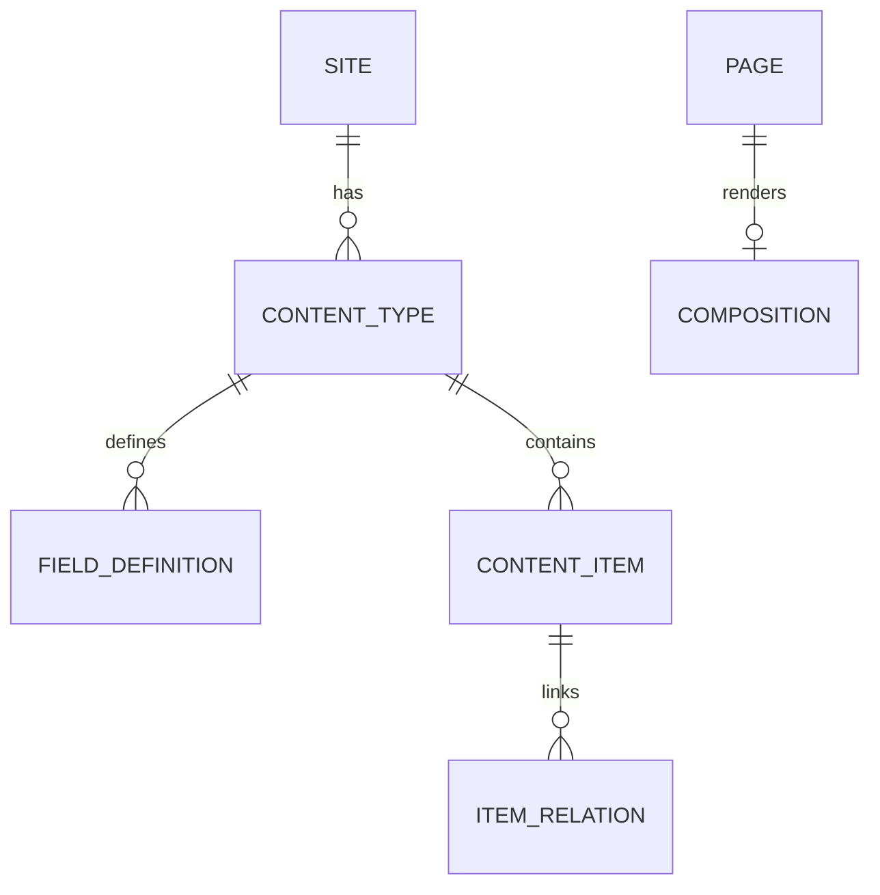
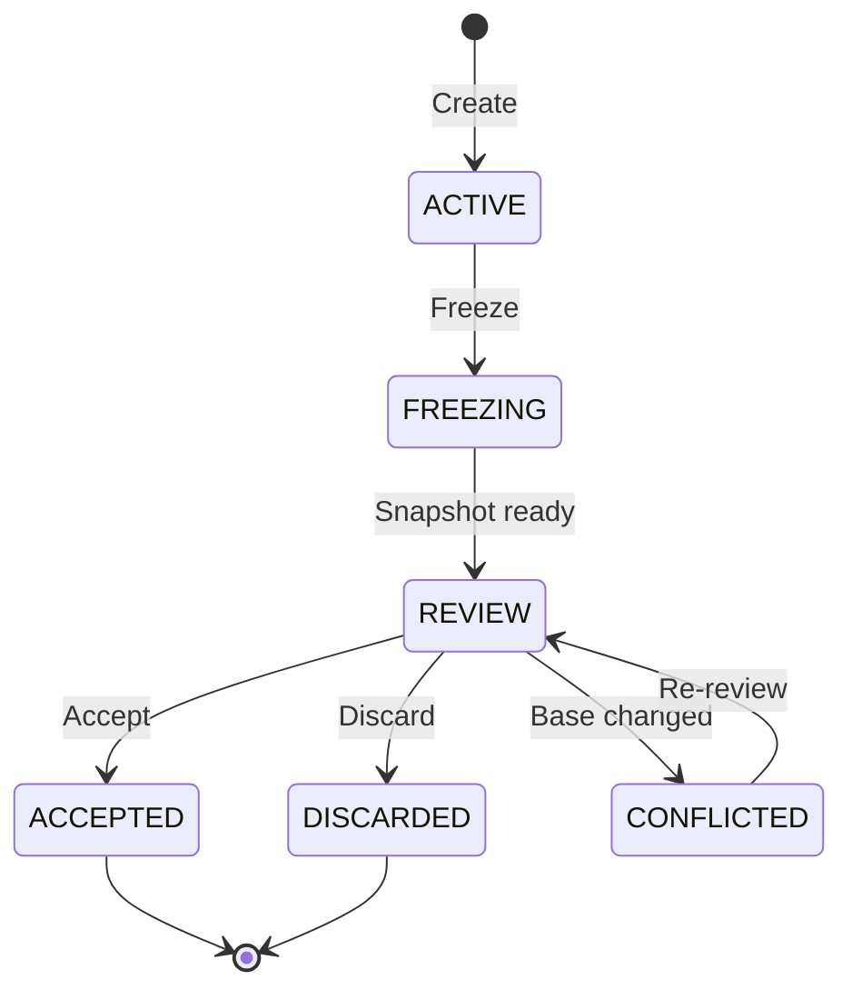
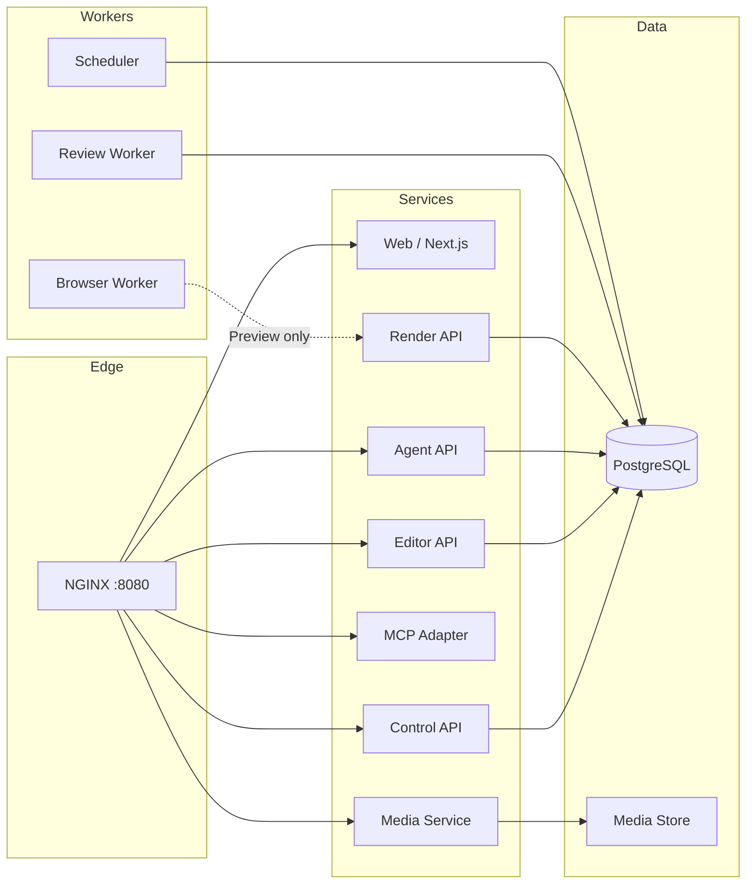

# SLAIF Agent-Site — Complete User Manual

A self-hosted platform where humans and AI agents build, redesign, and manage
websites in isolated workspaces, inspect the real responsive result, and publish
only after human review.



## Table of Contents

1. [Getting Started](#getting-started)
2. [First-Time Setup](#first-time-setup)
3. [Logging In](#logging-in)
4. [Creating Your First Site](#creating-your-first-site)
5. [Site Management](#site-management)
6. [Content Model](#content-model)
7. [Workspaces](#workspaces)
8. [Responsive Design](#responsive-design)
9. [Architecture Overview](#architecture-overview)

---

## Getting Started

### Prerequisites

- Docker and Docker Compose installed
- A web browser (Chrome, Firefox, Safari recommended)

### Quick Start

```bash
git clone https://github.com/ulfe-lmi/slaif-agent-site.git
cd slaif-agent-site
docker compose up --build --wait -d
```

The stack will start all services. When the bootstrap container completes,
it prints a one-time setup URL and token.


*The landing page before setup — you'll be redirected to the setup wizard.*

---

## First-Time Setup

When you first access the platform, you'll see the setup page. This is a
one-time flow that creates the first Platform Administrator account.


*The setup page where you configure the first admin account.*

### Steps

1. Navigate to the setup URL printed by the bootstrap container:
   `http://localhost:8080/setup?token=<your-token>`
2. Enter a username for the admin account
3. Enter a secure password (and confirm it if prompted)
4. Click **Create** or **Setup**

> ⚠️ **Important**: The setup token is single-use. Once consumed, the setup
> route is permanently closed. If you lose the token before completing setup,
> restart the stack to generate a new one.

After successful setup, you'll see a confirmation:


---

## Logging In

Navigate to `/login` and enter your admin credentials.


After signing in, you'll be redirected to the admin dashboard:


*The admin dashboard after logging in as Platform Administrator.*

---

## Creating Your First Site

Click on **Create Site** or navigate to `/admin/sites/create`.


Fill in the required fields:

| Field | Description | Example |
|---|---|---|
| Site key | URL-friendly identifier | `demo` |
| Display name | Human-readable name | `Demo University` |
| Default locale | Primary language code | `en` |

Click **Create Site**.


*The newly created site's detail page.*

---

## Site Management

Each site has its own isolated content model, pages, navigation, theme,
media library, memberships, and workspaces.


*Site detail page showing overview information.*

### Site Settings

Access settings via the site's **Settings** tab or by navigating to
`/admin/sites/{siteId}/settings`.


From here you can:
- Update the display name
- Change the default locale
- Manage domain mappings (hostname → site routing)

### Domain Management

Add custom hostnames that route to this site:

| Field | Example |
|---|---|
| Hostname | `demo.university.edu` |
| Path prefix | `/` (optional) |

---

## Memberships

Manage who has access to each site. Roles are site-scoped.


### Built-in Roles

| Role | Delegation Ceiling | Can Publish |
|---|---|---|
| Platform Administrator | Policy-defined | Yes |
| Site Owner | Level 4 | Yes |
| Site Architect | Level 4 | No |
| Site Designer | Level 3 | No |
| Site Editor | Level 2 | No |
| Content Editor | Level 1 | No |
| Reviewer | None | Yes (separate grant) |
| Viewer | None | No |

---

## Content Model

The content model defines what types of content exist on your site.
All content lives in copy-on-write workspaces until explicitly promoted.

### Key Concepts



### Creating a Content Type

Content types are workspace data — they never require database migrations.
An agent or human with Level 4 delegation can create them dynamically.

---

## Workspaces

All editorial changes happen inside workspaces. A workspace is an isolated
copy-on-write overlay on the canonical data.



### Lifecycle

1. **Create** — A workspace is created for a specific site with a delegation preset
2. **Active** — Agents/humans make changes through the API or editor
3. **Freeze** — Changes stop; a review snapshot is materialized
4. **Review** — Reviewers inspect the changes
5. **Accept** — Changes are promoted to canonical atomically
6. **Discard** — Changes are thrown away; canonical is untouched

### Capability Tokens

Agents authenticate using capability tokens (format: `sas2_<id>_<secret>`).
Tokens are shown exactly once at creation time. Only the SHA-256 digest is stored.

---

## Responsive Design

The admin interface is responsive and works on desktop, tablet, and phone.

### Desktop (1440px)


### Tablet (768px)


### Mobile (375px)


*Mobile admin dashboard — critical governance functions remain accessible.*


*Mobile site detail page.*

---

## Public Site

Once a site is published, it's accessible via its configured hostname or
the local path `/s/<site-key>/`.


---

## Architecture Overview



### Security Model

A request authorized solely by an Agent-Site agent capability can modify
only its deployment-, site-, and workspace-bound state. It cannot:

- Write canonical content directly
- Publish without human review
- Manage users or roles
- Run SQL or schema migrations
- Alter executable code or infrastructure

---

## API Reference Summary

| Service | Base Path | Auth |
|---|---|---|
| Control API | `/api/control/v1/` | Session cookie |
| Editor API | `/api/editor/v1/` | Session cookie |
| Agent API | `/api/agent/v1/` | Capability bearer token |
| MCP | `/mcp/v1/` | Capability bearer token |

---

## Troubleshooting

| Problem | Solution |
|---|---|
| Setup page shows "already initialized" | The setup was already completed. Use existing credentials. |
| Cannot log in | Verify username/password. Check control-api logs. |
| Site not accessible | Check domain mappings in site settings. |
| Workspace stuck in FREEZING | Check review-worker logs. May need manual intervention. |
| Images not loading | Ensure media service is healthy and storage volume exists. |

---

## Security Considerations

See [`CRITICAL.md`](../../CRITICAL.md) for known security items requiring
review before production deployment.
